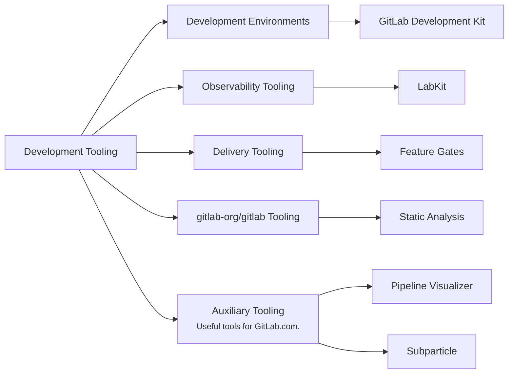

## Mission

- Build state-of-the-art developer tools that are efficient and reliable, empowering developers to keep their development environments up-to-date painlessly.
- Enable team members and the wider community to contribute efficiently to our tools and products.
- Measure what matters: improvements in developer experience, efficiency, and toil reduction, using both quantitative and qualitative metrics.

## Vision

Our vision is to create tools that enable GitLab team members and the wider community to contribute to GitLab rapidly, efficiently and reliably.

## Areas of responsibilities

## Team Structure



## Roadmap

As part of continuous roadmapping, we'll review our roadmap quarterly, updating it as we validate or refine our approach and reflect new priorities.

### Now

**Focus:** Improve Developer Experience across Development Environments and lay foundation of FY'27 (FY26Q4)

- Improve GitLab engineering teams' onboarding experience for Development Environments
- Improve observability and monitoring capabilities for Development Environments
- FY'27 planning and groundwork:
  - Build architectural concept for modular containerised Development environments
  - Curate technical requirements, proof-of-concept, and tooling of Feature Gates system for improved rollout health on SaaS
  - Provision logging standardisation mechanisms in LabKit for improved production debugging

### Next

**Focus:** Build foundations for improved feature stability (FY27Q1/Q2)

- Enable engineering teams to self-serve their components' integration in Development Environments
- Improve production debugging with standardised logging & metrics using LabKit
- Complete technical solutioning of Feature Gates system for improved rollout health on SaaS

### Later

**Focus:** Build foundations for improved feature stability (FY27Q3+)

- Build production-aligned Development Environments to improve team's confidence in shipped-changes 
- Provision tracing capabilities within LabKit to improve production debugging and incident resolution
- Build Feature Gates system to improve rollout health on SaaS

### Keeping The Lights On (KTLO)

In addition to planned work, our team will also be responsible for ongoing maintenance and support that impacts shared tooling functionality and infrastructure, such as dependency upgrades, security vulnerabilities, critical bug fixes, etc.

## Working with us

For problems, feature requests, enhancements: Please **[create an issue](https://gitlab.com/gitlab-org/quality/request-for-help/-/issues/new?description_template=developer_experience_request)** in our [RFH repo](https://gitlab.com/gitlab-org/quality/request-for-help#developer-experience---request-for-help). Or you can Engage us in `#g_development_tooling`.

For individual questions, please mention team members directly on GitLab.com or reach out to the team through our Slack channels.

### Communication

| Description            | Link                                                                                                                                         |
| ---------------------- | -------------------------------------------------------------------------------------------------------------------------------------------- |
| **GitLab Team Handle** | [`@gl-dx/development-tooling`](https://gitlab.com/gl-dx/development-tooling)                                                                     |
| **Slack Channel**      | [`#g_development_tooling`](https://gitlab.enterprise.slack.com/archives/C07UW7F3FL2)                                                           |
| **Team Issue Board**   | [Team Issue Board](https://gitlab.com/groups/gitlab-org/-/boards/8974136?label_name%5B%5D=group%3A%3Adevelopment+tooling&iteration_id=Current) |
| **Issue Tracker**      | [`gitlab-org/dx/tooling/team`](https://gitlab.com/gitlab-org/quality/tooling/team/-/issues/)                                                 |

## How we work

We're geographically distributed across AMER, APAC & EMEA regions and work asynchronously by default.

### Meetings

We meet synchronously once a week to plan our iterations, align on priorities and discuss any ongoing topics. Currently the schedule alternates biweekly to accomdate members of all involved timezones. 
To facilitate a productive discussion, topics should be entered into the agenda by the beginning of the week. 

### Project Management

We follow project management process for [Infrastructure Platforms department](/handbook/engineering/infrastructure/platforms/project-management/).

For more information on current projects, refer to our [parent epic](https://gitlab.com/groups/gitlab-org/quality/-/epics/114).
