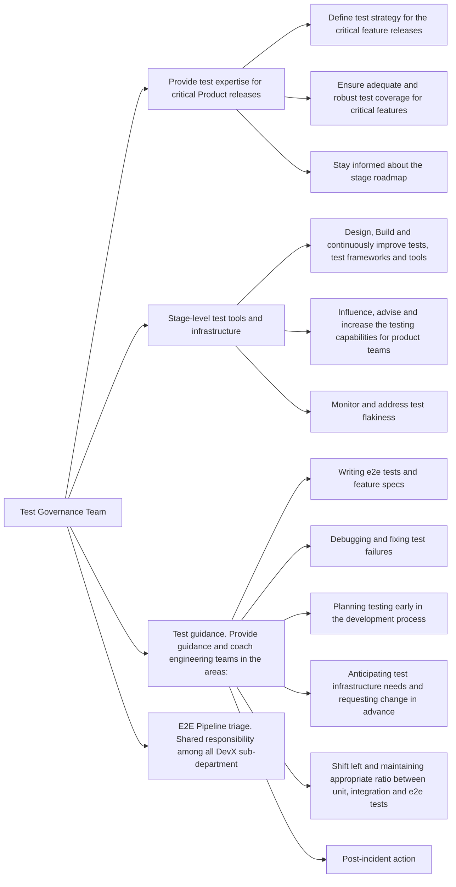

## Common Links

| **Category**            | **Handle**                                                                                     |
|-------------------------|------------------------------------------------------------------------------------------------|
| **GitLab Group Handle** | [`@gl-dx/test-governance`](https://gitlab.com/gl-dx/test-governance)                           |
| **Slack Channel**       | [`#g_test-governance`](https://gitlab.enterprise.slack.com/archives/C064M4S0FU5)               |
| **Slack Handle**        | `@dx-test-governance`                                                                     |
| **Team Boards**         |                                                                                                |
| **Issue Tracker**       | [`tracker`](https://gitlab.com/groups/gitlab-org/developer-experience/test-governance/-/issues) |
| **GitLab Repositories** | [test-governance](https://gitlab.com/gitlab-org/developer-experience/test-governance)          |

## Mission

Ensure highly effective testing across all teams by providing test frameworks and tools, optimizing configurations, and partnering with development teams to create and maintain comprehensive functional tests that prevent bugs from reaching customers.

## Vision

* Providing stable, repeatable, and fast test frameworks and configurations to catch bugs as early as possible
* Training to upskill teams on functional testing and quality. Every engineering team should know what to test, when, and how to contribute valuable tests to our test suites to maintain test coverage as the application grows
* Incident and bug analysis for GitLab.com and Dedicated - identifying test gaps and working with development teams to improve testing
* Effective quarantine process to quickly identify and isolate flaky tests for stage groups to fix or remove

## Team members



## Core Responsibilities

## Roadmap and themes

Test Governance Roadmap is based on commitments we do withing the current quarter and aligned with company goals. All Test Governance commitments are roughly divided into the following themes and sub-themes:

* Test Resilience
  * Stability. We ensure that quality processes are intuitive and test outcomes are predictable.
  * Speed. We make sure that functional testing frameworks are performing at desired speed and new tooling don't add to execution time.
* Test Observability
  * Track test levels. We ensure that functional test levels are tracked and respected.
  * Flakiness. We ensure that flaky tests detected and taken care of earlier.
  * Quarantine. We ensure that our test suite is healthy and consists of a high-value tests.
  * Coverage. We improve quality coverage by providing new and extending existing test automation frameworks to enable diverse testing types.
* Testing Knowledge base
  * We proved a comprehensive set of documentation, guidelines, how-tos and trainings to coach engineers on quality.
* Test Governance
  * We guarantee the quality of the end product by providing the right balance in test coverage; notify about feature changes to upstream teams; making sure that critical journeys are always tested thoroughly.
  * Strategy and tools. We evolve quality strategy to support organisational growth.
* Development Enablement
  * We provide helper tools to engineers to empower engineers with quality ownership.

Use [DevEx: Test Governance Issue](https://gitlab.com/groups/gitlab-org/quality/-/epics/116) to see the current Test Governance effort.

### Short-term commitments

Focus: Improve the quarantine process for flaky tests (FY26Q4 - FY27Q1)

* Quarantine Process and documentation updates
  * Provide clear guidance for engineering teams on how to work with quarantine and expected timelines
  * Describe the current implementation of the process
* Address Fast Quarantine Violations and Streamline process
  * Clean up Fast Quarantine
  * Support backports
* Address ownerless, shared tests and existing quarantine

### Mid-term commitments

Focus: Self-Healing tests (FY27Q1 - FY27Q2)

* This project will enable self-healing adaptive tests that can keep up with the latest code changes without manual routine work. We will introduce a system that will suggest fixes to existing tests on the MR level, flaky tests and quarantined tests.
* Build system that adapts automated tests to changes in the code
* Integrate self-healing tests with flaky tests and quarantine tests processes

### Working with us through request for help

The Test Governance group aims to better enable teams to apply the principle that [quality is everyone's responsibility](/handbook/engineering/development/principles/#quality).
Please request all support via the RFH process below. This will allow us to prioritize requests against our planned project roadmap.
Please use the following Request for Help process for all support requests.

#### Request for Help Process

1. Creates an issue in the [Request for Help](https://gitlab.com/gitlab-org/quality/test-governance/request-for-help#step-1-create-a-new-issue) project. Please complete all sections of the template so we can quickly triage your request
1. The Test Governance team will triage the request within a week, adding appropriate labels and assigning team members based on the request type and priority. You will recieve details about the prioritization and next steps on the request for help issue.

For more detailed guidance on E2E test coverage, consider these approaches:

* Engage with key DRIs to define [persona](/handbook/product/personas) use cases that illustrate how different customers will use new features
* Evaluate which parts of use cases can be covered by lower-level tests versus E2E tests, keeping the entire [testing pyramid](https://docs.gitlab.com/ee/development/testing_guide/testing_levels.html) in mind
* Refer to our documentation on [Testing Best Practices](https://docs.gitlab.com/development/testing_guide/end_to_end/best_practices) before submitting your request

<!--
## How we work
### Work related rituals
### Work management
#### Planning
-->

## Team meetings

Please refer to [Group Test Governance's processes](/handbook/engineering/infrastructure-platforms/developer-experience/test-governance/workflows/#processes-and-their-frequencies) for more details on the purposes of these meetings.

* **Team sync, knowledge sharing**: bi-weekly (2 sessions to cover all timezones)
* **Issues/Epics refinement**: weekly, alternating between sync (2 sessions to cover all timezones) and async
* **Quarterly planning**: once per quarter
* **Retrospective**: monthly but grouped by quarter
