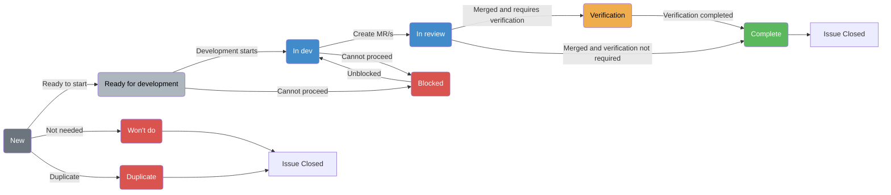

## About

The Cells Infrastructure team is responsible for developing key services and
components of the [Cells](/handbook/engineering/architecture/design-documents/cells/)
architecture. The team also collaborates closely with other
development teams on their contributions to Cells.

## Documentation Navigation

This page provides an overview of the Cells Infrastructure team. For specific workflows and processes, see:

- **[Decision-Making & Transparency Guidelines](process.md)** - How we make decisions and maintain transparency
- **[AI Prompts](ai-prompts.md)** - Library of AI prompts for common team workflows
- **[Tenant Scale project management guidance](../operating-system/project-management.md)**
- **[GitLab DRI Handbook](/handbook/people-group/directly-responsible-individuals/)**

### Team Members



### Contact

To get in touch with us, it's best to create an
[issue](https://gitlab.com/gitlab-com/gl-infra/tenant-scale/cells-infrastructure/team/-/issues/new)

For general questions around cells, feel free to use the Slack channel
[#f_protocells](https://gitlab.enterprise.slack.com/archives/C0609EXHX6F)

To contact the team use the Slack channel:
[#g_cells_infrastructure](https://gitlab.enterprise.slack.com/archives/C07URAK4J59)

## How We Work

### Project Management

[Follows Tenant Scale project management guidance](../operating-system/project-management.md) with one exception: **uses [issue status](https://docs.gitlab.com/user/work_items/status/) instead of workflow labels**. Note that we still require labels to be set at the epic level.

#### DRI & Supporting contributors

The [DRI](/handbook/people-group/directly-responsible-individuals/) of an epic
will be responsible for
[making decisions](/handbook/leadership/making-decisions/#making-decisions)
regarding technical direction of a project. Making a decision will involve
creating proposals and gathering feedback from peers and the Engineering
Manager. It also involves reaching out and collaborating with stakeholders
external to the team when applicable.

For detailed guidance on decision-making authority and transparency practices, see our [Decision-Making & Transparency Guidelines](process.md).

The DRI is also responsible for project management, which means keeping the epic
up to date with relevant issues, removing issues that are no longer relevant,
and writing weekly updates in the automatically generated comment in the epic.

#### Issue Tracking

The Cells Infrastructure team adheres to these core principles:

1. **Assign only actively in-progress issues**. Issues that aren't being worked
   on should remain unassigned.
1. **Apply mandatory labels**. Every issue must include:
   - `group::cells infrastructure`
   - `section::tenant scale`
   - `Category:Cell`
   - `devops::runtime`
1. **Add service-specific labels as needed**. If an issue pertains to a
   particular service (e.g., the Topology Service), tag it accordingly—e.g.,
   `Service::Topology Service`.

The Cells Infrastructure team works across multiple GitLab projects such as
`gitlab-org/gitlab`, `gitlab-org/cells/http-router` and
`gitlab-org/cells/topology-service`. By default, you should open
issues that will be owned by the team under the
[Cells Infrastructure Team Issue Tracker](https://gitlab.com/gitlab-com/gl-infra/tenant-scale/cells-infrastructure/team/-/issues)
and apply the `group::cells infrastructure` label. Move issues for the Cells
Infrastructure team from other projects to the team issue tracker when
appropriate.

For issues in the team's issue tracker or other `gitlab-com/gl-infra` projects, we use GitLab's built-in issue status feature to track workflow status. Ensure that all issues that are in progress, ready, or need triage have the relevant status applied.

We track these issues using workflow issue boards:

- [`gitlab-com/gl-infra` projects](https://gitlab.com/gitlab-com/gl-infra/tenant-scale/cells-infrastructure/team/-/boards/9605325)
- [`gitlab-org` group issues](https://gitlab.com/groups/gitlab-org/-/boards/9762600)

For new issues in `gitlab-org`, mention @daveyleach using `/cc @daveyleach`.

#### Issue Descriptions

All issues need to include a description of the work, any identified
`action items` or `exit criteria`. When decisions are made regarding
implementation details that change the initial description, update the
description (and issue title if necessary) so that it always accurately reflects
what the issue is implementing or achieving. The issue can also be evaluated
by a peer as "Ready for development" to ensure enough context has been provided.
For help creating issues, refer to the available templates

- [General issue template](https://gitlab.com/gitlab-com/gl-infra/tenant-scale/cells-infrastructure/team/-/blob/main/.gitlab/issue_templates/issue.md?plain=1)
- [Discussion issue template](https://gitlab.com/gitlab-com/gl-infra/tenant-scale/cells-infrastructure/team/-/blob/main/.gitlab/issue_templates/disscussion.md?plain=1)

For help with issue creation and evaluation, see our [AI Prompts](ai-prompts.md) including the Issue Readiness and Issue Summary prompts.

We also have a duo agent called *Cells-project-issue-creator* which can be used

- Navigate to [cells infrastructure](https://gitlab.com/gitlab-com/gl-infra/tenant-scale/cells-infrastructure/team) project
- [Select the Cells-project-issue-creator agent](https://docs.gitlab.com/user/gitlab_duo_chat/agentic_chat/#select-an-agent)
- Describe the issue you want created and it will create an issue using the template

#### Issue Status Reference

| Status | Description | When to Use |
|--------|-------------|-------------|
| **New** | Initial state for newly created issues | When first creating an issue |
| **Ready for development** | Issue is ready to be worked on | When all planning is complete and work can begin (consider peer review if unsure of readiness) |
| **In dev** | Active development is in progress | When a developer is actively working on the issue or MR related to the issue |
| **In review** | Issues merge requests are under review | When all active MRs relating to the issue are awaiting peer review |
| **Blocked** | Work cannot proceed due to dependencies | When external dependencies or other issues prevent progress |
| **Complete** | Work is finished and verified | When the issue is fully implemented, tested, and meets exit criteria |
| **Won't do** | Issue is being closed without completion | When the issue is no longer applicable or deprioritized |
| **Duplicate** | Issue is a duplicate of another issue | When the issue is a duplicate of another issue |
| **Verification** | Validation is required before completion| Development is complete but needs validation in test and production environments |

### Development Workflow

As owners of the issues assigned to them, engineers are expected to keep the
status of their issues up to date. When an engineer starts working an issue,
they mark it with the "In Dev" status as the starting point and continue
updating the issue throughout development. As we're also required to update
epics for the grand review weekly by Wednesday, the owners of the issue are
also expected to provide any relevant updates to the issue they're working on if
they're not also the DRI of the epic it belongs to. You can use the duo prompt
for [Issue Update](ai-prompts.md)

The process primarily follows this diagram:

#### Code Reviews

Code reviews follow the standard guidelines outlined in this
[acceptance checklist](https://docs.gitlab.com/development/code_review/#acceptance-checklist)

#### Maintainers

To become a maintainer of a cells infrastructure owned project, create an issue using the [maintainer template](https://gitlab.com/gitlab-com/gl-infra/tenant-scale/cells-infrastructure/team/-/issues/new?issuable_template=maintainer)

### Team Meetings

Each week the Cells Infrastructure meets for one hour on Tuesdays - alternating
between APAC/EMEA 0700UTC and EMEA/AMER 1100UTC friendly time zones. The intent of this meeting is:

- Demos
- Review any technical decisions, blockers, etc. as a team to get feedback.
- Share information that the team should know
- Team discussions (process, roadmaps/upcoming work, company items, etc.)

For generating weekly status reports and epic summaries for these meetings, see the [AI Prompts](ai-prompts.md) for Weekly Epic Summaries.

### Geekbot/Status Updates

We use an integration with Slack, Geekbot, to provide updates on work in
progress. Each Monday Geekbot will ask team members for an update
and post via Slack.

### Manager Responsibilities

Each week the EM will review the issue boards. The intent of the review is to:

- Ensure that issues have the appropriate status set.
- Check on the status of in progress, blocked, and in review issues.
- Ensure that there are refined issues ready to be worked on. Refined issues are
  weighted, have sufficient context in the description, and have the **Ready for
  development** status indicating that it is ready to be worked on.
- Check that issues are aligned to our roadmap and status updates on relevant
  epics.

## Resources

- Slack:
  - [#g_cells_infrastructure](https://gitlab.enterprise.slack.com/archives/C07URAK4J59)
  - [#f_protocells](https://gitlab.enterprise.slack.com/archives/C0609EXHX6F)
  - [#g_cells_infrastructure_standup](https://gitlab.enterprise.slack.com/archives/C07UWPM2Y0P)
- [Cells Infrastructure Team Issue Tracker](https://gitlab.com/gitlab-com/gl-infra/tenant-scale/cells-infrastructure/team/-/issues)
- [Team Member Assigned Issues Board - Useful for looking at in flight workload by member](https://gitlab.com/groups/gitlab-com/-/boards/8981056)
- [Workflow Board](https://gitlab.com/gitlab-com/gl-infra/tenant-scale/cells-infrastructure/team/-/boards/9605325)
- [GitLab Org Workflow Board](https://gitlab.com/groups/gitlab-org/-/boards/9762600)

## Related Documentation

### Team Process & Guidelines

- **[Decision-Making & Transparency Guidelines](process.md)** - Guide on how we make decisions, escalation paths, and documentation principles
- **[AI Prompts](ai-prompts.md)** - Collection of AI prompts for issue management, code reviews, testing, and status reporting
