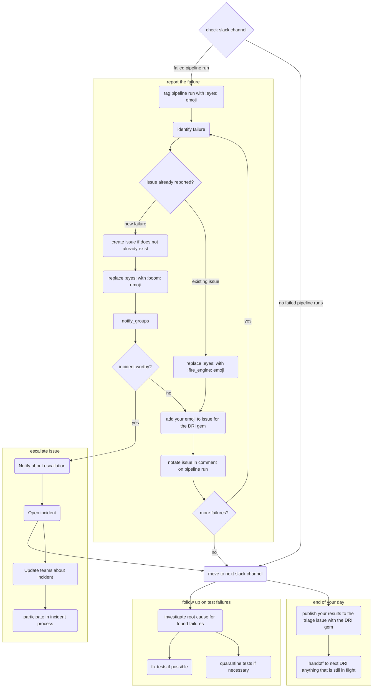

## Overview

These guidelines gives GitLab team members on pipeline triage an idea on the priorities and processes that come with this responsibility. This builds from the information provided in [On-Call Rotation](oncall-rotation.md).

This guide is an extension of the [Broken `master`](/handbook/engineering/workflow/#broken-master) engineering workflow and is intended to provide a more specific guide on how to triage end-to-end test pipeline failures. As a [first step to identifying and resolving a broken master incident, please follow the steps in the broken master process.](../workflow/#broken-master-escalation)

The Pipeline triage [DRI](/handbook/people-group/directly-responsible-individuals/) is responsible for analyzing and debugging test pipeline failures. Please refer to the [DRI weekly rotation schedule](oncall-rotation#schedule) to know who the current DRIs are.

NOTE:
For information regarding debugging test pipeline failures, check out [Debugging Failing E2E Tests and Test Pipelines](https://docs.gitlab.com/development/testing_guide/end_to_end/debugging_end_to_end_test_failures/)

## General guidelines

1. **Investigate or fix failing update path QA in [monthly](https://gitlab.com/gitlab-org/release-tools/-/blob/80d9e08d7ffd99546e810911a31fb46934097880/.gitlab/ci/monthly/update-paths-ci.yml#L43) and [patch](https://gitlab.com/gitlab-org/release-tools/-/blob/80d9e08d7ffd99546e810911a31fb46934097880/.gitlab/ci/security/update-paths-ci.yml#L43) release pipelines**, coordinate with [Release Managers](/handbook/engineering/deployments-and-releases/#release-managers) as needed on fixes.
1. **Investigate or [fix failing pipelines for Release Environments](https://gitlab.com/gitlab-com/gl-infra/release-environments/-/pipelines?page=1&scope=all&source=pipeline&ref=main&status=failed)**, coordinate with [Release Managers](/handbook/engineering/deployments-and-releases/#release-managers) as needed on fixes.
1. **Fix tests failing in `master` before other development work**: [Failing tests on `master` are treated as the highest priority](/handbook/engineering/workflow/#broken-master) relative to other development work, e.g., new features. Note that for pipeline triage DRIs, [triage and reporting](#report-the-failure) takes priority over fixing tests.
1. **Investigate or [fix failing pipelines for Release Environments](https://gitlab.com/gitlab-com/gl-infra/release-environments/-/pipelines?page=1&scope=all&source=pipeline&ref=main&status=failed)**, coordinate with [Release Managers](/handbook/engineering/deployments-and-releases/#release-managers) as needed on fixes.
1. **Follow the [pipeline triage guidelines](#how-to-triage-a-qa-test-pipeline-failure) for investigating, reporting, and resolving test failures**
1. **Flaky tests are quarantined until proven stable**: A flaky test is as bad as no tests or in some cases worse due to the effort required to fix or even re-write the test. As soon as it is detected, it is quarantined immediately to stabilize CI, fixed as soon as possible, and monitored until it is fixed.
1. **Close test failure issue (e.g example [issue](https://gitlab.com/gitlab-org/gitlab/-/issues/412769)) when the test is moved out of quarantine**: Quarantine issues should not be closed unless tests are moved out of quarantine.
1. **Quarantine issues should be assigned and scheduled**: To ensure that someone is owning the issue, it should be assigned with a milestone set and have appropriate `~"quarantine"`, quarantine with type (e.g. `~"quarantine::bug"`) and failure with type (e.g. `~"failure::bug"`) labels.
1. **Make relevant stage group aware**: When a test fails no matter the reason, an issue with related product group label (e.g. `~"group::ide"`) should be created and made known to the relevant product stage group as soon as possible.
  In addition to notifying that a test in their domain fails, enlist help from the group as necessary.
1. **Failure due to bug**: If one or multiple test failure(s) is a result of a bug, create a bug issue and provide as much details as possible (e.g. using issue's Bug template, provide steps to reproduce, relevant screenshots, etc.). Link the **all** related test failure issues to the bug issue. Apply `~"type::bug"`, severity, priority, product group, feature category, etc. labels to ensure a fix is scheduled in a timely manner.
  Test failure issues are used for tracking and investigating purposes, they should not have `~"type::bug"` label. If the test failure is a result of a bug, apply `~"failure::bug"` label instead.
1. **Everyone can fix a test, the responsibility falls on the last who worked on it**: Anyone can fix a failing/flaky test, but to ensure that a quarantined test isn't ignored,
  the last engineer who worked on the test is responsible for taking it out of [quarantine](https://gitlab.com/gitlab-org/gitlab/blob/master/qa/README.md#quarantined-tests).

## Triage flow

The flow of triaging the pipelines as a decision tree (nodes link to the relevant sections of the handbook)

## How to triage a QA test pipeline failure

The general triage steps are:

- [Report the failure](#report-the-failure)
- [Review the failure logs](#review-the-failure-logs)
- [Investigate the root cause](#investigate-the-root-cause)
- [Classify and triage the test failure](#classify-and-triage-the-test-failure)
- [Notify relevant groups about the failure](#notify-relevant-groups-about-the-failure)

After triaging failed tests, possible follow up actions are:

- [Fixing tests](#fixing-the-test)
- [Quarantining tests](test-governance/detailed-quarantine-process.md)
- [Dequarantining tests](test-governance/detailed-quarantine-process.md#dequarantine-a-test)

### Report the failure

For scheduled pipelines, test failures will be created and updated in the [Test Failure Issues](https://gitlab.com/gitlab-org/quality/test-failure-issues) project.

Your priority is to make sure we have an issue for each failure, and to communicate the status of its investigation and resolution. When there are multiple failures to report, consider their impact when deciding which to report first. See the [pipeline triage responsibilities](/handbook/engineering/testing/oncall-rotation/#responsibility) for further guidance.

If there are multiple failures we recommend that you identify whether each one is new or old (and therefore already has an issue open for it). For each new failure, open an issue that includes only the required information. Once you have opened an issue for each new failure you can investigate each more thoroughly and act on them appropriately, as described in later sections.

The reason for reporting all new failures first is to allow faster discovery by engineers who might find the test failing in their own merge request test pipeline. If there is no open issue about that failure, the engineer will have to spend time trying to figure out if their changes caused it.

Known failures should be linked to the current [pipeline triage report](https://gitlab.com/gitlab-org/quality/pipeline-triage/-/issues).
This can be performed by the [DRI gem](https://gitlab.com/gitlab-org/ruby/gems/dri) (a tool that automates linking issues to pipeline triage reports) by labelling with your profile emoji.

However, be aware that issues can be opened by anyone and are not created automatically.

1. Search for existing issues that have already been created with the `failure::*` label. By order of likelihood:
    1. [`failure::investigating`](https://gitlab.com/gitlab-org/gitlab/-/issues?scope=all&utf8=%E2%9C%93&state=opened&label_name%5B%5D=failure%3A%3Ainvestigating)
    1. [`failure::test-environment`](https://gitlab.com/gitlab-org/gitlab/-/issues?scope=all&utf8=%E2%9C%93&state=opened&label_name%5B%5D=failure%3A%3Atest-environment)
    1. [`failure::broken-test`](https://gitlab.com/gitlab-org/gitlab/-/issues?scope=all&utf8=%E2%9C%93&state=opened&label_name%5B%5D=failure%3A%3Abroken-test)
    1. [`failure::flaky-test`](https://gitlab.com/gitlab-org/gitlab/-/issues?scope=all&utf8=%E2%9C%93&state=opened&label_name%5B%5D=failure%3A%3Aflaky-test)
    1. [`failure::stale-test`](https://gitlab.com/gitlab-org/gitlab/-/issues?scope=all&utf8=%E2%9C%93&state=opened&label_name%5B%5D=failure%3A%3Astale-test)
    1. [`failure::bug`](https://gitlab.com/gitlab-org/gitlab/-/issues?scope=all&utf8=%E2%9C%93&state=opened&label_name%5B%5D=failure%3A%3Abug)
    1. [`failure::external-dependency`](https://gitlab.com/gitlab-org/gitlab/-/issues/?sort=created_date&state=opened&label_name%5B%5D=failure%3A%3Aexternal-dependency)
1. If the issue has already been reported please use the existing issue to track the latest status.
1. If there is no existing issue for the failure, please [create an issue](#create-an-issue) using one of [classification labels](#classify-and-triage-the-test-failure) via the steps below.

{}In the relevant Slack channel:

1. Apply the :eyes: emoji to indicate that you're investigating the failure(s).
1. If there's a system failure (e.g., Docker or runner failure), retry the job and apply the :retry: emoji. Read below for examples of system failures.
1. If an issue exists, add a :fire_engine: emoji. It can be helpful to reply to the failure notification with a link to the issue(s), but this isn't always necessary, especially if the failures are the same as in the previous pipeline and there are links there.
1. If it is a new failure issue, add a :boom: emoji.

Checkout the list of [Slack channels](/handbook/engineering/infrastructure-platforms/developer-experience/onboarding/#slack-channels) for the pipeline-related channels.

#### Create an issue

Please use this step if there are no issues created to capture the failure. If there is already an issue please skip this step.

1. Create an issue for the test or system failure (if retrying the job does not resolve the latter) in [https://gitlab.com/gitlab-org/gitlab/issues](https://gitlab.com/gitlab-org/gitlab/issues) using the [QA failure](https://gitlab.com/gitlab-org/gitlab/issues/new?issuable_template=QA%20Failure) template. For failures in CustomersDot tests, open an issue in [CustomersDot](https://gitlab.com/gitlab-org/customers-gitlab-com/-/issues) project.
    - Apply the `~"type::ignore"` label to the issue until the investigation is complete and an [issue type](/handbook/product/groups/product-analysis/engineering/metrics/#work-type-classification) is determined.
    - Inform the counterpart SET about the failure.
    - For system failures, it may make sense to open an issue in a different project such as [Omnibus GitLab](https://gitlab.com/gitlab-org/omnibus-gitlab/issues), [GitLab QA](https://gitlab.com/gitlab-org/gitlab-qa/issues), or [GitLab Runner](https://gitlab.com/gitlab-org/gitlab-runner/issues).
    - For staging environment-related failures, you can post a question in [`#infrastructure-lounge`](https://gitlab.slack.com/archives/CB3LSMEJV), or open an issue in the [infrastructure project](https://gitlab.com/gitlab-com/gl-infra/infrastructure)
    - Ask for help in [`#s_developer_experience`](https://gitlab.slack.com/archives/C3JJET4Q6) if you're unsure where to file the issue.
1. In the relevant Slack channel, add the :boom: emoji and reply to the failure notification with a link to the issue.
1. Add the issue as a related issue to the current pipeline triage report. If multiple issues are the result of 1 bug, add the bug issue to the report instead.

### Review the failure logs

The aim of this step is to understand the failure. The results of the investigation will also let you know what to do about the failure. Update the failure issue with any findings from your review. For more information about the failure logs, check out [Debugging Failing Tests and Test Pipelines](https://docs.gitlab.com/development/testing_guide/end_to_end/debugging_end_to_end_test_failures/#test-failure-logs)

### Investigate the root cause

Depending on your level of context for the test and its associated setup, you might feel comfortable investigating the root cause on your own, or you might get help from other SETs right away.

When investigating on your own, we suggest spending at most 20-30 minutes actively trying to find the root cause (this excludes time spent reporting the failure, reviewing the failure logs, or any test setup and pipeline execution time). After that point, or whenever you feel out of ideas, we recommend asking for help to unblock you.

**Note:** Please avoid logging in via `gitlab-qa` and all the other bot accounts on Canary/Production. They are monitored by [SIRT](/handbook/security/security-operations/sirt/) and will raise an alert if someone uses them to log in. If it is really needed to log in with these accounts, please give a quick heads-up in [#security-division](https://gitlab.slack.com/archives/CM74JMLTU) that someone is logging into the bot and tag `@sirt-members` for awareness.

Below is the list of the common root causes in descending order of likelihood:

1. Code changes: Check if the new code was deployed to the environment.
    - Find the diff between current and previous GitLab versions using this example `https://gitlab.com/gitlab-org/security/gitlab/-/compare/start_commit_sha...end_commit_sha` to see if there was a change that could have affected the test.
2. Feature Flag: Check if a new feature flag is enabled in the environment.
    - When a feature flag is enabled, it's being reported to specific QA pipeline Slack channel. This also triggers a Full QA job and it may help to identify which specific feature flag caused the failure.
    - A list of logs containing details on both recent and historic feature flag changes can also be viewed by visiting the [feature-flag-log](https://gitlab.com/gitlab-com/gl-infra/feature-flag-log) project. Each time a feature flag is updated, a new issue is generated in the project with helpful information such as when the feature flag was changed, who performed the update and on which environment. The project contains several `host` labels that can help filter by environment when searching through issues (ex: `~host::staging.gitlab.com`)
        - You can also reference this [dashboard](https://samdbeckham.gitlab.io/feature-flags) for a visual representation of feature flag statuses.
3. Environment / Infrastructure: If there were no code or feature flag changes and the environment has flaky errors, first start with analyzing [Sentry errors and Kibana logs](#review-the-failure-logs) to further investigate the issue.
    - Review the `#incidents-dotcom` channel to check if any ongoing incidents may be contributing to the failures.
    - If [`validate_canary!` check](https://gitlab.com/gitlab-org/gitlab/-/blob/4aa6dde8a375be69b3b1d0d2e2330c7885cbeb54/qa/qa/runtime/canary.rb#L8) is failing, check if [canary is not disabled on the environment](https://gitlab.com/gitlab-org/release/docs/blob/master/general/deploy/canary.md#canary-chatops) by running
      `/chatops run canary --production` on [#production](https://gitlab.slack.com/archives/production) or `/chatops run canary --staging` on [#staging](https://gitlab.slack.com/archives/staging) Slack channels. If canary is enabled, each server should report a few connections `UP`.
      There is [known intermittent issue](https://gitlab.com/gitlab-org/gitlab/-/issues/431847) with the traffic not getting directed to canary even though the `gitlab_canary=true` cookie is set.
    - GitLab's [Tamland](https://gitlab-com.gitlab.io/gl-infra/tamland/intro.html) may also be a helpful resource to review. Tamland is used to help forecast the utilization and saturation of various services, such as Sidekiq. For example, if high saturation is predicted, this could surface as flaky behavior in our tests due to performance degradation from that service. More information about Tamland can be found [here](/handbook/engineering/infrastructure-platforms/capacity-planning/#forecasting-with-tamland).
    - You may also reach out to the Infrastructure team at `#infrastructure-lounge` and ask if something was changed recently on the environment in question.
4. Test Data: Check that test data is valid. Live environments like Staging and Production rely on pre-existing data (QA users, access tokens).
5. New GitLab QA version: Check if a new [GitLab QA version](https://gitlab.com/gitlab-org/gitlab-qa/-/tags?sort=updated_desc) was released.

Failure examples can be seen in [Training Videos](#training-videos).

### Classify and triage the test failure

The aim of this step is to categorize the failure as either a stale test, a bug in the test, a bug in the application code, or a flaky test.

We use the following labels to capture the cause of the failure.

- `~"failure::investigating"`: Default label to apply at the start of investigation.
- `~"failure::stale-test"`: [Stale test due to application change](#stale-test-due-to-application-change)
- `~"failure::broken-test"`: [Bug in the test](#bug-in-the-test)
- `~"failure::flaky-test"`: [Flaky test](#flaky-test)
- `~"failure::test-environment"`: [Failure due to test environment](#failure-due-to-test-environment)
- `~"failure::bug"`: [Bug in the application](#bug-in-the-application)
- `~"failure::external-dependency"`: [Failure due to an external dependency](#failure-due-to-external-dependency)

Bugs blocking end-to-end test execution (due to the resulting quarantined tests) should additionally have severity and priority labels. For guidelines about which to choose, please see the [blocked tests section of the issue triage page](/handbook/product-development/how-we-work/issue-triage/#blocked-tests).

**Note**: It might take a while for a fix to propagate to all environments. Be aware that a new failure could be related
to a recently-merged fix that hasn't made it to the relevant environment yet. Similarly, if a known failure occurs but
the test should pass because a fix has been merged, verify that the fix has been deployed to the relevant environment
before attempting to troubleshoot further.

#### Stale test due to application change

The failure was caused by a change in the application code and the test needs to be updated.

- Include your findings in a note in the issue about the failure.
- Apply the `~"failure::stale-test"` label.
- If possible, mention the merge request which caused the test to break, to keep the corresponding engineer informed.

See [Quarantining Tests](#quarantining-tests)

#### Bug in the test

The failure was caused by a bug in the test code itself, not in the application code.

- Include your findings in a note in the issue about the failure.
- Apply the `~"failure::broken-test"` label.

See [Quarantining Tests](#quarantining-tests)

#### Bug in the application

The failure was caused by a bug in the application code.

- Apply `~"failure::bug"` label to the test failure issue(s).
- Create a new issue link all related test failure issue(s) to this issue.
- Include your findings in a note in the bug issue about the failure.
- Add the steps to reproduce the bug and expected/actual behavior.
- Apply the `~"type::bug"` label, and cc-ing the corresponding Engineering Managers (EM), QEM, and SET.
- Apply the `~"found by e2e test"` label to the bug issue (or bug fix MR if it is fixed immediately) to indicate the bug was found by the end-to-end test execution.
- If the problem adheres to the definition of a [transient bug](/handbook/product-development/how-we-work/issue-triage/#transient-bugs), apply the ~"bug::transient" label as well.
- If there is an issue open already for the bug, use this issue instead and apply the above steps.
- Communicate the issue in the corresponding Slack channels.
- [Quarantine](test-governance/detailed-quarantine-process.md) the test right after the bug issue has been created. Leave a note on the bug issue with the link to the quarantined test and mention that it should be un-quarantined with the fix.
- When the reason for quarantining a test is because of a low severity bug in the code which will not be fixed in the upcoming couple of releases, add the `~"quarantine"` , quarantine with type and `~"failure::bug"` labels to the test failure issue(s).
- When the bug is fixed, the related quarantined tests should be unquarantined and verified as well. The bug issue and all related test failure issues should be closed out together.

**Note**: GitLab maintains a [daily deployment cadence](https://gitlab.com/gitlab-com/gl-infra/delivery/-/issues/880) so a breaking change in `master` reaches Canary and Production fast. Please communicate broadly to ensure that the corresponding [Product Group](/handbook/product/categories/#devops-stages) is aware of the regression and action is required. If the bug is [qualified for dev escalation](/handbook/engineering/development/processes/infra-dev-escalation/process/#scope-of-process) (example: `priority::1/severity::1` issue that blocks the deployment process), consider involving [On-call Engineers](/handbook/engineering/development/processes/infra-dev-escalation/process/) in the [`#dev-escalation`](https://gitlab.slack.com/archives/CLKLMSUR4) channel. To find out who's on-call follow the links in the channel subject line.

To find the appropriate team member to cc, please refer to the [Organizational Chart](https://comp-calculator.gitlab.net/org_chart).

See [Quarantining Tests](#quarantining-tests)

#### Flaky Test

**Read more**:

- [What is a flaky test?](https://docs.gitlab.com/ee/development/testing_guide/unhealthy_tests.html#whats-a-flaky-test)
- [What are the potential causes for a test to be flaky?](https://docs.gitlab.com/ee/development/testing_guide/unhealthy_tests.html#what-are-the-potential-cause-for-a-test-to-be-flaky)

**Process**

- Include your findings in a note in the failure issue.
- Apply the `~"failure::flaky-test"` label to the failure issue.
- Apply a `~"flaky-test::*"` [scoped label](https://gitlab.com/groups/gitlab-org/-/labels?subscribed=&sort=relevance&search=flaky-test::) to the failure issue.

Flakiness can be caused by a myriad of problems. Examples of underlying problems
that have caused us flakiness include:

- Not waiting appropriately for pages to load or transitions from one state to another to complete.
- Animations preventing tests from interacting with elements.
- Non-independent tests (i.e. test A passes when run first, but fails otherwise).
- Actions not completing successfully (e.g. logging out).

For more details, see the list with example issues in our
[unhealthy tests](https://docs.gitlab.com/ee/development/testing_guide/unhealthy_tests.html) documentation.

See [Quarantine Process - Quick Reference](quarantine-process.md)

For detailed quarantine workflows, see the [Detailed Quarantine Process](test-governance/detailed-quarantine-process.md)

#### Failure due to test environment

The failure is due external factors outside the scope of the test but within a test environment under GitLab's control. This could be due to environments, deployment hang-ups, or upstream dependencies within GitLab's control.

- Include your findings in a note in the issue about the failure.
- Apply the `~"failure::test-environment"` label.
- Identify the general category of improvement and add the failure issue to the approprite `Test Reliability` issue listed within the [Improve test environment reliability and reduce flaky/transient test failures](https://gitlab.com/gitlab-org/quality/team-tasks/-/issues/1309) tracking issue.

A job may fail due to infrastructure or orchestration issues that are not related to any specific test. In some cases these issues will fail a job before tests are ever executed. Some examples of non-test related failures include:

- Failed to download container from GitLab Container Registry
- Failed to complete orchestration of a Geo cluster
- CI runner timeouts
- 500 error while uploading job artifacts
- Expired tokens (For more information, check out how to [Rotate Credentials](https://internal.gitlab.com/handbook/engineering/infrastructure/engineering-productivity/rotating-credentials/))

#### Failure due to external dependency

The failure is due to an external dependency the test is reliant on, but is outside of GitLab's control. This could be due to outages in external package management systems, or outages in third-party integrations. If possible, external dependencies should be avoided to increase the reliability of the test suite.

- Include your findings in a note in the issue about the failure.
- Apply the `~"failure::external-dependency"` label.
- Include a link to the external dependency's outage notice, if available.

Some examples of external dependency failures could include:

- Outages in package or container management systems such as registry.npmjs.org, RubyGems.org, NuGet or dockerhub
- Outages in third-party integrations such as Zuora

### Notify relevant groups about the failure

#### Failure needs escalation

If the failure is in a `smoke` test, it will block deployments. Please inform the release managers of the root cause and if a fix is in progress by Quality. On GitLab.com, you can use `@gitlab-org/release/managers`. In Slack, you can use `@release-managers`.

If the failure could affect the performance of `GitLab.com` production, or make it unavailable to a specific group of users, you can [declare an incident](/handbook/engineering/infrastructure/incident-management/#reporting-an-incident) with `/incident declare` in the `#production` Slack channel, this will automatically prevent deployments (if the incident is at least an S2).

#### Notify group in all cases

Please also raise awareness by looping in the appropriate team members from the product group, such as SET or EM. The SET/EM can be identified by looking for who is assigned to that [stage/group](/handbook/product/categories/#devops-stages). Many tests are tagged with a `product_group` which will help with identification. You may also want to post in Quality's Slack channel `#quality` depending on the impact of the failure.

## Following up on test failures

### Fixing the test

If you've found that the test is the cause of the failure (either because the application code was changed or there's a bug in the test itself), it will need to be fixed. This might be done by another SET or by yourself. However, it should be fixed as soon as possible. In any case, the steps to follow are as follows:

- Create a merge request (MR) with the fix for the test failure.
- Apply the ~"Pick into auto-deploy", ~"priority::1", and ~"severity::1" labels if the fix is urgent and required to unblock deployments.

If the test was flaky:

- Confirm that the test is stable by ensuring it passes 3 to 5 times while in quarantine.

> **Note** The number of passes needed to be sure a test is stable is just a suggestion.
> You can use your judgement to pick a different threshold.

If the test was in quarantine, [remove it from quarantine](#dequarantining-tests).

### Quarantining Tests

See [Quarantine Process - Quick Reference](quarantine-process.md)

For detailed quarantine workflows, see the [Detailed Quarantine Process](test-governance/detailed-quarantine-process.md)

### Dequarantining Tests

Please see the Dequarantine section in [Quarantine Process](test-governance/detailed-quarantine-process.md#dequarantine-a-test)

## Training videos

These videos walking through the triage process were recorded and uploaded to the [GitLab Unfiltered](https://www.youtube.com/channel/UCMtZ0sc1HHNtGGWZFDRTh5A) YouTube channel.

- [Quality Team: Failure Triage Training - Part 1](https://www.youtube.com/watch?v=Fx1DeWoTG4M)
  - Covers the basics of investigating pipeline failures locally.
- [Quality Team: Failure Triage Training - Part 2](https://www.youtube.com/watch?v=WeQb8GEw6PM)
  - Continued discussion with a focus on using Docker containers that were used in the pipeline that failed.
- [Quality Engineering On-call Rotation and Debugging QA failures](https://youtu.be/zdIEbl_DPHA) ([private video](/handbook/marketing/marketing-operations/youtube/#unable-to-view-a-video-on-youtube) on GitLab Unfiltered)
  - Overview of QE on-call rotation process, GitLab deployment process and how to debug failed E2E specs with examples.
- [Quality Engineering: Test environments show and tell](https://drive.google.com/file/d/1m3f5Vz-KSRu7SfNmdDjTQsU5kMDpPwDJ/view)
  - A show and tell presentation that gives an overview of our test environments. Originally presented for an audience of our counterparts.
- [Runner Taskscaler and Fleeting Test Plan Discussion](https://www.youtube.com/watch?v=_uuy7KCDgWw)
  - A high level discussion on the new runner architecture, including the new [taskscaler](https://gitlab.com/gitlab-org/fleeting/taskscaler) and [fleeting](https://gitlab.com/gitlab-org/fleeting/fleeting), the components replacing docker-machine for [runner autoscaling](https://docs.gitlab.com/runner/runner_autoscale/).
