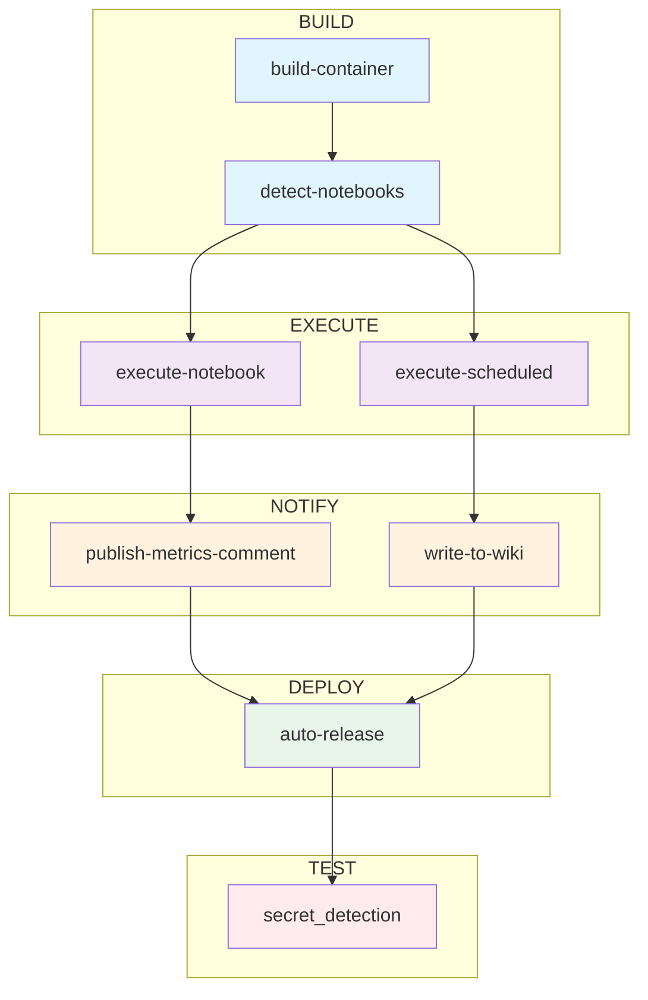

---

## Our Approach to Using CI/CD For Machine Learning

When it comes to model training, inference, and deployment, there are trade-offs to using your local machine vs. CI. Our approach is flexible to allow users to do both.

- When executing model training or inference on your local machine, users will be able to:
  - Execute training or inference code using local resources and python builds specific to the machine
  - Log, view, and retrieve experiments in your preferred experiment tracker
  - Upload and download model artifacts to your preferred model/package registry

- When executing model training or inference remotely using GitLab CI/CD, users will be able to:
  - Select CPU or GPU runners based on the size and needs of the model
  - Automatically detect and rebuild the model container based on changes to **Dockerfile** or **requirements.txt**
  - Use different containers for different models in development, staging, and production
  - Log, view, and retrieve experiments in your preferred experiment tracker
  - Upload and download model artifacts from your model registry
  - Automatically report model metrics and performance in the merge request for review by others.
  - Notebooks automatically run when modified
    - Manual overrides: In the commit message, use `[run path/to/notebook.ipynb]` to force-run specific notebooks or `[skip run]` to prevent execution
    - Sequential execution: Multiple notebooks changed in one commit run automatically in sequence
  - Allow training and inference CI pipelines to run at set dates and times using [Scheduled pipelines](https://docs.gitlab.com/ee/ci/pipelines/schedules.html)
  - Log results to [Project wiki](https://docs.gitlab.com/ee/user/project/wiki/)
  - Use [GitLab for Slack](https://docs.gitlab.com/ee/user/project/integrations/gitlab_slack_application.html) integration to monitor pipeline status

### Advantages of Using CI for Training Data Science Models

- Reproducibility
- Automation
- Speed
- Separate development, staging, and production environments
- Logging results directly to Merge Request and Project Wiki
- Scalable GPU and CPU resources
- Scheduling
- Slack notifications for monitoring CI pipelines

## Getting Started

This section covers, in detail, the mechanisms behind how these pipelines are created and configured. **If you are just interested in getting your machine learning CI training pipeline up and running, skip directly to the [Model Training Step-by-Step Instructions](/handbook/enterprise-data/platform/ci-for-ds-pipelines#model-training-step-by-step-instructions)**

**If you are just interested in getting your machine learning inference pipeline up and running, skip directly to the [Inference and Deployment Step-by-Step Instructions](/handbook/enterprise-data/platform/ci-for-ds-pipelines#inference-and-deployment-step-by-step-instructions)**

### Key Repository Files

Within our public **[GitLab Data Science CI Example](https://gitlab.com/gitlab-data/data-science-ci-example)** repository are the following key files:

- **.gitlab-ci.yml**: This is the CI/CD configuration file that defines the jobs that will be run for each pipeline. The actual pipelines are pulled from the [CI/CD Component Catalog](https://gitlab.com/explore/catalog/gitlab-data/ds-component-pipeline), with only the variables that need specified are set in this .yml.
- **Dockerfile**: Instructions for creating the docker image used in the Container Registry. Here we are using python 3.9 running on Ubuntu 22.04 with CUDA drivers for GPU
- **requirements.txt**: The python packages to install in the container
- **training_config.yaml**: Configuration for training notebook
- **inference_config.yaml**: Configuration for inference notebook
- **notebooks/training_example.ipynb**: training notebook used for this example
- **notebooks/inference_example.ipynb**: inference code notebook used for this example
- **xgb_model.json**: The saved model from training that will be used for inference

### CI/CD Pipeline Stages

## Model Training with CI/CD

### Training Pipeline

1. **Build**
   - **build-container**: Automatically rebuilds the container when **Dockerfile** or **requirements.txt** files change, or when notebooks are executed. Uses smart content-based caching to avoid unnecessary rebuilds.
   - **detect-notebooks**: Identifies which notebooks to run based on file changes or manual overrides
2. **Execute**
   - **execute-notebook**: Automatically runs notebooks that have been modified, or specific notebooks when manually triggered
3. **Notify** (optional)
   - **publish-metrics-comment**: Write model metrics as a comment to the merge request. This is executed after successful notebook execution.
4. **Test** (optional)
   - **secret_detection**: [Pipeline secret detection](https://docs.gitlab.com/ee/user/application_security/secret_detection/) to scan for potential exposed secrets in your pipeline

### Training Setup

Let's take a detailed look at the repository (**Code -> Repository**):

- In the **notebooks** directory, open [training_example.ipynb](https://gitlab.com/gitlab-data/data-science-ci-example/-/blob/main/notebooks/training_example.ipynb).
- To see how the CI pipeline works, view [.gitlab-ci.yml](https://gitlab.com/gitlab-data/data-science-ci-example/-/blob/main/.gitlab-ci.yml). The pipeline uses a component from the [CI/CD catalog](https://gitlab.com/explore/catalog) with simple configuration:
  - `COMMIT_RUNNER`: Determines which runner to use for commit-triggered notebook execution
  - `SCHEDULED_RUNNER`: Determines which runner to use for scheduled pipeline runs
- Finally, let's look at the [training_config.yaml](https://gitlab.com/gitlab-data/data-science-ci-example/-/blob/main/training_config.yaml). Here we can configure certain variables for training our model:
  - `outcome`: Our outcome/target/dv variable. The example notebook is using the breast cancer dataset from scikit-learn and the outcome field in that dataset is named `target`
  - `optuna` configurations: The example notebook runs an xgboost model with [Optuna](https://optuna.org/)
  - `mlflow`: Configuration for MLflow experiment tracking

### Model Training Step-by-Step Instructions

1. [Fork](https://docs.gitlab.com/ee/user/project/repository/forking_workflow.html) the public [GitLab Data Science CI Example](https://gitlab.com/gitlab-data/data-science-ci-example) repository.

2. **One-time Setup**:

   - **Configure Runners**: Edit `.gitlab-ci.yml` to set `COMMIT_RUNNER` to your preferred runner (e.g., `saas-linux-medium-amd64-gpu-standard` for GPU). You can remove the variable altogether to use the default runner.
   - **Project Access Token**: Create a project access token (**Settings -> Access Tokens**) named `REPO_TOKEN` with `Developer` role and scopes: `api, read_api, read_repository, write_repository`.
   - **Experiment Tracker** (optional but recommended): Set up `MLFLOW_TRACKING_URI` and `MLFLOW_TRACKING_TOKEN` CI/CD variables following the [MLflow Client Compatibility Instructions](https://docs.gitlab.com/ee/user/project/ml/experiment_tracking/mlflow_client.html).
   - ***Note:*** De-select the "Protect Variable" flag to enable experiment tracking on unprotected branches. Tick "Mask variable" to prevent the value from showing in the logs. 

3. **Training Your Model**:
   - Create a new branch
   - Modify your training notebook (e.g., `notebooks/training_example.ipynb`)
   - Commit your changes - **the pipeline runs automatically!**
   - Create a merge request to see the training pipeline execute
     - Click on “Pipelines” and you should see the training pipeline running. Click into the any of the jobs to see more information.
     - ***Note***: If you did not set up the step above “Write Model Metrics to Merge Request”, then the publish-metrics-comment job will fail. The pipeline will still pass with warnings

4. **Manual Execution** (when needed):
   - To run a specific notebook without modifying it: Add `[run notebooks/training_example.ipynb]` to any commit message
   - To prevent execution when modifying a notebook: Add `[skip run]` to your commit message

5. **View Results**:
   - After the pipeline has successful run, a new comment with model metrics will be added to the merge request
   - If you connected the CI job to your experiment tracker, you will also be able to view the outputs and model artifacts

## Model Inference with CI/CD

### Inference Pipeline

1. **Build**
   - **build-container**: Same smart container building as training pipeline
   - **detect-notebooks**: Identifies inference notebooks to run
2. **Execute**
   - **execute-notebook**: ***(Merge Requests Only)*** Runs inference notebooks
   - **execute-scheduled**: **((Scheduled Pipelines Only)*** Runs inference notebooks
3. **Notify** (Optional)
   - **publish-metrics-comment**: ***(Merge Requests Only)*** Writes model performance metrics as a comment on the merge request
   - **write-to-wiki**: ***(Merge Requests Only)*** Writes model performance metrics and job details to the project wiki
4. **Deploy** (Optional)
   - **auto-release**: Automatically triggers deployment when production tags are created
5. **Test** (optional)
   - **secret_detection**: [Pipeline secret detection](https://docs.gitlab.com/ee/user/application_security/secret_detection/) to scan for potential exposed secrets in your pipeline

### Inference Setup

The inference setup is nearly identical to training, with a few key differences:

- **notebooks/inference_example.ipynb**: Contains the inference logic
- **inference_config.yaml**: Configuration specific to inference, including model file paths and field mappings
- **xgb_model.json**: The saved model from training that will be used for inference
- **Scheduled execution**: Production inference notebooks can be scheduled to run automatically

### Inference and Deployment Step-by-Step Instructions

1. **Setup** (if not already done for training):
   - Follow the same one-time setup steps from the training section
   - **Wiki Configuration**: Create `API_ENDPOINT` CI/CD variable: `https://gitlab.com/api/v4/projects/<your_project_id>`

2. **Inference via MR Commits**:
   - Create or modify your inference notebook (e.g., `notebooks/inference_example.ipynb`)
   - Commit your changes - **the pipeline runs automatically!**
   - Use manual overrides if needed: Add `[run notebooks/inference_example.ipynb]` or `[skip run]` to the commit message

3. **Production Deployment and Scheduling**:
   - **Create Production Release**: Navigate to **Code -> Tags -> New Tag**, create a tag like `v1.0.0`
   - **Schedule Pipeline**: Go to **Build -> Pipeline schedules -> New schedule**
     - Set your desired schedule (e.g., daily at noon)
     - Set target tag to your production tag (e.g., `v1.0.0`)
     - Add variable: `SCORING_NOTEBOOK` = `notebooks/inference_example.ipynb`. This is the notebook that will run according to the schedule.
   - **Test**: Manually trigger the schedule to verify it works
   - 

4. **Monitor Production**:
   - View scheduled run logs and metrics in **Plan -> Wiki**
   - Configure Slack notifications via **Settings -> Integrations -> GitLab for Slack**
   - Follow the instructions in the [GitLab For Slack app documentation](https://docs.gitlab.com/ee/user/project/integrations/gitlab_slack_application.html)

## Model Deployment and Productionalization With CI/CD

### Advantages of Model Deployment in GitLab

- **Centralized Model Management:** GitLab's Experiment Tracker and Model Registry provides a centralized location for storing, versioning, and managing machine learning models.
- **Automated Deployment:** Use GitLab CI/CD to automate the deployment process with auto-release functionality for production tags.
- **Scalability:** GitLab's infrastructure allows for easy scaling of your model serving capabilities as demand grows.
- **Reproducibility:** By using GitLab's version control and CI/CD pipelines, you can ensure that your model training, inference, and deployment processes are reproducible.
- **Documentation and Logging:** Monitor model pipelines, receive slack notifications when failures occur, and log key metrics directly to the project wiki.
- **Security:** Leverage GitLab's security features to ensure your models and data are protected throughout the deployment process.
- **Continuous Improvement:** Models can be fine-tuned, retrained, and tested without disrupting models in production.
- **Cost-Effective:** Resources are only consumed when the model runs, reducing the cost of running your models.

### Production Deployment Process

1. **Create Production Tag**: Creating a production tag (e.g., `v1.2.3`) automatically triggers the deployment pipeline and builds a production container
2. **Schedule Inference**: Set up scheduled pipelines to run inference at regular intervals using the production container
3. **Monitor and Log**: All production runs are automatically logged to the project wiki with metrics and job details
4. **Development vs Production**: Development tags (e.g., `dev-1.2.3`) do not trigger automatic deployment, allowing safe testing

## Slack Notifications (optional)

- In Slack, add the GitLab for Slack app
- Follow the instructions in the [GitLab For Slack app documentation](https://docs.gitlab.com/ee/user/project/integrations/gitlab_slack_application.html)
- Configure notifications to be sent to your data science channel only when pipelines fail for proactive monitoring
- Successful pipeline runs can optionally skip notifications to reduce noise

**And that's it! The new auto-detection system makes machine learning pipelines much simpler to use. Feel free to modify these pipelines and notebooks to fit your data science modeling needs. Be sure to check out all the other great data science resources on our [Data Science Handbook Page](/handbook/enterprise-data/organization/data-science/). If you are experiencing any difficulty or if you have any suggestions to improve these pipelines, feel free to [open an issue with us](https://gitlab.com/gitlab-data/data-science-ci-example/-/issues/new). Happy pipelining!**
