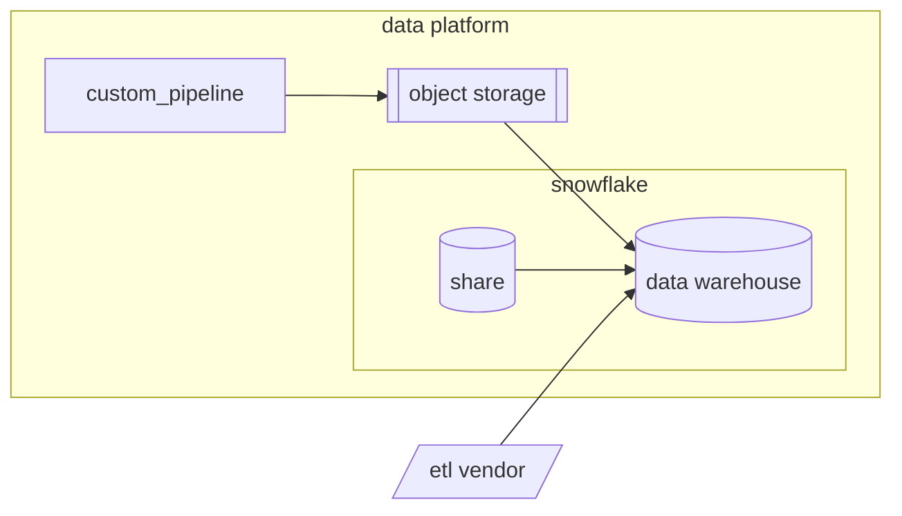

The Data Platform contains data from a wide variety of sources. In order to support such dynamic and vast integrations we employ a data extraction strategy with advanced tooling and best-in-class data engineering standards.
Detailed information about specific **Data Pipelines** is available on our [Internal GitLab Handbook Pipelines page](https://internal.gitlab.com/handbook/enterprise-data/platform/pipelines).

## Data Extraction Solutions

Ideally, all data extraction pipelines should fall into 1 of 3 categories:

1. [Snowflake Share](https://docs.snowflake.com/en/user-guide/data-sharing-intro)
1. ETL Vendor (Fivetran)
1. Custom Pipeline

These solutions have varying strengths and weaknesses and there is no solution that fits all cases. In solutioning we take a variety of factors into consideration.

| Factors         | Snowflake share | ETL Vendor | Custom |
| --------------- |---------------- | ---------- | -------|
| Ease            | ✅              | ✅         | ❔     |
| Flexible        | ❌              | ❌         | ✅     |
| Private         | ✅              | ❌         | ✅     |
| Secure          | ✅              | ✅         | ✅     |
| Maintainable    | ❔              | ❌         | ✅     |
| Cost Effective  | ❔              | ❔         | ❔     |
| Democratization | ❌              | ❔         | ✅     |
| Data validation | ❌              | ❔         | ✅     |

Given that the main downside to Custom Pipelines is their slower time to implementation, any gains on developer efficiency and code maintainability here come with significant advantages. Even still, in many cases new pipelines are implemented without clarity on criticality. Enterprise applications are often changed and replaced and so even if we were able to implement the best possible custom pipeline framework, it would still make sense for us to use vendors. That is, in many cases, writing a custom pipeline just isn't worth the time or effort.

### Criteria for Snowflake Share

The main limitation on Snowflake Shares is their availability. If a Snowflake share is available for a data source **_and_ it meets the requirements given by our business partners** then it's likely a good solution, assuming any price is within budget.

It is essential to assess current and future requirements for the data because the easy and simplicity of using snowflake shares is paired with no flexibility. So if our requirements exceed what is available in the share then we are left without options. Further, if downstream models have already been implemented, a pipeline migration would be needed, which can be more expensive than an initial implementation.

### Criteria for ETL Vendor

ETL Vendors, like Fivetran give us more flexibility than a Snowflake share, but they come with additional cost to our contract. As noted, these can be a great option when we need to move quickly, especially when the criticality of a new data source is unclear.

A lack of flexibility and maintainability is still an important consideration here. We've had trouble managing high complexity pipelines within vendor interfaces, and have experienced pain in change management without the ability to apply approvals or tests to changes. If the complexity of objects and/or attributes is relatively high, it might be worth considering a custom pipeline. Another aspect to consider here is that ETL vendors are often [limited in the scheduling of the refreshes](https://gitlab.com/gitlab-data/analytics/-/issues/21649#note_2262432625)

The volume of records is also a primary consideration for using Vendors at the moment as they are usually priced on usage. Contract impact is a required evaluation step for this solution. High cost may also warrant a custom pipeline.

Some data sources are just too sensitive to allow for a third party to have access. Keeping the pipeline within our data platform is likely required for such cases.

For Platform efficiency, we do not want vendors in this area with overlapping functionalities. This means we want a maximum of 1 vendor. While vendors often provide different sets of available connectors, the availability of connectors in a different vendor's product is not sufficient justification to add that vendor. A business case to add a new vendor to the Data Platform must include replacing the current existing vendor.
Currently, the Data Platform has multiple vendors (Fivetran, Stitch, and Meltano). This means we will consolidate to 1 vendor (to be determined).

### Criteria for Custom Pipelines

Custom data pipelines should be considered our best option in the sense that these pipelines offer the most opportunity for flexibility, privacy, security, and maintainability. Though, as noted, such a solution isn't always warranted.

---

## Evaluating and Solutioning Pipeline Sources

Things we consider when implementing a pipeline for data extraction (but are not limited to) are:

- [**Data Classification**](/handbook/security/policies_and_standards/data-classification-standard/)
  - Customer Data (Red data) could only processed via listed and approved [third party sub processors](https://about.gitlab.com/privacy/subprocessors/#third-party-sub-processors)
- **Schema Complexity**
  - Managing a pipeline with a high number of objects and attributes becomes tedious and risky when done in the UI of an ETL vendor.
- **Data Volume**
- [**Business Criticality**](/handbook/enterprise-data/platform/#tier-definition)
- Latency Requirements
- Integration Options (database, API, filestore, etc.)

Some of these necessitate certain solutions. For example, data in a filestore like GCS will always be solutioned with custom pipelines as it's the easiest _and_ lowest cost solution. But in many cases there isn't a consistent path. For example, we sometimes have many options available for access.

We assess these factors when solutioning a new data source in the [New Data Source Issue Template](https://gitlab.com/gitlab-data/analytics/-/blob/master/.gitlab/issue_templates/%5BNew%20Request%5D%20New%20Data%20Source.md?ref_type=heads)<!-- which will be updated before this MR is merged -->. The investigation and validation process outlined there is essential to our success and is required to be completed in order for implementation to be scheduled.
<!-- needs more detail about how we ensure this process is completed in a timely way -->

---

## Custom Pipelines

A significant weakness that can emerge from custom pipelines is that we can write inconsistencies, redundancies, and complexity into our data platform if we're not careful. To this end we expect our custom pipelines to adhere to the following specifications.

### Easy to Use

Not only should our custom pipelines be easy for the platform team to develop and maintain, but they should be easy to use so that **everyone can contribute**. As with Postgres Pipeline (PGP), `yaml` configurations are a preferred way to abstract configurations into a common and human readable language. Additionally, custom pipelines have the most potential here as special permissions, including licenses, are often required for operating on vendor pipelines and snowflake shares. However, with project code, we can make configuration of pipelines available to everyone who'd like to participate in their development.

An essential part of this is **documentation**, which should comply, at minimum, with our [Data Pipeline Documentation Template](https://internal.gitlab.com/handbook/enterprise-data/platform/pipelines/template/). Additionally, contributing is often made opaque by a lack of consistent testing and deployment processes, therefore custom pipelines should use consistent patterns in environment management and development processes. <!-- Abition - define this in airflow_utils.gitlab_pod_env_vars and link here -->
Branch names are programmatically prefixed to names of data storage targets for development and testing environments to eliminate pollution of production data and standardize our development processes.
Pipelines should include tests in pytest at a minimum and for all pipelines, ci jobs should be set up for explicit testing and review.
More details about best practices with pytest tests can be found in [**Python Guide**](/handbook/enterprise-data/platform/python-guide/#unit-testing-with-pytest).
As with using pytest for testing, we use python logging for logging, with the same advantage of consistency in addition to features like exception handling and log levels, which are useful in debugging.

### Secure

Everything we build should be secure, which means we implement the best security practices and resources available to us, which include, but are not limited to.

- - Development follows our [Comprehensive Security Posture for the Data Platform](https://internal.gitlab.com/handbook/enterprise-data/platform/data-platform-security/comprehensive-security-posture-for-the-data-platform/).
- Each pipeline has it's own access granted at the source, stored in our secure vaults.
- Each pipeline has it's own access granted at the target, stored in our secure vaults.
- Snowflake Authentication are done through [key-pair](https://docs.snowflake.com/en/user-guide/key-pair-auth)
- Secrets are always [masked and hidden in CI](https://docs.gitlab.com/ci/variables/#hide-a-cicd-variable)
- Service account users are [typed as such](https://docs.snowflake.com/en/user-guide/admin-user-management#types-of-users) and restricted with a [network policy](https://docs.snowflake.com/en/user-guide/network-policies)
- Accessed only by approved parties with special attention to [SAFE Framework](/handbook/legal/safe-framework/) and [Data Classification Standards](/handbook/security/policies_and_standards/data-classification-standard/) and governed by [Snowflake Object Tagging](https://docs.snowflake.com/en/user-guide/object-tagging/introduction).

### Performant

Our Extraction Pipelines should be performant, which we define along the following standards:

Performant Pipelines:

1. employ optimized queries
1. process data appropriately
1. self-heal

#### Optimized Queries/Requests

The queries or API requests we run should also be performant. Where possible we pool connections, use indexes (like primary keys or timestamps), minimize fields/columns (Avoid `SELECT *` statements). If available compress data transfers and use efficient serialization formats (like Parquet) between data or file stores.

#### Appropriate Data Processing

It's often assumed that faster (low-latency) pipelines are better, in many cases however, the lower latency a pipeline is, the more overhead processing costs are incurred. In many cases a daily batch is both sufficient for business needs and pipeline efficiency (Useful Output / Total Input).
It's important to note that for incremental loads that are indexed over dates and times, batch size becomes a factor of refresh frequency. Additional factors should also be considered, such as data volume, available memory and connection resources, as well as the needs of our business partners. Determining the most appropriate refresh frequency and batch size is sometimes a matter of trial and error, or in many cases determined by connection resources such as API quotas and limits.

There are cases where batch processing is too high latency for the business case and/or efficient use of memory (some data is so large in volume that batches are too memory intensive). Streaming pipelines, such as Snowplow, are often expensive and so the value of the business case should exceed that expense. Another way to solve for high data volume is through parallel and asynchronous processing.

Our data extraction pipelines should also do as little data transformation as possible as we operate as an EL**T** data platform, with all transformations being handled by [dbt](/handbook/enterprise-data/platform/dbt-guide/) downstream. This means that the data we extract from the source should match the source and whether using a vendor, Snowflake Share, or a Custom Pipeline, we ensure that parity both at the creation or implementation of a new pipeline as well as programmatically once implemented by use of formal testing in our code base.

#### Self-Healing

Sometimes all that is needed to fix a failed pipeline run is a retry. Pipelines should be written idempotently so that this can be easily automated within Airflow configurations. In the case of connection errors, exponential backoff is advised. Additionally, circuit-breakers should be used when a single failure can result in cascading failures as we do with `check_replica_snapshot`. When completing a custom pipeline consider what is most likely to fail and what steps need to be taken to resolve the failure. If that can be written into the pipeline then do it. In many cases it just takes time for us to learn where we can improve and this is a case when we stridently apply our [iteration value](/handbook/values/#iteration).

Though often done in subsequent iterations of a pipeline, as we did with Postgres Pipeline, backfilling should also be handled automatically, especially for top tier, business critical pipelines. The first iteration of any pipeline must include documentation on an easy to use backfill process. These should be handled through the same orchestrator as the pipeline itself. For example, if the pipeline is run via airflow then backfilling should be easily done within airflow tasks.

## Roadmap

This page is prescriptive and we hope generally descriptive as well. The following is our plan to bring our legacy pipelines into alignment with this strategy.

1. FY26-Q3: Deprecate first redundant solutions
2. FY26-Q4/FY27Q1: Decide upon ETL Vendor solution and full migration
3. FY27Q2: Standardize Development and Staging Environments
4. FY27H2: Simplify Existing critical pipelines for easier contributions
5. T.b.d.: Implement Self-Healing for pipelines with frequent errors and outages
