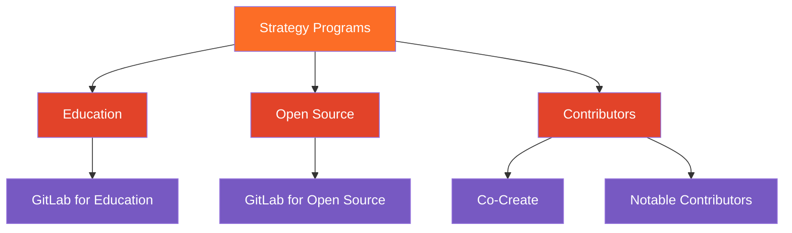

These operational guidelines define how the Strategy Programs team operates, collaborates, and executes our work. They provide the structural foundation and shared processes that enable us to deliver consistent, high-quality programs for the Education, Open Source, and Contributors ecosystems. We cultivate a deep understanding of our own product by using GitLab to manage our planning, collaboration, and execution.

## Structure

Our activities and related resources are in the [Strategy Program](https://gitlab.com/gitlab-org/developer-relations/strategy-programs) subgroup, under Developer Relations in the GitLab.org project. It contains our programs and other operational activities.

### Team activities

Operational tasks that are not specific to a program are logged with issues in [Strategy Programs team-task](https://gitlab.com/gitlab-org/developer-relations/strategy-programs/team-task). This [issue board](https://gitlab.com/gitlab-org/developer-relations/strategy-programs/team-task/-/boards) allows to see our operational workload by status.

### Program activities

Activities related to a program are logged as epics and issues, in its corresponding project, under the relevant subgroup (Contributors, Education, Open Source).

**Epics** allow to log time-bounded or complex activities and capture the outcomes that contribute to our OKRs.

**Issues** allow to log discrete tasks required to execute on the epics or other program work.

For example, for Co-Create an epic is created to track a customer lifecycle from onboarding to first contribution, and an issue to track an onboarding workshop. For GitLab for Education, an epic is created for the creation a new blog post from idea to promotion in social media, and an issue for content writing with the customer.

## Monitoring and reporting

### GitLab Boards

* [OKRs](https://gitlab.com/gitlab-com/gitlab-OKRs/-/issues/?sort=updated_desc&state=opened&label_name%5B%5D=Division%3A%3AMarketing&label_name%5B%5D=Department%3A%3ADevRel%20%26%20Strategy&first_page_size=20)

* [Epics by quarter](https://gitlab.com/groups/gitlab-org/developer-relations/strategy-programs/-/epic_boards/2073660): View of outputs expected each quarter

* [Issues by status](https://gitlab.com/groups/gitlab-org/developer-relations/strategy-programs/-/boards/9764050): Pipeline view of discrete tasks executed by our team

* [Issues by team member](https://gitlab.com/groups/gitlab-org/developer-relations/strategy-programs/-/boards/9764111): Workload and backlog per team member ([filter status:In dev to see current](https://gitlab.com/groups/gitlab-org/developer-relations/strategy-programs/-/boards/9764111?status=In%20dev))

* Program-specific boards: check the corresponding handbook program page

### Dashboards

* Tableau: WIP

## Status

Status

* `New` - Starting point for newly submitted issues
* `Refinement` - Requires more information
* `Validation backlog` - Not prioritized, to be reconsidered in the future
* `Planning breakdown` - WIP, planning
* `In dev`- WIP, executing
* `Blocked` - Progress is blocked and requires additional support or escalation

Issues can be closed as:

* `Complete` - Activity is done
* `Duplicate` - Should be closed with link to open issue
* `Won't do` - Items that won't be actioned now or in the future

## Labels

Epics are labeled with `FYXX::QX` - Corresponding to Fiscal Year and Quarter when activity is expected to be complete.

Issues and epics are labeled with specific program labels such as `Strategy Programs::GitLab for Education` or  `Strategy programs::Co-Create`. When it doesn't fall into a specific program, use `Strategy Programs`.

OKRs are labeled with `OKR` as well as the corresponding `FYXX::QX`
