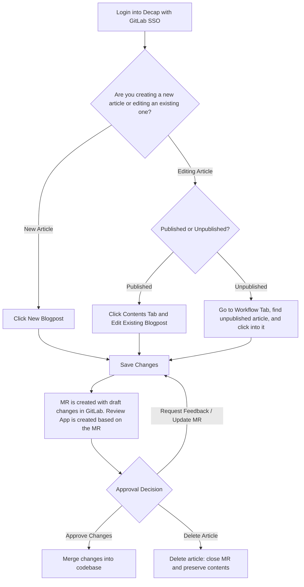
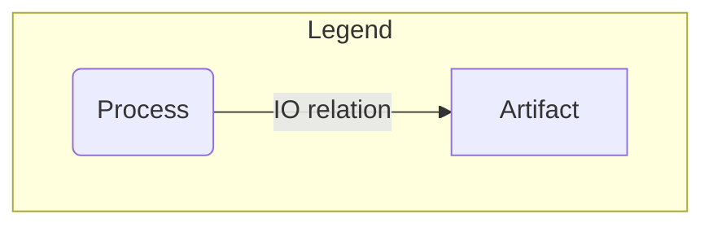

## Blog (about.gitlab.com/blog/)

### Where can I find blog posts?

Blog posts can be found in two different locations:

1. [Yaml files in the about.gitlab.com Repository](https://gitlab.com/gitlab-com/marketing/digital-experience/about-gitlab-com/-/tree/main/content?ref_type=heads)
2. [Decap CMS](https://about.gitlab.com/admin/blog/)

### Creating a blog post in the about.gitlab.com repository

Creating a blog post from scratch is as easy as filling out the [blog post template](https://gitlab.com/gitlab-com/marketing/digital-experience/about-gitlab-com/-/blob/main/.gitlab/merge_request_templates/blog-post.md?ref_type=heads). This can be done using the WebIDE, or by setting up the project locally.

1. Copy the example yaml document, and place it under the `/blog/` folder within the appropriate locale. For example, English blog posts would be under `/content/en-us/blog/`
2. Add an author (first name, last name). If the author does not already exist in this [list of authors](https://gitlab.com/gitlab-com/marketing/digital-experience/about-gitlab-com/-/tree/main/content/en-us/blog/authors?ref_type=heads), you can create a new one by copying and pasting the format of an existing author.
3. Fill in the remaining sections of the yaml file, using markdown for the body of the blog post, and assign your merge request to `@Sgittlen` for review.

### Creating a blog post using Decap CMS



1. Log into Decap by visiting https://about.gitlab.com/admin/ and entering your GitLab credentials.
1. Navigate to the Blog Dashboard via right navigation panel OR by going to https://about.gitlab.com/admin/blog/
1. Using the language of your choice, select a `Blog - Post` Collection.
1. Fill in the fields under `Content`. Most fields are required unless otherwise noted. (You may also fill out the `SEO` fields - if you leave them blank, they will populate automatically with the Title and Description from the `Content` section.The last section, `Config`, can optionally be used to change the slug, and set the blog post to be Featured on the blog landing page.)
1. Click `Save` in the upper right corner.
1. Check the latest [Merge Requests](https://gitlab.com/gitlab-com/marketing/digital-experience/about-gitlab-com/-/merge_requests) in the about.gitlab.com repository. A new merge request titled "Create Blog - Post {title}" will have automatically been created.
1. Within that MR, you will be able to view the review app of your blog post, and tag `@Sgittlen` for approval and merge.
1. Deleting a non-published post in Decap will end up **closing the MR**. If you are looking for that content, it will remain in the GitLab UI.

Video Tutorials can be found at the following [playlist](https://www.youtube.com/watch?v=91Ul69LrSb4&list=PL05JrBw4t0KoIEZXWugERwHAsR2cEalKl). For assistance, please reach out to `#digital-experience-team` or `#blog` in slack.

#### Additonal Notes

- Note that the swim lames/board in the Workflow tab correspond to labels applied to the various MRs.
- If you want to add an author, category, or tag, you will need to create those in Decap and merge the MRs in to the `main` branch first. Once that is complete the author, category, or tag will become available to be selected in Decap when creating or editing an existing article.

### Adding media to blog posts

#### Mermaid charts

````plaintext

````

#### Videos

```html
    <figure class="video_container">

    <iframe width="560" height="315"
    src="https://www.youtube.com/embed/pA5SfHwlq0s" frameborder="0"
    allowfullscreen="true">

    </iframe>

    </figure>
```

#### Code blocks with syntax highlighting

````plaintext
```json
    {
        "Version": "2012-10-17",
        "Statement": [
            {
                "Effect": "Allow",
                "Action": [
                    "ecr:GetAuthorizationToken",
                    "ecr:BatchCheckLayerAvailability",
                    "ecr:GetDownloadUrlForLayer",
                    "ecr:DescribeRepositories",
                    "ecr:ListImages",
                    "ecr:DescribeImages",
                    "ecr:BatchGetImage"
                ],
                "Resource": "*"
            }
        ]
    }
```
````

### Creating a blog post using the Web IDE

1. Visit the project repository at https://gitlab.com/gitlab-com/marketing/digital-experience/about-gitlab-com
1. Click the `Edit` button dropdown, and select `Open with Web IDE`
1. Once open, navigate to the folder you'd like your blog post in
    - For most, this will be in `content -> en-us -> blog`
    - Localized blog posts can be found in the content/{{language-code}} folder, such as `content -> fr-fr -> blog`
1. Add a new file by clicking the `Add file` button at the top of the sidebar pane. Be sure to name your file whatever the url of the blog post will be
    - Alternatively, if you have an existing yaml file (i.e. from Argo), you can drag and drop the file directly into the folder of your choosing. Be sure to `right click -> rename` the file to match the English version
1. From here, you can copy and paste an existing blog post yaml file and fill in your new values, or use the [blog MR template](https://gitlab.com/gitlab-com/marketing/digital-experience/about-gitlab-com/-/blob/main/.gitlab/merge_request_templates/blog-post.md?ref_type=heads) to start from scratch
    - Be sure to either upload your blog image inside [/public/images/blog/hero-images/](https://gitlab.com/gitlab-com/marketing/digital-experience/about-gitlab-com/-/tree/main/public/images/blog/hero-images?ref_type=heads), or copy a URL from Cloudinary
1. Once you're happy with your post, you can create a merge request through the Web IDE by selecting the `Source Control` icon on the left sidebar, then click the dropdown beside the `Commit and push to main` button -> `Create a new branch and commit` (you won't be able to commit and push to `main` directly)
    - Hit `Enter` to just use the default branch name
    - Click the `Create MR` button that appears in the bottom corner
1. Wait for the pipeline to run to view your review app

For a video walkthrough, click [here](https://youtu.be/dN1XZjZmJP0).

## Events

### Adding an event to the events landing page

To add an event to [about.gitlab.com/events/](https://about.gitlab.com/events/), you can use Decap, or the Web IDE:

#### Decap CMS

1. Log into Decap CMS by going to [about.gitlab.com/admin/](https://about.gitlab.com/admin/) and logging in with your GitLab credentials.
1. Along the left sidebar, select `Events -> Landing Page Card`, and click the `New Event Landing Page Card` button at the top of the screen.
1. Fill out the following fields:
   - Name - Name of event
   - Type - The type of event (i.e. Conference, Webcast)
   - Description - A brief description of the event. Can use markdown.
   - Start Date - Use the date picker to select the date of the event. This field is required
   - End Date - (optional) If the event spans multiple days, select the end date. Can leave this field blank.
   - Location - Add city and state of event. If virtual, type in `Virtual`.
   - Region - Select the appropriate region for event
   - Industry - (optional) Select an industry, if relevant.
   - Event URL - Add registration URL
1. Once you are happy with the content, click `Save` at the top of the screen.
1. This will automatically create a Merge Request with your changes, which you can use to view the Review App and make any changes.
   - To find your merge request, check [this list of open merge requests](https://gitlab.com/gitlab-com/marketing/digital-experience/about-gitlab-com/-/merge_requests) for the MR titled `Create Event - {{ Your Event Name }}`
1. Review, approve, and merge your MR to see it live on the website.

Video Tutorial [available here](https://youtu.be/j3z-smLIZbE)

#### Web IDE

1. Open the Web IDE for [about.gitlab.com](https://gitlab.com/gitlab-com/marketing/digital-experience/about-gitlab-com)
1. Create a new `.yml` file in [/content/shared/en-us/events/landing/cards](https://gitlab.com/gitlab-com/marketing/digital-experience/about-gitlab-com/-/tree/main/content/shared/en-us/events/landing/cards?ref_type=heads) and title it the name event (with no spaces).
   - Ex: `connect-sydney-2025.yml`
1. Fill in the following fields, maintaining the same format for the date:

    ```plaintext

    name: 
    type: 
    description: |
    Suports markdown, ex: Get together with the GitLab community to contribute, learn and win **exciting prizes**.
    startDate: YYYY-MM-DD
    endDate: YYYY-MM-DD (optional)
    location: 
    region: 
    industry: 
    eventURL: 

    ```

1. Create an MR, review, and merge your changes

## Event Landing page

To access a customer case study, visit Decap at about.gitlab.com/admin, and login with your GitLab credentials.

### Creating a new Full Event Landing Page

1. On the Main Dashboard :house:, select `Event - Full Event Pages` from the left hand sidebar. You should see the existing event pages listed.
1. Click the `New Event - Full Event Pages` button at the top of the page.
1. Fill in the fields:

- **Config**: URL is the filename/slug of your event. So if you'd like your event to be at `about.gitlab.com/events/my-event-name`, this field should be `my-event-name`
- **SEO**: These values are the metadata on the page. Title and Description are required values, and character limits are listed under each field.
- **Content**: These are customizable blocks, which you can click `Add content blocks` and select different types of content from the dropdown. You can delete content blocks, or drag and drop them to reorder. Details on each content block below.

1. Save your changes by clicking Save at the top. This will not publish your changes, it simply creates a Merge Request for you to review.
1. Visit the list of merge requests and find the one with your Event title.
1. Once the pipeline runs in your MR, check the review app to make sure you're happy with your changes.
1. To make any edits, go back to your Decap file, make your changes, and save them again. The changes will appear in your existing Merge Request.
1. Merge your MR, and the changes will be live on the site after about 15 minutes.

### Content Blocks

#### Hero


- **Header**: The main large bold text. Required.
- **Description**: Supports markdown. Optional.
- **Primary & Secondary button**: both are Optional.
- **Background image**: We only support background images, not images to the side of the content. Use the widget to upload your hero into Cloudinary or choose from an existing hero image in the Events folder.

#### Agenda


- **Title**: The overall title (i.e. 'Agenda'). Optional.
- **Subtitle**: Optional
- **Agenda**: Select `Add agenda +` to add a session name/time/description and optional registration button. Can also add optional speaker info and headshots.
- Can add as many agenda items and speakers as necessary.

#### Two Column Block

This contains any number of half-width items. You select what goes in the right column, then what goes in the left column.

- **Config**: Can input an anchor ID to scroll to a section on the page (i.e. #register) or set sticky to true to keep the item at the top of the screen while scrolling.
- **Nested components**: These are the individual components that you can customize. EventsAccordionWrapper, EventsFormWrapper, EventsImageCard, EventsLightningTalk, EventsScheduleColumns are available and are detailed below.

#### Events Accordion Wrapper


- **Title**: Title above the accordion
- **Subtitle**: Supports markdown. Optional
- Accordion: These are the individual accordion items, containing a header and content that supports markdown.
- Config: Theme support (i.e. `epic-conference` or `kubecon`

#### Events Form Wrapper


- **Title**: Title above the form
- **Description**: Supports markdown. Optional
- Form ID: Marketo form ID. This comes from Marketing Operations - DEx does not build forms
- Form Name: For tracking and analytics
- MultiStep: Set to true if the form has been built as a multistep form

#### Events Image Card


- **Title**: Title on the card (i.e. 'GitLab Booth 722')
- **Description**: Supports markdown. Optional
- Image: Select from Cloudinary or upload a new image
- Button: Optional

#### Events Lightning Talks


- **Title**: Title above the events
- **Description**: Supports markdown. Optional
- **Date**: Regular String. Optional
- **Items**: Can add the agenda items like name, description, and whether it has a 'Coming Soon' badge and a link (supports JiffleNow tokens)

#### Events Schedule Columns


- **Header**: Title above the events
- **Description**: Supports markdown. Optional
- **Date**: Regular String. Optional
- **Items**: Can add the agenda items like name, description, and whether it has a 'Coming Soon' badge and a link (supports JiffleNow tokens)

#### Next Steps


Default CTA at the bottom of the page. Not required, and not customizable.

## Customer Case Studies

To access a customer case study, visit Decap at [about.gitlab.com/admin](https://about.gitlab.com/admin/), and login with your GitLab credentials.

### Creating a new Customer Case Study

1. On the Main Dashboard :house:, select `Customers Case Studies` from the left hand sidebar. You should see the existing customer case studies listed in alphabetical order.
1. Click the `New Customers Case Studies` button at the top of the page.
1. Fill in the fields:

- **Config**: Size, Region, and Industry dropdowns are used for filtering on the [All Customers page](https://about.gitlab.com/customers/all/)
- **SEO**: These values are the metadata on the page. Title and Description are required values, and character limits are listed under each field.
- **Content**: This is what displays on the webpage.
- **Name**: Company name. This will also create the url by taking the company name, converting it to lowercase, and adding hyphens where any spaces are. i.e. `/my-case-study/`
- **Logo**: Select `Choose an Image`, and upload the logo to Cloudinary so that it can be used throughout the website
- **Hero Heading**: The large text that appears above the hero image.
- **Hero image**: Upload or select an existing image from Cloudinary
- **Image Attribution**: If the hero image requires a source or credit from a photographer, you can place it here. [Example](https://about.gitlab.com/customers/deutsche-bahn-ag/)
- **3 Benefits**: will appear above your hero image. Please note that the `icon` should be one of the icons listed [here](https://slippers.gitlab.com/?path=/story/foundations-icons--icons), with the exact spelling/capitalization.
- **Industry/Location/Solution/Employee count**: Appear below the hero image
- **3 Stats**: These appear on the left hand side of the page, and move as you scroll.
- **Headline**: Appears in bold at the top of the article
- **Summary**: Right below the headline
- **Quote**: Will have a purple background
- **Content**: Can have as many sections as you'd like.

1. Save your changes by clicking `Save` at the top. This will not publish your changes, it simply creates a Merge Request for you to review.
1. Visit the list of [merge requests](https://gitlab.com/gitlab-com/marketing/digital-experience/about-gitlab-com/-/merge_requests/?label_name%5B%5D=decap-cms%2Fdraft) and find the one with your Customer Case Study title.
1. Once the pipeline runs in your MR, check the review app to make sure you're happy with your changes.
1. To make any edits, go back to your Decap file, make your changes, and save them again. The changes will appear in your existing Merge Request.
1. Merge your MR, and the changes will be live on the site after about 15 minutes.

### Editing an existing Customer Case Study

1. On the Main Dashboard :house:, select `Customers Case Studies` from the left hand sidebar. You should see the existing customer case studies listed in alphabetical order.
2. Find the Customer Case Study you'd like to edit, and click into it.
3. Make the edits (see above for which fields correspond to which sections on the page).
4. Save your changes by clicking `Save` at the top. This will not publish your changes, it simply creates a Merge Request for you to review.
5. Visit the list of [merge requests](https://gitlab.com/gitlab-com/marketing/digital-experience/about-gitlab-com/-/merge_requests/?label_name%5B%5D=decap-cms%2Fdraft) and find the one with your Customer Case Study title.
6. Once the pipeline runs in your MR, check the review app to make sure you're happy with your changes.
7. Merge your MR, and the changes will be live on the site after about 15 minutes.

Video Tutorial: https://youtu.be/TvUVW4X1Aco
