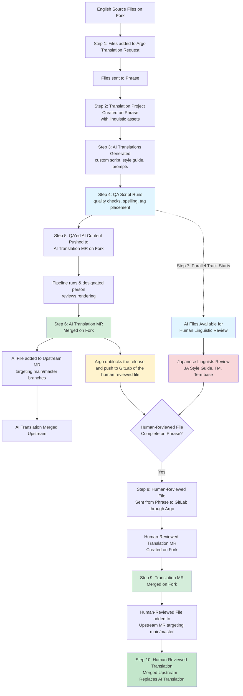

## Table of contents

- [Overview](#overview)
  - [Key terms for localized documentation](#key-terms-for-localized-documentation)
  - [Translation scope and exclusions](#translation-scope-and-exclusions)
    - [What gets translated](#what-gets-translated)
    - [Content excluded from translation](#content-excluded-from-translation)
- [Forked localization architecture](#forked-localization-architecture)
  - [Argo-GitLab integration](#argo-gitlab-integration)
  - [Branch strategy](#branch-strategy)
  - [Translation MRs](#translation-mrs)
- [Translation workflow](#translation-workflow)
  - [AI translation generation](#ai-translation-generation)
  - [Markdown processing for translation](#markdown-processing-for-translation)
  - [QA of AI translations](#qa-of-ai-translations)
  - [Translation request management](#translation-request-management)
- [Tech docs internationalization (i18n) architecture](#tech-docs-internationalization-i18n-architecture)
  - [Locale folder structure](#locale-folder-structure)
  - [Multilingual Hugo docs implementation](#multilingual-hugo-docs-implementation)
  - [Pipelines for localized product documentation](#pipelines-for-localized-product-documentation)
  - [Redirect behavior in internationalized documentation](#redirect-behavior-in-internationalized-documentation)
- [Localization UX features](#localization-ux-features)
  - [Contributing to translated documentation](#contributing-to-translated-documentation)
- [Known limitations and future Work](#known-limitations-and-future-work)

## Overview

The GitLab Localization team has built an enterprise-grade, AI-powered localization infrastructure that enables [docs.gitlab.com](http://docs.gitlab.com) to be available in multiple languages. We are launching with Japanese (ja-JP) support, with all product documentation content translated and accessible on a language toggle in the top navigation bar or through this link [docs.gitlab.com/ja-jp](http://docs.gitlab.com/ja-jp).

This documentation provides a comprehensive overview of the technical architecture, workflows, tooling, and processes that power GitLab's multilingual documentation site.

The Localization team owns the localization and internationalization infrastructure that enables docs.gitlab.com to be offered in multiple languages. This includes:

- Translation workflow automation
- AI translation generation code
- Localization tooling (Argo, Phrase TMS)
- Quality assurance processes on translated content
- Coordination with linguists and reviewers

### Key terms for localized documentation

To understand the localization infrastructure, familiarize yourself with these key terms:

| Term | Definition |
|------|------------|
| Source language | The language that a translation originates from. For docs it's always English. |
| Target language | The language that a translation is created in. |
| Translation MR | Merge request that only carries translated files from localization workflows to GitLab projects. [More info here](#translation-mrs). |
| Translation request | A translation project that pulls files from forked docs projects and packages them for AI and human review translation processes. |
| Target Update | Any update made to translated files, outside of the established translation workflow, that isn't triggered by English source content changes. |
| TMS | Translation Management System (refers to Phrase TMS in our context) |

### Translation scope and exclusions

#### What gets translated

All content available on docs.gitlab.com is translated, including:

- Product documentation across all five GitLab documentation repositories:
  - [GitLab](https://gitlab.com/gitlab-org/gitlab)
  - [Runner](https://gitlab.com/gitlab-org/gitlab-runner)
  - [Omnibus](https://gitlab.com/gitlab-org/omnibus-gitlab)
  - [Charts](https://gitlab.com/gitlab-org/charts/gitlab)
  - [Operator](https://gitlab.com/gitlab-org/cloud-native/gitlab-operator)
- Navigation elements and UI strings on [GitLab Docs](https://gitlab.com/gitlab-org/technical-writing/docs-gitlab-com)

#### Content excluded from translation

##### Contribute section

The content under the "Contribute" section ([https://docs.gitlab.com/development/](https://docs.gitlab.com/development/)) is not translated and it's available in English on the localized site. This section serves as internal engineering documentation primarily for GitLab engineers. It contains code guidelines and contribution information rather than product documentation. The Technical Writing team only ensures linting compliance for this section but doesn't manage the content.

##### Visual assets

- Images are not localized in the initial launch
- Diagrams are not localized in the initial launch

##### Previous versions of docs.gitlab.com site

Initially, the localized tech docs site will feature only the latest documentation version. The rollout of additional localized versions will require separate scoping and engineering work, following the same versioning cutoff policy applied to the English site. [Epic work here](https://gitlab.com/groups/gitlab-com/localization/-/epics/21).

## Forked localization architecture

To create a safe testing environment for localization work without affecting production or sending notifications to large groups, we established a forked repository structure.

The forked architecture consists of both [Prod](https://gitlab.com/gitlab-com/localization/tech-docs-forked-projects/prod) and [Test](https://gitlab.com/gitlab-com/localization/tech-docs-forked-projects/test) forks. The test forks were created for initial testing of localization workflows, experimenting with new features, and validating tooling changes. It's monitored by the Argo GitLab Clone integration.

The Prod fork receives Translation MRs directly from Argo, conducting actual translation work. This one is monitored by the "Argo GitLab Production" integration.

### Argo-GitLab integration

**Argo** is our centralized localization request management system. It serves as the orchestration layer between GitLab repositories and the translation workflow. It creates and manages translation requests, pulls source files from forked production repositories, packages files for translation workflows, tracks status of each file through the translation lifecycle. [Argo-GitLab integration project link](https://gitlab.com/gitlab-com/localization/argo-gitlab-integration).

Integration points:

- The [Argo-GitLab integration](https://gitlab.com/gitlab-com/localization/argo-gitlab-integration) monitors forked repositories and creates MRs automatically
- [Argo-Phrase integration](https://gitlab.com/groups/gitlab-com/localization/-/epics/95) sends files to Phrase for translation and retrieves translated files
- [The Argo Asset dashboard](https://gitlab.com/gitlab-com/localization/localization-team/-/issues/173) helps us track translation assets and their status. It enables us to track the translation history and identify new our updated English assets for translation by comparing update dates between the GitLab docs projects and the and Argo.

#### `argo_translation.yml` configuration file

The [`argo_translation.yml` configuration file](https://gitlab.com/gitlab-com/localization/argo-gitlab-integration/-/blob/main/doc/en-US/argo_translation_yaml.md) is added at the root of every project containing translatable files. It configures the Argo-GitLab integration by defining which files and file types should be translated, what target languages to translate them into, and where the translated files should be placed.

Here's the epic for the configuration implementation of [argo_translation.yml for continuous localization of docs](https://gitlab.com/groups/gitlab-com/localization/-/epics/111).

[What is argo_translation.yml and its configurability and ownership](https://gitlab.com/gitlab-com/localization/localization-team/-/issues/159#top) issue.

#### Branch strategy

- `main-translation` is a special branch on production forks where translations are first merged
- From `main-translation`, upstream MRs are created targeting main/master branches in production projects
- This isolation prevents incomplete translations from affecting production while enabling parallel work. It also allows for more freedom of experimentation and quick turnaround.

Related issue: [Document the branch maintenance process for GitLab tech docs translation](https://gitlab.com/gitlab-com/localization/docs-site-localization/-/issues/112)

### Translation MRs

A [Translation MR](https://gitlab.com/gitlab-com/localization/argo-gitlab-integration/-/blob/main/doc/en-US/merge_requests.md) only carries translated files. These translations are based off of a source commit of the corresponding EN file they're translated from. The [Product docs Translation MRs - process and configuration enhancements](https://gitlab.com/groups/gitlab-com/localization/-/epics/114) epic contains various optimizations for Translation MRs, including workflow enhancements, Argo configurations, MR template updates, etc.

#### Translation MR labels

The following table contains a list of the labels that are either automatically added to a Translation MR by the Argo-GitLab integration or manually by the Localization team.

| Label | Usage |
|-------|-------|
| [~"translation-MR-status:: AI complete"](https://gitlab.com/groups/gitlab-com/localization/-/merge_requests/?sort=updated_desc&state=opened&label_name%5B%5D=translationMR-status%3A%3AAI%20Complete&first_page_size=20) | Label added by Argo to indicate that all AI Translations have been committed to this MR, or previous Translation MRs. |
| [~"translation-MR-status:: in progress"](https://gitlab.com/groups/gitlab-com/localization/-/merge_requests/?sort=updated_desc&state=opened&label_name%5B%5D=translationMR-status%3A%3AIn%20Progress&first_page_size=20) | Label added by Argo to indicate that there are still files undergoing translation, and will be committed to this MR when translations are done. |
| [~translation-MR-status:: complete"](https://gitlab.com/groups/gitlab-com/localization/-/merge_requests/?sort=updated_desc&state=opened&label_name%5B%5D=translationMR-status%3A%3AComplete&first_page_size=20) | Label added by Argo to indicate that all linguistic reviewed files carried out by linguists have been committed to this MR, or previous Translation MRs. |
| [~"gitlab-translation-service"](https://gitlab.com/groups/gitlab-com/localization/-/merge_requests/?sort=updated_desc&state=opened&label_name%5B%5D=gitlab-translation-service&first_page_size=20) | Label added by Argo to indicate changes generated automatically by the [Argo GitLab Integration](https://gitlab.com/gitlab-com/localization/argo-gitlab-integration) |
| [~"L10n-target-update:: New"](https://gitlab.com/groups/gitlab-com/-/merge_requests/?sort=updated_desc&state=merged&label_name%5B%5D=L10n-target-update%3A%3A%20New&first_page_size=20) | To indicate that an edit to a localized file has been made outside of the localization workflow. |
| [~"L10n-target-update: Applied in TMS"](https://gitlab.com/groups/gitlab-com/-/merge_requests/?sort=updated_desc&state=merged&label_name%5B%5D=L10n-target-update%3A%3A%20Applied&first_page_size=20) | Label to be used when an edit to a localized file on GitLab is now accounted for in the localization workflow. |
| [~"translation-upstream:: pending"](https://gitlab.com/groups/gitlab-com/localization/tech-docs-forked-projects/prod/-/merge_requests/?label_name%5B%5D=translation-upstream%3A%3A%20pending) | Label added by Argo on the localization fork to indicate that the translated files in that MR are not part of any upstream MR targeting master or main yet. |
| [~"translation-upstream:: complete"](https://gitlab.com/groups/gitlab-com/localization/tech-docs-forked-projects/prod/-/merge_requests/?label_name%5B%5D=translation-upstream%3A%3A%20complete) | Label added by the Localization team to indicate that a translated file in a fork has been added to an upstream translation push MR. |

> [!note]
> Target updates labels to track contributions from the wider community [are also created in the GitLab.org group](https://gitlab.com/groups/gitlab-org/-/labels?subscribed=&archived=false&sort=relevance&search=target-update).

#### Translation MR types

There are two primary types of Translation MRs created automatically in the localization workflow:

**[AI Translation MR](https://gitlab.com/groups/gitlab-com/localization/-/merge_requests/?sort=updated_desc&state=opened&label_name%5B%5D=translationMR-status%3A%3AAI%20Complete&first_page_size=20)**

- When: it's created immediately after the QA'ed AI translation is completed in Phrase TMS
- Where: it's created on the production fork project and it targets the main-translation branch
- Content: AI-generated translations that have undergone file QA
- Why: the purpose of these are to enable a fast deployment of initial translations to keep JA site as up to date with production as possible
- Label: translation-MR-status:: AI complete indicates that it's an MR that contains QA'ed AI translations

**[Human-Reviewed Translation MR](https://gitlab.com/groups/gitlab-com/localization/-/merge_requests/?sort=updated_desc&state=opened&label_name%5B%5D=translationMR-status%3A%3AComplete&first_page_size=20)**

- When: it's created after a linguist completes a linguistic review of the AI translation in Phrase
- Where: it's created on the production fork project and it targets the main-translation branch
- Content: it carries the linguistically reviewed and refined translations carried out by a linguist
- Why: the purpose of these is to replace the AI translations with higher-quality reviewed content
- Label: translation-MR-status:: complete indicates that it's an MR that contains translated files linguistically reviewed by a linguist.

Both MR types follow the same upstream merge process after being merged to the main-translation branch.

#### Regular upstream merges

After translations are reviewed and merged to the main-translation branch on the fork, a new MR is automatically created to merge translations upstream.

Target projects:

1. [gitlab-org/gitlab](https://gitlab.com/gitlab-org/gitlab)
2. [gitlab-org/gitlab-runner](https://gitlab.com/gitlab-org/gitlab-runner)
3. [gitlab-org/omnibus-gitlab](https://gitlab.com/gitlab-org/omnibus-gitlab)
4. [gitlab-org/charts/gitlab](https://gitlab.com/gitlab-org/charts/gitlab)
5. [gitlab-org/cloud-native/gitlab-operator](https://gitlab.com/gitlab-org/cloud-native/gitlab-operator)

## Translation workflow

We've established a two-tier translation workflow that balances speed and quality. AI-assisted translations are published to the documentation site before linguistic human review is complete, giving users faster access to the latest information. These translations are then reviewed by professional and specialized human translators and updated as needed for accuracy and quality. This approach ensures the localized documentation site stays as close as possible to the English version while we iteratively improve translation quality.
Here's an overview diagram:

### AI translation generation

To deliver efficient, scalable translations that maintain the technical precision required for GitLab's product documentation, we developed an AI-powered system that integrates Phrase TMS with Google's Vertex AI Gemini model. The workflow authenticates with both platforms, downloads MXLIFF files from Phrase TMS projects, and routes segments through either full translation or post-editing based on translation memory match scores. The system then applies automated quality fixes before uploading completed translations back to Phrase TMS. Translation quality is enhanced through prompt enrichment with style guides, original file context, UI label translations, and terminology extracted with [spaCy NLP](https://spacy.io/).

Built in Python, the [translation script](https://gitlab.com/gitlab-com/localization/tech-docs-ai-powered-translation/-/blob/main/script.py) features sophisticated tag handling that preserves XLIFF structure through up to 5 iterative correction cycles, ensuring XLIFF 1.2 standards compliance even when tags are missing or corrupted. The system processes content in batches of 500 segments by default, leverages parallel processing for optimal performance, and includes retry logic to gracefully handle API rate limits and errors.

For more information about how the AI-powered translation script works, see the [Tech Docs AI-powered translation](https://gitlab.com/gitlab-com/localization/tech-docs-ai-powered-translation) project.

### Markdown processing for translation

GitLab's documentation employs specialized Markdown syntax (GLFM) with custom elements like `%{placeholder}` variables, `[!alert]` blocks, `::include` directives, and GitLab-specific references that aren't supported by standard translation system filters or parsers. Additionally, the docs.gitlab.com website uses [documented Hugo shortcodes](hhttps://docs.gitlab.com/development/documentation/styleguide/#shortcodes). These elements required protection from modification by human and machine translators, necessitating custom regular expression patterns and parser configurations in Phrase TMS.

Argos Multilingual's solutions team developed comprehensive parser configuration settings across three project templates in Phrase TMS to handle GitLab's diverse documentation elements, including:

- Code blocks (triple-backtick and inline code)
- URLs and GitLab-specific icon placeholders (e.g., `{check-circle}`, `{tanuki}`)
- Alert boxes
- Tabbed content syntax (`::Tabs`, `::TabTitle`, `::EndTabs`)
- YAML headers, front matter, and navigation files with mixed content
- Standalone i18n YAML/JSON files
- Markdownlint-disable comments
- GitHub-flavored Markdown formatting

For more information, see the following epic: [Phrase TMS configurations for product docs content](https://gitlab.com/groups/gitlab-com/localization/-/epics/93).

#### Docs Markdown filter

Docs Markdown filter is used for all GitLab docs Markdown files, except the[markdown.md](https://gitlab.com/gitlab-org/gitlab/-/blob/master/doc/user/markdown.md) file. Key settings enabled for this filter:

- Flavor: GitHub Flavored Markdown is the closest variant of Markdown supported by Phrase TMS
- Preserve whitespaces: disabled, otherwise Phrase is going to try to replicate the structure of the English  Markdown file (including line breaks), leading to sentences being split in the middle.
- Process YAML header: this setting enables processing YAML headers in Markdown files.
- Import code blocks: disabled - we don't want to modify (translate) any code blocks
- Exclude code elements: code elements will be converted to inline tags and protected.
- Convert to Phrase TMS tags: this regular expression converts the following elements into Phrase inline tags, so they are protected in translation: Hugo shortcodes (icon placeholders, alert boxes, tabbed content, collapsible content, walkthrough snippets) and anchor IDs
- Don't escape characters: we have discovered that Phrase tries to protect some characters by escaping them in translated files. Adding `[` here prevents Phrase from inserting `\[` in the translated file.

#### Docs Markdown (markdown.md)

Special template with custom configurations to parse file [markdown.md](https://gitlab.com/gitlab-org/gitlab/-/blob/master/doc/user/markdown.md).

This is a copy of Docs Markdown settings with some exceptions:

- Import code blocks: this setting is enabled for markdown.md file to give us opportunity to translate the code samples used in the file.
- Don't escape characters: # character is added to the list.

#### Docs navigation

TThis translation project template is designed to handle the [navigation.yaml](https://gitlab.com/gitlab-org/technical-writing/docs-gitlab-com/-/blob/main/data/en-us/navigation.yaml) file. It works with the [walkthroughs](https://gitlab.com/gitlab-org/technical-writing/docs-gitlab-com/-/tree/main/data/en-us/walkthroughs) .yaml files as well.

Key setting:

- Import specific keys only: a specifically created regular expression will export title and description elements (anywhere in the structure) for translation.

#### Docs i18n files

Designed to handle additional localization files (en.json, en-us.json, en-us.yaml).

Key settings:

- Convert to Phrase TMS tags: any placeholders like {0} and {1} will be converted to inline tags in Phrase
- Use Markdown subfilter: any Markdown content in YAML elements will be parsed as Markdown
- Use HTML subfilter: any HTML content in JSON elements will be parsed as HTML

### QA of AI translations

After the AI translations are uploaded to Phrase TMS, we run the custom [Tech Docs MR QA checker](https://gitlab.com/gitlab-com/localization/tech-docs-mr-qa-checker). It currently checks only Markdown files and produces a list of errors that human linguists go through and fix. The second set of QA checks are happening directly in Phrase TMS, using its [list of QA checks](https://support.phrase.com/hc/en-us/articles/5709703799324-Quality-Assurance-QA-TMS#list-of-qa-checks-0-4). The issues listed by the Tech Docs MR QA checker and the Phrase TMS QA are fixed before the QA-ed Markdown file gets pushed into the fork as part of an AI Translation MR. The comprehensive list of QA checks was developed through investigation in [this issue](https://gitlab.com/gitlab-com/localization/docs-site-localization/-/issues/372#note_2861022087). Automated prevention logic was added to the AI translation script to prevent certain errors from occurring, while the QA checker validates other items that cannot be automatically prevented.

Phrase TMS segments source files during parsing and restricts QA checks to individual segments without access to surrounding context. The [Tech Docs MR QA checker](https://gitlab.com/gitlab-com/localization/tech-docs-mr-qa-checker) script is used for context-dependent validation.

That's why we created the custom Tech Docs MR QA checker. This QA checker digests the whole source and target Markdown files and performs [all of these checks](https://gitlab.com/gitlab-com/localization/tech-docs-mr-qa-checker#tech-docs-mr-qa-checker). Some of those checks are custom and are not implementable in Phrase TMS QA.

There are a few checks that are not automatable and we rely on human linguists to check these as a part of reviewing the AI translation on the Revision step on Phrase TMS:

- **Quotation marks**: [Quotation marks are added in the correct place in the sentence](https://gitlab.com/gitlab-com/localization/docs-site-localization/-/issues/343)
- **Links**:
  - [Check correct placement of link in sentence or paragraph](https://gitlab.com/gitlab-com/localization/docs-site-localization/-/issues/346). No wrong placing.
  - Check that the correct words are placed inside the text display link between square brackets.

### Translation request management

Translation work is carried out in the localization forks of six product documentation projects: GitLab, GitLab Runner, Omnibus GitLab, GitLab Chart, GitLab Operator, and GitLab Docs. These forks are managed by the Localization team. They also reduce the risk of issues in the production projects and minimize interruptions for Technical Writing, Engineering, and other teams who maintain the production projects. The localization forks are periodically updated with changes from the upstream projects. Translation requests are created and managed on the forks through the localization request management system called [Argo](https://gitlab.spartansoftwareinc.com/#login).

Argo monitors the localization forks and automatically identifies new or updated English files after each sync with the upstream projects. It displays a list of all monitored files and their translation status in the UI, allowing the Localization Team to select which files to include in a new translation request directly from the system. Argo also indicates which files should not be included, such as those already in active translation requests. The request creation process can be automated as well.

For each request, Argo exports the selected files from a localization fork at a specific commit, routes them through the appropriate AI translation process according to predefined criteria, and delivers the translated files back to the fork as one or more Translation MRs using predefined templates and commit messages. The entire process is supported by various integrations, including the Argo-GitLab integration and translation-vendor-specific integrations.

The Translation MRs are reviewed by automated quality checks and merged by the Localization Team on the localization fork. The team then creates upstream MRs to integrate the latest translations into the upstream project. Finally, the Technical Writing team reviews these upstream MRs and merges them into the master or main branches.

Argo is designed to function as a command center for localization requests. It tracks translation status and progress throughout the workflow, providing pertinent information such as links to the source commit and Translation MRs within a request. Additionally, Argo retains copies of all exported source and translated files and records the execution time and responses of all automated steps in each request for record-keeping and troubleshooting. Argo also offers a GitLab-issues-like feature called Comments, enabling all users involved in a request to communicate directly within the system.

## Tech Docs internationalization (i18n) architecture

### Locale folder structure

Translations are stored in locale-specific folders within each documentation project. Currently, only Japanese (ja-jp) locale is supported.

**Locale folders across projects**:

- [Locale folder on gitlab-org/gitlab/doc](https://gitlab.com/gitlab-org/gitlab/-/tree/master/doc-locale/ja-jp)
- [Locale folder on gitlab-org/gitlab-runner/docs](https://gitlab.com/gitlab-org/gitlab-runner/-/tree/main/docs-locale/ja-jp?ref_type=heads)
- [Locale folder on gitlab-org/omnibus-gitlab/doc](https://gitlab.com/gitlab-org/omnibus-gitlab/-/tree/master/doc-locale/ja-jp?ref_type=heads)
- [Locale folder on gitlab-org/charts/gitlab/doc](https://gitlab.com/gitlab-org/charts/gitlab/-/tree/master/doc-locale/ja-jp?ref_type=heads)
- [Locale folder on gitlab-org/cloud-native/gitlab-operator/doc](https://gitlab.com/gitlab-org/cloud-native/gitlab-operator/-/tree/master/doc-locale/ja-jp?ref_type=heads)

**GitLab Docs project - docs-gitlab-com**

Translated content exists here in different directories:

- [Data folder on gitlab-org/technical-writing/docs-gitlab-com](https://gitlab.com/gitlab-org/technical-writing/docs-gitlab-com/-/tree/main/data?ref_type=heads)
- [Locales folder gitlab-org/technical-writing/docs-gitlab-com](https://gitlab.com/gitlab-org/technical-writing/docs-gitlab-com/-/tree/main/locales?ref_type=heads)

### Multilingual Hugo docs implementation

The following features were developed to enable Hugo to support multilingual content:

1. [Japanese locale configuration](https://gitlab.com/gitlab-org/technical-writing/docs-gitlab-com/-/merge_requests/767) - Added ja-jp locale to Hugo config with proper content mounting across all documentation projects
2. [Language selector](https://gitlab.com/gitlab-org/technical-writing/docs-gitlab-com/-/merge_requests/787) - Implemented user-friendly language switcher accessible on every page
3. [Internationalization testing](https://gitlab.com/groups/gitlab-com/localization/-/epics/109) - Validated navigation, UI strings, and various site components with Japanese translations
4. [Sidebar navigation](https://gitlab.com/gitlab-org/technical-writing/docs-gitlab-com/-/merge_requests/820) - Updated navigation URLs to be language-relative, ensuring users remain in their selected language
5. [Template link localization](https://gitlab.com/gitlab-com/localization/docs-site-localization/-/issues/243) - Converted internal links to use relLangURL for language persistence
6. [View Source/Edit links](https://gitlab.com/gitlab-com/localization/docs-site-localization/-/issues/28#note_2772393041) - Functional and pointing to English source
7. [CI/CD pipeline](https://gitlab.com/gitlab-com/localization/docs-site-localization/-/issues/183#note_2621036727) updates for localized content
8. [English fallback](https://gitlab.com/gitlab-org/technical-writing/docs-gitlab-com/-/merge_requests/833) functionality
9. [Hreflang](https://gitlab.com/gitlab-com/localization/docs-site-localization/-/issues/313) tag implementation
10. [Disclaimer banners](https://gitlab.com/gitlab-com/localization/docs-site-localization/-/issues/255) for Japanese content
11. [Image localization](https://gitlab.com/gitlab-com/localization/docs-site-localization/-/issues/242) support
12. [Anchor ID](https://gitlab.com/gitlab-com/localization/docs-site-localization/-/issues/155) handling for translated content
13. Automated tech docs [branch maintenance](https://gitlab.com/gitlab-com/localization/pipeline-sync-test/automate-tech-docs-fork)
14. [Hugo feature flag configuration](https://gitlab.com/gitlab-com/localization/docs-site-localization/-/issues/252) - Enabled controlled rollout of i18n features through config-based feature flags

### Pipelines for localized product documentation

We've implemented multi-language testing for our documentation to maintain consistent quality across all translated content. These tests use the same quality checks as the English documentation, but target the internationalized content in the /doc-locale/ or /docs-locale/ directories.

Our pipelines are successfully catching critical translation issues like bad shortcodes, spaces inside links, bare URLs, orphaned files or broken redirects, for example. Pipelines provide quality gates preventing broken translations from reaching production. For more information, see the [Build pipelines for localized product documentation](https://gitlab.com/groups/gitlab-com/localization/-/epics/109) epic and the [Tests for translated documentation](https://docs.gitlab.com/development/documentation/testing/#tests-for-translated-documentation) page in GitLab product documentation.

Simultaneously, translation MRs were experiencing frequent Markdown formatting issues, particularly with broken bold and italic emphasis due to CommonMark spec edge cases with CJK languages (see [issue #597](https://gitlab.com/gitlab-com/localization/docs-site-localization/-/issues/597)). We've implemented automated Markdown linting checks using markdownlint-cli2 to catch formatting errors before merge.

### Redirect behavior in internationalized documentation

A redirect automatically sends users from one URL to another when content has been moved, renamed, or reorganized. For our globalized documentation site, redirects are critical because they ensure users can access content regardless of language while maintaining a consistent experience across all locales.

When users access Japanese URLs, they're automatically redirected to the target page using an English content fallback mechanism to fill in missing translations. The redirect happens seamlessly without any notification to the user.

#### How redirects work

When a redirect exists in `/doc/old_path/` pointing to `/new_path/`:

- Japanese users accessing `/doc-locale/ja-jp/old_path/` will be redirected to `/doc-locale/ja-jp/new_path/`
- They'll see translated content if it exists, or English fallback if it doesn't

#### Testing redirects in QA environment

You can see this behavior in our [upstream QA environment](https://gitlab.com/gitlab-org/technical-writing/docs-gitlab-com/-/merge_requests/1371):

- **Original URL:** `https://docs.gitlab.com/review-mr-1371/ja-jp/user/duo_workflow/risks`
- **Redirects to:** `https://docs.gitlab.com/review-mr-1371/ja-jp/user/duo_agent_platform/flows/software_development/`

This works even though the `/duo-workflow` directory doesn't exist in the Japanese locale folder (`/doc-locale/ja-jp/user`) on master. The system uses the redirect defined in the English documentation at `/doc/user/duo_workflow/risks.md`.

#### Important edge case

If a Japanese file already exists at the redirect source (for example, `/doc-locale/ja-jp/old_path/_index.md`), it takes precedence—users see that content instead of being redirected. In this case:

- English side: redirects users to the new page
- Japanese side: shows the old page content

English redirects only come into play on the Japanese site if there is no Japanese file at all (English fallback).

#### Post-launch considerations

For continuous localization post launch, we'll need to either:

1. Create matching redirect files in Japanese locales when content moves
2. Remove outdated Japanese files to let English redirects take effect

We can defer handling redirects until launch since we don't have users bookmarking links yet, but we'll need a process ready for when we launch the Japanese docs site.

#### Monthly maintenance - redirects

The Redirects component in `argo_translation.yml` contains a list of all the Redirects files. Each project using Argo for translation has this file at its root. This allows the GitLab Localization team to distinguish those files in Argo when deciding which ones to translate in the Asset Dashboard. The list of Redirects changes, so this list of files must be updated routinely as defined in the monthly maintenance issue template.

## Localization UX features

The documentation site will include a language dropdown for switching between English and other locales, only ja-jp is available for now. Localized documentation will launch with only the latest version available, as earlier versions fall outside the translation scope. A site-wide banner indicates that English documentation is the authoritative source when discrepancies arise.

The selected language will persist throughout the user's session across all navigation. Links will direct users to the localized pages where translations exist. For untranslated pages, users will be routed to the /ja-jp/ URL, which displays translated global elements like navigation while the main content remains temporarily in English. Users will stay within the Japanese site context and continue accessing translated pages, regardless of whether they encounter untranslated content.

**English content on the localized site**

Due to the different paces at which the English site and localized site go, [we configured Hugo](https://gitlab.com/gitlab-org/technical-writing/docs-gitlab-com/-/merge_requests/833) so that it'll serve English content when Japanese translations are not available, preventing 404 errors for untranslated pages. Hence, it's possible to encounter pages on the localized site that are partially translated or are fully in English.

To see what content is left out of scope and what's in scope for launch, please make sure to read the "[Content excluded from translation](#content-excluded-from-translation)" section.

**Disclaimer banner**

The English documentation site is the authoritative source for the most current and accurate information. To ensure Japanese users are aware of this, we have implemented a sticky banner on the Japanese site that states (English back translation):

*"The English version serves as the authoritative documentation, and this Japanese translation, created using AI-assisted translation, is for reference only. Some content in the Japanese translation has not yet been reviewed by a human. Any discrepancies between versions may exist due to translation delays. For the most current and accurate information, please refer to the [English language documentation]."*

Our goal is to provide timely information to non-English users through an AI-assisted translation workflow. However, translations may contain inaccuracies until they undergo human linguistic review. For more information, see [Use of generative AI](https://docs.gitlab.com/legal/use_generative_ai/).

**Multilingual search**

Currently, search within the localized documentation site only functions in English.

The Localization team has analyzed and scoped the work required to enable multilingual search capabilities. The documentation site uses Elasticsearch to power search on [docs.gitlab.com](http://docs.gitlab.com). Extending this to support Japanese documentation presents significant technical challenges, as Japanese is a non-Latin script that requires specialized text analysis tools.

Due to the scope of this work, multilingual search was excluded from the initial launch. We plan to address this functionality as a follow-up priority.

For more information about the work related to enabling multilingual search on [docs.gitlab.com](http://docs.gitlab.com), see the [Docs multilingual search](https://gitlab.com/groups/gitlab-com/localization/-/epics/108) epic.

### Contributing to translated documentation

All GitLab code contributions and engineering processes must be conducted in English, including reviews and public contributions, [see more here](https://docs.gitlab.com/development/documentation/#translated-documentation).

For translated documentation specifically, we currently have limitations on accepting external contributions. Translations follow a highly detailed workflow, and any external contribution must be carefully integrated into this process to prevent it from being overwritten in future translation iterations. At this time, we are still working to enable translation contributions in a scalable and sustainable way. If you choose to submit a translation through an MR, please be aware that it will be subject to assessment by GitLab's Localization team and may not be accepted.

When translations are updated independently of changes to the English source content (known as "target updates"), these changes must be synchronized within our linguistic assets. To facilitate this tracking, we have established a specific labeling system.

- [target-update:: New](https://gitlab.com/gitlab-org/gitlab/-/merge_requests/?label_name%5B%5D=L10n-target-update%3A%3A%20New)
- [target-update:: Applied in TMS](https://gitlab.com/gitlab-org/gitlab/-/labels?subscribed=&archived=&sort=relevance&search=target-update#)

## Known limitations and future work

We use the "docs-post-launch" label in the Docs site Localization project to label the work that will be tackled after we launch the localized tech docs site. An overview of the issues can be [seen here](https://gitlab.com/groups/gitlab-com/localization/-/issues?sort=created_date&state=opened&label_name%5B%5D=docs-post-launch&first_page_size=20).

### 3rd party UI content, GitLab UI, bold elements

GitLab's style guide around bold explains that its usage should only be for UI labels and navigation paths. When translating we distinguish between two types:

**GitLab UI labels:** Translated by replacing the English text with the Japanese equivalent from locale/ja/gitlab.po (sourced from Crowdin).

- Example: Select **Create group**. → **グループを作成**を選択します。

**Third-Party UI labels:** Formatted as **English**（Japanese）, keeping the English bold and adding Japanese in parentheses.

- Example: Select **Subnets** from the left menu. → 左側のメニューから**Subnet**（サブネット）を選択します。

During implementation, we found instances where the style guide wasn't consistently followed on the English content, including bold text used for emphasis. These inconsistencies have led to variations in how translations were handled. These issues need to be identified and resolved during the linguistic human review stage of the translation workflow.

Here's a [more detailed overview](https://gitlab.com/gitlab-com/localization/tech-docs-ai-powered-translation/-/blob/main/doc/ui_labels.md) of how UI labels are added into GitLab's documentation translation workflow.

### Edge cases in rendering Markdown for CJK languages

Japanese translations in GitLab documentation have broken bold/italic formatting due to [CommonMark spec limitations](https://spec.commonmark.org/0.31.2/#emphasis-and-strong-emphasis) with CJK (Chinese, Japanese, Korean) languages. You can read through the discussion and the discoveries in this [Issue](https://gitlab.com/gitlab-com/localization/docs-site-localization/-/issues/597).

The issue has been partially resolved for GitLab's product interface through [MR !208734](https://gitlab.com/gitlab-org/gitlab/-/merge_requests/208734), which upgraded the [comrak](https://crates.io/crates/comrak/) Markdown renderer to version 0.41.0+ and enabled the CJK-friendly emphasis extension. This means bold and italic formatting now renders correctly within GitLab itself (issues, merge requests, comments, etc.). However, the GitLab documentation site remains affected because it uses Hugo as its static site generator, which relies on the Goldmark Markdown renderer. The Goldmark maintainer [rejected a PR](https://github.com/yuin/goldmark/pull/529) that would have added CJK support directly to the library. While an external Go package called [goldmark-cjk-friendly](https://github.com/tats-u/goldmark-cjk-friendly) has been created as a standalone extension, it cannot be used without either forking Hugo (which the team has ruled out due to maintenance burden) or getting the extension added to Hugo's official Goldmark Extensions repository, which would make it available as a configuration option for all Hugo users.

### Offline help pages

The GitLab application has a page that can be accessed on /help ([https://gitlab.com/help](https://gitlab.com/help) for example). In a default GitLab installation, the links on the /help page will redirect the user to [GitLab Docs](https://docs.gitlab.com). But an installation can be configured to render the /help pages within the GitLab application, allowing them to be read offline.

For this initial localized tech docs site launch, the [/help pages will remain unchanged](https://gitlab.com/gitlab-com/localization/docs-site-localization/-/issues/5), so there are [no modifications to code or functionality](https://gitlab.com/gitlab-com/localization/docs-site-localization/-/issues/5#note_2461165933). Non-English users accessing /help will see a partially translated interface, but documentation content will display in English. Any clicks on documentation links will redirect users to the English docs at [docs.gitlab.com](http://docs.gitlab.com).
