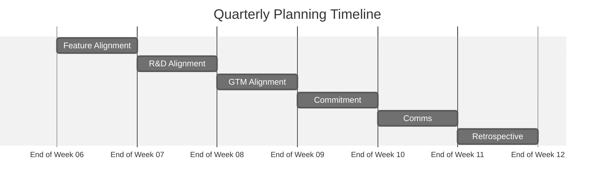

The **R&D Interlock Process** is used to align Product Management, User
Experience, and Engineering teams on roadmap planning and coordinating
execution. The interlock consists of three major components:

- The [Resource Allocation Framework](#resource-allocation-framework) provides a
  structure to map product and engineering driven efforts to the available
  engineering resources.
- The [Roadmap Structure](#roadmap-structure) describes the planning artifacts
  (roadmaps) used for alignment and defines their ownership, purpose and
  audience.
- The [R&D Alignment Process](#rd-alignment-process) provides a process and
  timeline to create alignment for the next execution quarters.

The alignment process outlines a joint approach across product-driven and
engineering-driven initiatives while ensuring clear communication channels with
various stakeholders.

Note: During the remainder of FY26 (through January 2026), the team will participate in accelerated planning, planning one quarter every 2 months. Our goal is to deliver a 4-quarter roadmap that is in alignment with industry-wide trends and maturing SaaS companies similar to GitLab. Once we have achieved that at the end of January, we will go to regular planning cadence of planning 1 quarter every 3 months.

## Resource Allocation Framework

We're establishing a balanced approach between product-led and
engineering-driven initiatives that prioritizes customer needs, quality
standards, and long-term product sustainability. This balance serves as the
foundation for ongoing dialogue between Product Management and Engineering
teams, with the flexibility to adjust ratios as needed for each team's specific
context.

Initiatives are tracked through the [R&D Interlock Dashboard](https://gitlab.com/groups/gitlab-org/-/wikis/CXO-Operational-Dashboards/R&D-Interlock-Dashboard).

- ### P1/P2/P3: Product-Driven Initiatives

  - Prioritization Levels
    - P1: 100% Eng Confidence that the complete initiative will be delivered at the committed date
    - P2: 80% Eng Confidence that the complete initiative will be delivered at the committed date
    - P3: 50% Eng Confidence, can be stopped if a P1-2 or E1-2 is at risk.
  - Some but not all P1/P2/P3 projects will be added to the
    [Public Roadmap](#public-roadmap) (owned by GTM) and will be labeled with
    the GTM tiers T1/T2/T3 (reference:
    [definition of GTM tiers](https://docs.google.com/spreadsheets/d/1Pis-VRUYTlitNjoKmDKNQMIf-4bWBo5XjPyWOYo0R54/edit?gid=838006198#gid=838006198&range=B20)).
    - It’s possible that T and P priorities do not strictly match. For example,
      a contractual customer commitment might be a P1 for Product but a T3 for
      GTM. Similarly, a competitive gap might be a P2 for Product but a T3 for
      GTM. It is expected that this divergence of priorities will happen
      frequently.
    - **GTM priorities T1-3 can never be higher (only ever be equal or lower)
      than Product priorities P1-P3, else we’ll run into priority
      inversion. Exceptions need PLT/ELT/MLT approval.**
    - T priorities are externally communicated to stakeholders via
      [Public Roadmap](#public-roadmap)
    - P priorities are externally communicated to stakeholders via
      [Internal Roadmap](#internal-roadmap)

- ### E1/E2/E3: Engineering-Driven Initiatives

  - Prioritization Levels:
    - E1: 100% Eng Confidence that the complete initiative will be delivered at the committed date
    - E2: 80% Eng Confidence that the complete initiative will be delivered at the committed date
    - E3: 50% Eng Confidence, can be stopped if a P1-2 or E1-2 is at risk.
  - Internal visibility only
  - Not externally communicated
  - No dependencies outside of Engineering

Unless approved by the respective VP of Product and/or Engineering, there is a
maximum limit of 1 x (P1 or E1) and 2 x (P2 or E2) per 20 engineers with a
minimum of 1 x P2 per key investment areas (e.g. SCM, CI, Security, Compliance,
Planning, Duo).

Creating a clean alignment ("interlock") between Product and Engineering
requires a structured planning methodology that integrates user requirements
with focused quality improvements and essential technical efforts. This
framework establishes a dual-track system where product-driven initiatives
(P1/P2/P3) operate with explicit resource allocation parameters—P1 receiving
engineering capacity to deliver 100% of planned scope with 100% certainty and
full visibility in external communications, P2 allocated engineering resources
to deliver 100% of planned scope with 80% certainty, both with defined
acceptance criteria. P3 efforts are implemented through iterative development
cycles when capacity permits with a target of 50% confidence. This systematic
approach ensures proper resource allocation while creating a traceable
relationship between committed functionality and execution.

Parallel to these requirement-driven developments, the framework implements a
technical sustainability track (E1/E2/E3) with equivalent resource allocation
metrics but isolated from external dependencies and release communications. This
structure enables critical refactoring, dependency upgrades, test automation
improvements, and infrastructure optimization to proceed with appropriate
prioritization without external scheduling constraints.

The configurable ratio between P-track and E-track allocations provides
implementation flexibility across different system components and architectural
layers, allowing teams to adapt the framework based on technical debt
accumulation, system stability metrics, and component lifecycle
phases—ultimately producing systems that satisfy functional requirements while
maintaining architectural integrity.

## Roadmap Structure

### R&D Execution Roadmap

- **Content:** All P1/P2/P3 and E1/E2/E3 initiatives
- **Cadence:** Quarterly updates, 4-quarter rolling window
- **Audience:** Product and Engineering leadership
- **Owner:** Eng VP in alignment with Product
- **Purpose:** Readiness, Feasibility, and Execution Planning
- **Format:** One deck per section
  ([template](https://docs.google.com/presentation/d/1UTjvJVl544gj9cYrmKeW8KI8dtXBZ6jzxywOuIxRHrI/edit)),
  one roadmap overview for customer and engineering driven initiatives per
  stage, Individual alignment slides for each initiative

### R&D Investment Roadmap

- **Content**: P1/P2 and E1/E2 initiatives (80%+ confidence)
- **Cadence**: Quarterly updates, 4-quarter rolling window
- **Audience**: Board level
- **Owner: CPO and CTO Purpose**: Strategic investment overview

### Internal Roadmap

- **Content**: All P1/P2/P3 features
- **Cadence**: Quarterly updates, 4-quarter rolling window
- **Audience**: Select customers
- **Owner**: PM VP in alignment with Eng and UX
- **Purpose**: Product evolution and feature planning

### Public Roadmap

- **Content**: A subset of P1/P2/P3 product-driven features will be labeled as
  T1/T2/T3 for GTM. **N.b. that GTM priority T1/T2 can never be higher than
  product priority to avoid priority inversion.**
- **Cadence**: Quarterly updates, 4-quarter rolling window
- **Audience**: Customers
- **Owner**: GTM in alignment with Product
- **Purpose**: External commitment tracking

```mermaid
---
config:
  look: handDrawn
  theme: neutral
---
flowchart LR
    Execution_Roadmap("
        ⚙ **R&D Execution Roadmap**<br>
        *Purpose*: Readiness, Feasibility and Execution Planning<br>
        **P1/P2/P3 and E1/E2/E3 Initiatives**<br>
        *Audience*: PM, UX and Engineering Leadership
        *Owner*: Env VP in alignment with PM and UX
    ")

    Product_Roadmap("
        🧁 **Product Roadmap**<br>
        *Purpose*: Product Evolution and Features<br>
        **P1/P2/P3 Initiatives**<br>
        *Audience*: Select Customers
        *Owner*: PM VP in alignment with Eng and UX
    ")

    Investment_Roadmap("
        💰 **R&D Investment Roadmap**<br>
        *Purpose*: Strategic investment overview<br>
        **P1/P2 and E1/E2 Initiatives**<br>
        *Audience*: Board level
        *Owner*: CPO and CTO
    ")

    Public_Roadmap("
        📢 **Public Roadmap**<br>
        *Purpose*: Strategic investment overview<br>
        **P1/P2/P3 Initiatives**<br>
        *Audience*: Select Customers
        *Owner*: PM VP in alignment with Eng and UX
    ")

    Execution_Roadmap --> Product_Roadmap
    Execution_Roadmap --> Investment_Roadmap
    Product_Roadmap --> Public_Roadmap
```



## R&D Alignment Process

The R&D Alignment process produces a generally agreed on
[R&D Execution Roadmap](#rd-execution-roadmap) (and all
[derivative roadmaps](#roadmap-structure)) one quarter ahead of the planning
window. If we’re planning for Q<sub>n</sub> to Q<sub>n+3</sub>, the planning
quarter is prior to execution and marked as Q<sub>n-1</sub> to provide a clear
planning timeline. The alignment process runs in Q<sub>n-1</sub> Week 7-12.



<table>
  <tr>
    <td>
      <h3 id="#feature-definition">Feature Definition</h3>
      <p>Timeline: Q<sub>n-1</sub> Week 1</p>
    </td>
    <td>
      <ul>
        <li>Goal: Assure readiness of alignment
          <ul>
            <li>Phase 1: Outline the <a href="/handbook/product-development/how-we-work/roles-and-responsibilities/#who-what-why-how-and-when">Who, What, and Why</a>
              <ul>
                <li>Business value</li>
                <li>Requirements (use case and pains to address)</li>
                <li>Target user</li>
              </ul>
            <li>
            <li>Phase 2: Assess alignment readiness
              <ul>
                <li>Problem validation</li>
                <li>UX deliverable and solution validation scope</li>
                <li>UX bandwidth and timeline<li>
              </ul>
            </li>
          </ul>
        </li>
        <li>Owner: Phase 1: PLT, Phase 2: UXLT</li>
        <li>
          Participants: PM/PD/Eng Leaders
        </li>
      </ul>
    </td>
  </tr>
  <tr>
    <td>
      <h3 id="#feature-alignment">Feature Alignment</h3>
      <p>Timeline: Q<sub>n-1</sub> Week 8</p>
    </td>
    <td>
      <ul>
        <li>Goal: Create PM/PD/EM alignment on full set of P1-3/E1-3 features</li>
        <li>
          Content:
          <ul>
            <li>Discuss P1/P2/P3 and E1/E2/E3 initial draft ideas</li>
            <li>Identify ownership, dependencies and conflicts</li>
            <li>
              Initial assessment of:
              <ul>
                <li>Technical feasibility</li>
                <li>Engineering bandwidth and timeline</li>
                <li>Resource requirements and Dependencies</li>
                <li>Strategic alignment</li>
                <li>Customer Zero requirements and enablement</li>
              </ul>
            </li>
            <li>
              Improvements (Quality, stability, security etc.) should be mapped
              as either P or E driven initiatives
            </li>
          </ul>
        </li>
        <li>
          Artifact: Stage-level alignment slides in
          <a href="#rd-execution-roadmap">R&amp;D Execution Roadmap</a>
        </li>
        <li>Owner: PLT/ELT</li>
        <li>
          Participants: Group PM/PDM/EM for each capability under consideration
        </li>
        <li>Format: Sync or async, as preferred by group-level teams</li>
      </ul>
    </td>
  </tr>
  <tr>
    <td>
      <h3 id="#rd-alignment-discussion">R&amp;D Alignment Discussion</h3>
      <p>Timeline: Q<sub>n-1</sub> Week 9</p>
    </td>
    <td>
      <ul>
        <li>
          Goal: Align Product & Engineering leadership on:
          <ul>
            <li>
              Scope and importance of capability to customer, quality and needs
            </li>
            <li>Ability to commit to proposed E/P priority ranking</li>
          </ul>
        </li>
        <li>
          Content:
          <ul>
            <li>
              Discussion to align on:
              <ul>
                <li>Customer Problem and Business Value</li>
                <li>
                  Definition of Good: Clear user experience, success and
                  landing criteria
                </li>
                <li>Proposed priority</li>
                <li>Resource requirements</li>
                <li>Initial UX and Eng timeline estimates</li>
                <li>Dependencies identification</li>
                <li>Risk assessment</li>
              </ul>
            </li>
          </ul>
        </li>
        <li>
          Topic Granularity: Minimum threshold of 1 FTE quarter
          <ul>
            <li>
              Smaller initiatives are aggregated as milestones into thematic
              features
            </li>
          </ul>
        </li>
        <li>
          Artifact:
          <a href="#rd-execution-roadmap">R&amp;D Execution Roadmap</a> with one
          joint alignment slide per feature (<a
            href="https://www.google.com/url?q=https://docs.google.com/presentation/d/1UTjvJVl544gj9cYrmKeW8KI8dtXBZ6jzxywOuIxRHrI/edit"
            >template</a
          >)
        </li>
        <li>Owner: PLT/ELT/UXLT</li>
        <li>
          Participants:
          <ul>
            <li>E-track: EM responsible for capability</li>
            <li>P-track: PM/PDM/EM responsible for capability</li>
          </ul>
        </li>
      </ul>
    </td>
  </tr>
  <tr>
    <td>
      <h3 id="#gtm-alignment-discussion">GTM Alignment Discussion</h3>
      <p>Timeline: Q<sub>n-1</sub> Week 10</p>
    </td>
    <td>
      <ul>
        <li>
          Goal: Align R&amp;D and GTM leadership on:
          <ul>
            <li>Scope and importance of capability to GTM considerations</li>
            <li>Ability to commit to proposed T priority ranking</li>
          </ul>
        </li>
        <li>
          Content:
          <ul>
            <li>
              Pre-read: R&amp;D joint alignment slide in
              <a href="#rd-execution-roadmap">R&amp;D Execution Roadmap</a>
            </li>
            <li>Discussion artifact: Proposed T priorities from GTM</li>
          </ul>
        </li>
        <li>Owner: MLT</li>
        <li>Participants: ELT, PLT & MLT</li>
      </ul>
    </td>
  </tr>
  <tr>
    <td>
      <h3 id="#final-prioritization-and-commitment">
        Final Prioritization and Commitment
      </h3>
      <p>Timeline: Q<sub>n-1</sub> Week 11</p>
    </td>
    <td>
      <ul>
        <li>
          Goal: Document outcome of alignment discussions in
          <a href="#rd-execution-roadmap">R&amp;D Execution Roadmap</a>
        </li>
        <li>
          Content:
          <ul>
            <li>Final T/P/E assignments</li>
            <li>Delivery timeline commitment</li>
            <li>Resource allocation confirmation</li>
            <li>Identification of dependencies</li>
            <li>Documentation of risks</li>
          </ul>
        </li>
        <li>
          Owner:
          <ul>
            <li>E-track: EM responsible for capability, Eng VP signoff</li>
            <li>
              P-track: PM, PDM, & EM responsible for capability, PM, UX, and Eng VP signoff
            </li>
          </ul>
        </li>
        <li>Format: Async</li>
      </ul>
    </td>
  </tr>
  <tr>
    <td>
      <h3 id="#upstream-communication">Upstream Communication</h3>
      <p>Timeline: Q<sub>n-1</sub> Week 12</p>
    </td>
    <td>
      <ul>
        <li>
          Aligned P1-3 initiatives integrated into
          <a href="#internal-roadmap">Internal Roadmap</a>
        </li>
        <li>
          P1/P2 and E1/E2 initiatives integrated into
          <a href="#rd-investment-roadmap">R&amp;D Investment Roadmap</a>
        </li>
        <li>
          Select P1/P2 initiatives integrated into
          <a href="#public-roadmap">Public Roadmap</a> as T1/T2, n.b. that GTM
          priority T1/T2 can never be higher than product priority to avoid
          priority inversion.
        </li>
      </ul>
    </td>
  </tr>
  <tr>
    <td>
      <h3 id="#retrospective">Retrospective</h3>
      <p>Timeline: Q<sub>n</sub> Week 1</p>
    </td>
    <td>
      <ul>
        <li>
          Goal: Learn from prior planning cycle and identify any changes that
          need to be implemented going forward.
        </li>
        <li>
          Content: Collect, discuss and incorporate feedback from prior planning
          iteration
        </li>
        <li>Artifact: Q<sub>n-2</sub> Planning Retrospective.</li>
        <li>Owners: PLT/ELT</li>
        <li>Participants: Planners at Section and Stage Level</li>
      </ul>
    </td>
  </tr>
</table>

## Success Metrics

- Roadmap alignment with company goals
- Planning efficiency (time spent planning and aligning, effort sizing,
  customer / quality / sustainability balance)
- Planning and execution accuracy (Delivery against commitments in time)

## Commitment Change Requests

Any major changes to the timeline, scope, cost, priority, quality or risk for a
committed feature of priorities P1/E1 and P2/E2 should be raised to respective
PLT and ELT members as well as CPO and CTO through a **Commitment Change Request**
to get explicit approval and keep all stakeholders in the loop:

1. Project DRIs add an internal note (comment) as a new thread on the relevant interlock epic,
   and a link to the comment in [\#r-and-d-roadmap-changes](https://gitlab.enterprise.slack.com/archives/C08G1GJLKN0),
   mentioning the respective stakeholders. The epic comment should follow a standardized
   format, so decision makers can quickly respond / act:

   ```text
   ### Proposing change to feature

   - Change Type: [select: Timeline / Scope / Cost / Priority / Quality / Risk]
   - What’s changing: <Priority from XX to YY>, <Delivery Milestone from YY.Y to ZZ.Z>, …
   - Background: [2-3 sentences describing the decision]
   - Impact: [optional, further detail on impact to customers / cost / list of projects that are dependent on this project + @ mentions of DRIs for those projects]
   - Proposed by: [Name of Product and Engineering DRI]
   - Approvers: [specific PLT, ELT members], CPO, CTO

   <more narrative / details of change, motivation, impact>

   /label ~"Interlock status::Change requested" ~"Interlock changed"
   ```

   Note: If the change request is canceled, please revert/remove the labels added as part of the change request template.
2. Free form discussion on the epic comment as a thread, optional meeting.
3. Approval to commit to change from CPO and CTO.
4. Once approved, the team member who has kicked off the change request (eg. PM, EM) should add the "Interlock status::VP approved" label.

Any change that constitutes a slip in deadline, a significant reduction in
scope, or anything else that would make us miss customer expectations
constitutes a major change. *If in doubt, go through the change management
process.*

## GitLab Process

Generally, where implementation work can be public, use an [internal note](https://docs.gitlab.com/user/discussions/#add-an-internal-note) to make notes or discuss any sensitive information. Examples include, but are not limited to, customer names, ARR impact, and other business details that shouldn't be publicly visible.

If the implementation work is not in the `gitlab-org/` group, a separate interlock epic should be created using the [provided template](https://gitlab.com/groups/gitlab-org/-/epics/new?description_template=interlock_template). Each interlock epic should be linked to its corresponding workstream epic, allowing for easy navigation and drilldown into the actual implementation work. The interlock epic should be used to discuss anything related to the interlock process, and regularly updated with a summary on its "health" and progress.

## R&D Interlock Planning Timelines

- FY27Q2 Sep. 1, 2025 - Sep. 30, 2025
- FY27Q3 Oct. 15, 2025 - Nov. 15, 2025
- FY27Q4 Dec. 8, 2025 - Jan. 30, 2026

## Best Practices

1. **Focus on Alignment with Business Objectives, Not Amount of Epics**
R&D Interlock items need to be directly tied back to our investment themes. Each investment theme should have a maximum of 8 R&D Interlock items. Focus on what is most aligned with business objectives and goals. Directly work with your leadership to confirm alignment.
2. **Interlock Capacity**
Interlock items should encompass 70% of your teams capacity at maximum. We do not encourage any higher due to shifting business needs, resourcing, and capacity challenges that may take additional bandwidth to complete R&D priorities; you want to ensure your team has clearance to deliver.
3. **Keep commitment top of mind**
When your team commits to an interlock item; this means your team is willing to prioritize this work and deprioritize other initiatives.
4. **Cross-functional priority alignment**
If you interlock with another team on their product and/or delivery - you are committed to driving your responsibilities forward and deprioritizing other work to meet GitLab business goals.
5. **Plan Early**
As we start a continuous planning process, it is critical to start working with teams as early as possible. It is suggested to pre-plan a sync call in the middle of interlock planning to create a placeholder for applicable stakeholders to ensure dedicated time for alignment.

### GitLab's Product Roadmap R&D Interlock Process

<table>
    <tr>
        <th>Stage</th>
        <th>Steps</th>
        <th>Outcome</th>
    </tr>
    <tr>
        <td><strong>1. Feature Alignment</strong></td>
        <td>
            <ol>
                <li><strong>PM or EM:</strong> Create epic using the interlock template</li>
                <li><strong>PM:</strong> Add initial epic description, customer impact, ARR estimates</li>
                <li><strong>PM:</strong> Apply "Interlock status::New/Proposal in progress" label</li>
                <li><strong>PM:</strong> Apply section, stage, group labels</li>
                <li><strong>PM:</strong> Mention EM and UX on the epic to begin collaboration - agree on initial scope, viability, and UX resource needs</li>
                <li><strong>UX:</strong> Provide input on design scope and feasibility</li>
            </ol>
        </td>
        <td>
            <ul>
                <li>Epic created with initial info</li>
                <li>Initial identification of P/E-track alignment</li>
                <li>UX resource needs identified</li>
                <li>Stage-level alignment</li>
            </ul>
        </td>
    </tr>
    <tr>
        <td><strong>2. R&D Alignment Discussion</strong></td>
        <td>
            <ol>
                <li><strong>EM:</strong> Add technical details, assessment, scoping, funding info, anticipated milestone & due diligence</li>
                <li><strong>UX:</strong> Add design complexity assessment and resource needs</li>
                <li><strong>PM + EM+ UX:</strong> Collaborate on epic (comments or sync meetings)</li>
                <li><strong>PM,EM or UX:</strong> Confirm choices and update to "Interlock status::Ready for review with alignment across the PM, EM and UX"</li>
                <li><strong>PM or EM:</strong> Add appropriate priority label (P1/P2/P3 or E1/E2/E3)</li>
                <li><strong>PM:</strong> Mention GPM/Director to request review</li>
            </ol>
        </td>
        <td>
            <ul>
                <li>Epic with complete technical and UX assessment</li>
                <li>P/E priority designation</li>
                <li>Ready for leadership review</li>
            </ul>
        </td>
    </tr>
    <tr>
        <td><strong>3. GPM/Director Review</strong></td>
        <td>
            <ol>
                <li><strong>GPM + Eng Director + UX Director:</strong> Review details on epic</li>
                <li><strong>GPM + Eng Director + UX Director:</strong> Ask questions using comments</li>
                <li><strong>GPM or Eng Director:</strong> If both aligned on approval, update to "Interlock status::GPM/Director approved"</li>
                <li><strong>GPM or Director:</strong> If both aligned on no-approval, update to "Interlock status::Alternate proposed" and provide feedback</li>
                <li><strong>PM + EM + UX:</strong> If alternate proposed, address feedback and restart process</li>
            </ol>
        </td>
        <td>
            <ul>
                <li>Epic with GPM/Director approval</li>
                <li>Validated priority level</li>
            </ul>
        </td>
    </tr>
    <tr>
        <td><strong>4. GTM Alignment Discussion</strong></td>
        <td>
            <ol>
                <li><strong>PM + PMM:</strong> Review P-track items for external visibility</li>
                <li><strong>PM + PMM:</strong> Discuss external communication strategy</li>
                <li><strong>PM + PMM:</strong> Agree on proposed GTM tier (T1/T2/T3)</li>
                <li><strong>PM:</strong> Add appropriate GTM tier label if applicable</li>
                <li><strong>PM:</strong> Mention VP to request final review</li>
            </ol>
        </td>
        <td>
            <ul>
                <li>Proposed GTM tier assignments (T1/T2/T3)</li>
                <li>GTM tier labels applied to appropriate epics</li>
            </ul>
        </td>
    </tr>
    <tr>
        <td><strong>5. VP Review</strong></td>
        <td>
            <ol>
                <li><strong>VP:</strong> Review epic details and prioritize assignments</li>
                <li><strong>VP:</strong> Review all epics under associated investment theme. Ensure there are 8 commitments or less. If there are more, re-prioritize against business needs and add interlock non-essential label to issue that are not as significant to business goals.</li>
                <li><strong>VP:</strong> Ask questions using comments.</li>
                <li><strong>VP:</strong> Leave a comment explaining the justification if the issue is labeled with "Interlock status::Non-essential" label.</li>
                <li><strong>VP:</strong> If approved, update to "Interlock status::VP approved"</li>
                <li><strong>VP:</strong> If not approved, update to "Interlock status::Alternate proposed" and provide feedback</li>
                <li><strong>PM + EM + UX:</strong> If alternate proposed, address feedback and restart process</li>
                <li><strong>PM + EM + UX:</strong> If epic is labeled as non-essential ("Interlock status::Non-essential" label), connect with leader on next steps of the deliverable and if there is necessary adjustments to capacity (i.e. redirect focus on another deliverable, or continue work)</li>
            </ol>
        </td>
        <td>
            <ul>
                <li>Epic with VP approval</li>
                <li>Final commitment secured</li>
            </ul>
        </td>
    </tr>
    <tr>
        <td><strong>6. Executing</strong></td>
        <td>
            <ol>
                <li><strong>EM:</strong> Updates epic status label to "R&D roadmap status::Executing"</li>
                <li><strong>EM:</strong> Updates epic with health status labels weekly</li>
                <li><strong>EM:</strong> Documents any newly identified risks, dependencies as well as timing changes</li>
                <li><strong>EM:</strong> Links to implementation epics as work begins</li>
                <li><strong>EM/UX:</strong> Document risks and dependencies as they emerge</li>
            </ol>
        </td>
        <td>
            <ul>
                <li>Weekly health status updates</li>
                <li>Transparent delivery status</li>
                <li>Early risk identification</li>
            </ul>
        </td>
    </tr>
</table>

### R&D Interlock Process Review

For epics interlocked for the next two upcoming quarters, **PM + EM** will:

- Review item and verify confidence in delivery
  If there are major dependencies or risks, manage and present concerns to the leaders for review and reschedule
- Ensure appropriate delivery milestone is assigned
- Ensure health status label is updated and accurate

### When NOT to use this process

Not all work requires going through this interlock process. Regular development work that doesn't require cross-functional alignment, significant resource commitment, or go-to-market coordination can continue to use standard workstream epics and issues. The R&D Interlock Process is exclusive to high priority business objectives per investment area across the GitLab platform.

### Benefits

Work proposed via the R&D Interlock process will benefit from:

- **Executive visibility**: Items in this process receive visibility at the highest levels of the organization
- **Go-to-market coordination**: Customer-facing items may be included in GTM planning depending on `GTM tier`, enabling sales and marketing alignment
- **Resource commitment**: Formal engineering commitment at specified confidence levels; this means these teams are committed to delivering these investments and de-prioritizing other work in return
- **Cross-functional alignment**: Ensures Product, Engineering, and GTM teams are aligned on priorities
- **External communication**: Select items may be included in public/customer-facing roadmaps

### How to create a candidate for proposal

1. **Create an Epic** if existing epic is outside of `gitlab-org`
   1. Within the [`gitlab-org](https://gitlab.com/gitlab-org) group, create a new epic ([docs](https://docs.gitlab.com/user/group/epics/manage_epics/#create-an-epic))
   1. Copy to an [internal note](https://docs.gitlab.com/user/discussions/#add-an-internal-note) (for existing), or select (for new), the epic template named: [interlock_template](https://gitlab.com/groups/gitlab-org/-/epics/new?description_template=interlock_template)
1. **Complete the required information**
   1. Fill in all sections of the template
   1. Assign DRIs (PM, EM, UXPD&PDM)
   1. Apply appropriate labels (see [Labels Guide](https://gitlab.com/groups/gitlab-org/gitlab-rd-planning/-/wikis/R&D-Interlock-Process-Dashboard#labels-guide))
      - Note: If the candidate is not committed, all interlock specific labels should be removed.
   1. Apply target milestone
1. **Update interlock status throughout process**
   1. Update interlock status as discussions progress
   1. After the quarter begins, update health status weekly
   1. Document risks and dependencies as they emerge

### Viewing the interlock commitments

Utilize the [R&D Interlock Dashboard](https://gitlab.com/groups/gitlab-org/-/wikis/CXO-Operational-Dashboards/R&D-Interlock-Dashboard) to view interlocked commitments by quarter.

Reach out to `@amandarueda` if you'd like help creating a custom GLQL view for your group, stage, or section.

### Changes after commitment

Please keep epics [appropriately labelled](#labels-guide) if interlock committed items are changed, including:

1. To change the interlock item, use the [commitment change request](#commitment-change-requests) process.
1. To remove a committed interlocked item from the roadmap, you should:
   1. Add an internal comment on why (if using the [commitment change request](#commitment-change-requests) template, please remove the change labels).
   1. Add the  label.
   1. Remove any GTM label.
   1. Optionally, remove the investment label.
   1. Keep all other interlock related labels.

### Labels Guide

| Label               | Values| Purpose|
|--------------------------|--------------------|-------------------|
| Interlock candidate      |  | Identifies epics as part of the R&D Interlock process; automatically applied through the epic template |
| Section                  |  <br>  <br>  <br> *more labels available in series....*| Indicates which high-level organizational section the work belongs to, allowing for filtering across departments |
| Stage                    |  <br>  <br>  <br> *more labels available in series....*| Specifies which product stage is responsible for the work; enables stage leaders to view all commitments for their area |
| Group                    |  <br>  <br>  <br> *more labels available in series....*| Identifies the specific team responsible for implementation; allows teams to filter for just their own commitments |
| Interlock priority     |   <br>  <br>  <br>  <br>   <br>  | Interlock Priority labels indicate the level of confidence and commitment for both Product-driven (P1/P2/P3) and Engineering-driven (E1/E2/E3) initiatives. <br><br> - P1/E1 indicates 100% confidence in delivery with full resource commitment. <br> - P2/E2 indicates 80% confidence in delivery. <br>- P3/E3 indicates 50% confidence and may be deprioritized if P1/P2 or E1/E2 items are at risk. <br><br> Product priority (P) labels are used for customer-facing features, while Engineering priority (E) labels are used for technical improvements with internal visibility only. |
| Go-to-market tier        |  <br>   <br>   | GTM tier labels apply to a subset of Product-driven initiatives that will be communicated externally to customers and stakeholders. They represent Go-To-Market priority and visibility: <br><br> - Tier 1: Requires GA of capability, validation through the Early Access Program, customer references and tells a story of differentiation; Need the highest confidence of delivery and is externally communicated commitments  <br> - Tier 2: includes key feature updates that help tie together a story. These are considered less strategic, however may be noteworthy enough for a blog post or media interviews. They do not need to go through a formal early access or beta program, but must be available broadly with customer references as a "better" vs a requirement. Need high confidence items communicated to customers <br> - Tier 3: Directional items that may be communicated externally. Regular monthly release items that do not warrant a full GTM motion but should be included in communications, such as monthly release notes and potentially a blog post. <br><br> GTM tiers may be discussed during the collaboration phase, then finalized during the GTM Alignment Discussion (Week 10) by Marketing and Sales leadership. GTM priority tiers should never be higher than their corresponding Product priority (P1-P3) to avoid priority inversion.|
| Investment theme         |  <br>   <br>                     | Connects work to company's strategic investment areas as outlined in the FY26 company strategy; enables filtering to track progress on key company initiatives |
| Subscription tier        |  <br>  <br>                                                                                 | Specifies which GitLab subscription tier(s) will include the feature; helps with planning go-to-market activities |
| Platform|  <br>  <br>  <br>  | Indicates in which delivery platform the feature will be available |
| Quarters                 |  <br>  <br>  <br> *more labels available in series....*                                                     | Indicates the target delivery quarter for planning and tracking purposes; critical for filtering by timeframe |
| Interlock status labels  |  <br>  <br>  <br>  <br>  <br>  <br>  <br>  <br>  <br>  | Tracks the current state of the epic in the interlock process; updated as the epic progresses through review stages; drives board views and reporting |
| Interlock changed       |  | Identifies epics where a committed item had an approved change as part of the [commitment change request](#commitment-change-requests) |
| Interlock committed      |  | Identifies epics as confirmed and committed as part of the R&D Interlock process |
| Health                   |  <br>  <br>                                                                   | Indicates the delivery risk during execution phase; updated weekly by EMs once the quarter begins; helps leadership identify items requiring intervention <br><br> *(Note: we are using labels for health status until epic boards can utilize the [health status](https://docs.gitlab.com/user/group/epics/manage_epics/#health-status) feature)* |

### Future feature enhancements

The Plan stage has an incredible product roadmap for this year, with many items that will directly improve this interlock process. See below for upcoming features and let us know if you have ideas for additional improvements!

- **Epic milestones** - Replace quarter labels with proper milestone functionality, including the milestone burndown charts to see how the quarter is performing at a glance
- **Custom fields** - Reduce label sprawl by using fields instead of labels
- **Enhanced board capabilities** - Use expanded swimlane options (horizontal groupings) to reduce filters and saved views
- **Customizable metadata display** - Remove noise from executive views by controlling visible fields

## FAQs

<summary>Click to expand</summary>

1. **Q:** Why are we using epics instead of issues?
   - **A:** In future iterations, as the Plan features mature, our goal is to get this process into the Roadmap view, and eventually, connect the workstream to the strategy (plan) to enable drill down and progress information.

1. **Q:** Why don't we create these epics in a separate group from `gitlab-org`?
   - **A:** I've learned that we have hundreds of internal groups that the SRE team has to keep safe. Rather than piling on, I've chosen to use the main `gitlab-org` group as a boring solution. If this causes noise or concern we can revisit the decision.

1. **Q:** Is there a reason why we can't use the native health status widget instead of labels?
   - **A:** We are using labels for health status until epic boards can utilize the [health status](https://docs.gitlab.com/user/group/epics/manage_epics/#health-status) feature

1. **Q:** Can I save my own views for this process?
   - **A:** Of course, let us know if you have any questions about filter criteria or label usage.

1. **Q:** Do I need to make my epic confidential since I'm mentioning customer information?
   - **A:** Use an [internal note](https://docs.gitlab.com/user/discussions/#add-an-internal-note) by default for interlock discussion. If implementation should be non-public, then make the [epic confidential](https://docs.gitlab.com/user/group/epics/manage_epics/#make-an-epic-confidential).

1. **Q:** Are EMs or PMs responsible for creating the epic for interlock planning?
   - **A:** The PMs are the main DRI for the creation of the interlock epic, in partnership with their EMs for the P priorities, and vice versa for E priorities.

1. **Q:** It isn't clear how to adjust timelines after interlock has taken place? How can I do that? Can I move my delivery timeline up or back?
   - **A:** Teams should use [a change request](#commitment-change-requests) for any adjustment that need to take place. You can update your delivery forwards or backwards with appropriate leadership approval.

1. **Q:** Currently, our timelines are difficult to deliver. We are interlocking with teams, but there is current ambiguity in teams we must interlock with - does that mean we shouldn't interlock at all if we don't have clarity?
   - **A:** No, your teams should still work together to interlock. There is ambiguity in the process that still needs to be defined. Your teams can make a commitment to partner and execute once there is additional clarity on ambiguous areas of development. For now, please operate towards these dates with the caveat that we may not have 100% certainty, given that additional information may be needed for further interlock. Ultimately, the deadlines are a goal to guide the process along in a timely manner to ensure that each 'phase' has an adequate amount of time, but will be further reviewed for future planning iterations.

1. **Q:** I'm having a hard time with the current process and I need more guidance. Where can I go for help?
   - **A:** If you have any questions interlock process, please send a message in the [`#r-and-d-planning-leads` Slack channel](https://gitlab.enterprise.slack.com/archives/C08ESJBC0VB). We also have an R&D Interlock office every week during the planning period, and once a month outside of the planning period. You can attend, bring your questions, and get the latest status of the interlock. Sessions with no pre-populated questions in the notes will be cancelled.

</details>
