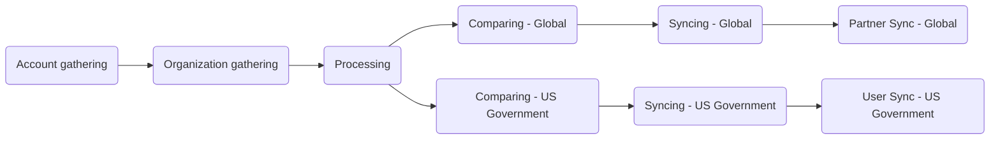

The Zendesk<>Salesforce Sync is a complex set of projects that run in "stages" to keep all our Zendesk production instances in sync with Salesforce. The stages for this look like:



## Account Gathering

<sup>*Source project: [gitlab-support-readiness/zd-sfdc-sync/salesforce-accounts](https://gitlab.com/gitlab-support-readiness/zd-sfdc-sync/salesforce-accounts)*</sup>

The purpose of this stage is to gather all relevant Salesforce accounts (except for partner accounts) and generate an artifact of them (to be passed into the next stage).

Via a [scheduled pipeline](https://docs.gitlab.com/ci/pipelines/schedules/), the `bin/gather` handles the actual work of the stage.

The script begins by generating a bearer token using the Salesforce API. With that, it establishes a Salesforce connection to begin running the query.

From here, the script runs the following Salesforce Query Language query:

<details>
<summary>SOQL query</summary>

```sql
SELECT
  Account_ID_18__c,
  Name,
  CARR_This_Account__c,
  Type,
  Ultimate_Parent_Sales_Segment_Employees__c,
  Account_Owner_Calc__c,
  Technical_Account_Manager_Name__c,
  Restricted_Account__c,
  Solutions_Architect_Lookup__r.Name,
  Account_Demographics_Geo__c,
  Account_Demographics_Region__c,
  Latest_Sold_To_Contact__r.Email,
  Latest_Sold_To_Contact__r.Name,
  Partner_Track__c,
  Partners_Partner_Type__c,
  Support_Hold__c,
  Account_Risk_Level__c,
  Support_Instance__c,
  (
    SELECT
      Id,
      Name,
      Subscription_ID_18__c,
      Zuora__Status__c,
      Zuora__SubscriptionStartDate__c,
      Zuora__SubscriptionEndDate__c,
      Sold_To_Email__c
    FROM Zuora__Subscriptions__r
    WHERE
      Zuora__Status__c != 'Cancelled' AND
      Zuora__SubscriptionEndDate__c >= #{end_date}
  ),
  (
    SELECT
      Id,
      Name,
      Zuora__SubscriptionRatePlanChargeName__c,
      Zuora__Subscription__c,
      Zuora__EffectiveStartDate__c,
      Zuora__EffectiveEndDate__c,
      Zuora__Quantity__c
    FROM Zuora__R00N40000001lGjTEAU__r
    WHERE
      Subscription_Status__c != 'Cancelled' AND
      Zuora__EffectiveEndDate__c >= #{end_date}
  )
FROM Account
WHERE
  Type IN ('Customer', 'Former Customer')
```

</details>

To ensure all data is pulled quickly and efficiently, the script first runs the query as is, and then makes subsequent API calls to pull additional records as needed.

Once all records have been obtained, it then maps them into more usable objects (for future stages).

After that, the script then creates a JSON file (to serve as an artifact).

Once the job is complete, a [downstream pipeline](https://docs.gitlab.com/ci/pipelines/downstream_pipelines/) (specifically a multi-project pipeline) is created, passing the artifact file to the next stage.

## Organization Gathering

<sup>*Source project: [gitlab-support-readiness/zd-sfdc-sync/zendesk-orgs](https://gitlab.com/gitlab-support-readiness/zd-sfdc-sync/zendesk-orgs)*</sup>

The purpose of this stage is to gather all Zendesk organizations (for all production instances) and generate artifacts of them for each instance (to be passed into the next stage, along with the artifact from the previous stage).

This is kicked off from a [downstream pipeline](https://docs.gitlab.com/ci/pipelines/downstream_pipelines/) (triggered via the [Account Gathering stage](#account-gathering)), where the scripts `bin/gather_global` and `bin/gather_us_government` handle the work (in parallel).

Each script does the same process, which is scrapping the organizations API endpoint page by page (using cursor based pagniation). As it grabs a page of organizations, it maps them into more usable objects (for future stages).

After that, the script then creates a JSON file (to serve as an artifact).

Once the job is complete, a [downstream pipeline](https://docs.gitlab.com/ci/pipelines/downstream_pipelines/) (specifically a multi-project pipeline) is created, passing the artifact file to the next stage.

## Processing

<sup>*Source project: [gitlab-support-readiness/zd-sfdc-sync/processor](https://gitlab.com/gitlab-support-readiness/zd-sfdc-sync/processor)*</sup>

The purpose of this stage is to use the artifacts generated via the [Account Gathering](#account-gathering) and [Organization Gathering](#organization-gathering) to produce accurate artifacts reflective of the "accounts" for each Zendesk instance to use (to be passed into the next stage, along with the artifacts from the previous stage).

This is kicked off from a [downstream pipeline](https://docs.gitlab.com/ci/pipelines/downstream_pipelines/) (triggered via the [Organization Gathering stage](#organization-gathering)), where the script `bin/processor` handles the work.

Unlike previous stages, this is where a sizeable amount of data analysis and manipulation occurs.

Due to the complexity of this, please see our docs on [The Processor](/handbook/security/customer-support-operations/docs/zendesk-salesforce-sync/processor/) for more information.

After the processor has done its processing, the script then creates JSON files (to serve as artifacts).

Once the job is complete, [downstream pipelines](https://docs.gitlab.com/ci/pipelines/downstream_pipelines/) (specifically a multi-project pipeline) are created (one for each production Zendesk instance), passing the relevant artifact files to the next stage.

## Comparing - Global

<sup>*Source project: [gitlab-support-readiness/zd-sfdc-sync/global-org-compare](https://gitlab.com/gitlab-support-readiness/zd-sfdc-sync/global-org-compare)*</sup>

The purpose of this stage is to use the artifacts generated via the [Processing](#processing) and [Organization Gathering](#organization-gathering) stages to determine the changes needed in the Zendesk Global production instance and produce artifact files to reflect them.

This is kicked off from a [downstream pipeline](https://docs.gitlab.com/ci/pipelines/downstream_pipelines/) (triggered via the [Processing stage](#processing)), where the script `bin/compare` handles the work.

The script largely compares two arrays (one derived from the "global accounts" and one from the "zendesk organizations") to determine what is missing (i.e. a create or a "mark for deletion") and what has differences (i.e. an update).

Once this is determined, the script then creates JSON files (to serve as artifacts).

Once the job is complete, a [downstream pipeline](https://docs.gitlab.com/ci/pipelines/downstream_pipelines/) (specifically a multi-project pipeline) is created, passing the artifact file to the next stage.

## Comparing - US Government

<sup>*Source project: [gitlab-support-readiness/zd-sfdc-sync/us-gov-org-compare](https://gitlab.com/gitlab-support-readiness/zd-sfdc-sync/us-gov-org-compare)*</sup>

The purpose of this stage is to use the artifacts generated via the [Processing](#processing) and [Organization Gathering](#organization-gathering) stages to determine the changes needed in the Zendesk US Government production instance and produce artifact files to reflect them.

This is kicked off from a [downstream pipeline](https://docs.gitlab.com/ci/pipelines/downstream_pipelines/) (triggered via the [Processing stage](#processing)), where the script `bin/compare` handles the work.

The script largely compares two arrays (one derived from the "us government accounts" and one from the "zendesk organizations") to determine what is missing (i.e. a create or a "mark for deletion") and what has differences (i.e. an update).

Once this is determined, the script then creates JSON files (to serve as artifacts).

Once the job is complete, a [downstream pipeline](https://docs.gitlab.com/ci/pipelines/downstream_pipelines/) (specifically a multi-project pipeline) is created, passing the artifact file to the next stage.

## Syncing - Global

<sup>*Source project: [gitlab-support-readiness/zd-sfdc-sync/zendesk-global-org-sync](https://gitlab.com/gitlab-support-readiness/zd-sfdc-sync/zendesk-global-org-sync)*</sup>

The purpose of this stage is to use the artifacts generated via the [Comparing - Global stage](#comparing---global) to implement the changes needed in the Zendesk Global production instance.

The `bin/sync` script handles the actual work of the stage.

It begins by working on the organizations it needs to create. Going through them one at a time, it does the following:

- Creates the organziation
- If the list of sold-to users (determined via the Salesforce active subscription information) do not exist in the Zendesk system (or are unassociated currently), it adds them to the organization as support contacts
- Posts in Slack (if not users were added, thus leaving a new organization without any support contacts)

After that is complete, it then works on the updates. These are done in chunks of 100 organizations at a time using the [Update Many Organizations](https://developer.zendesk.com/api-reference/ticketing/organizations/organizations/#update-many-organizations) API endpoint. For every 20 updates jobs created in this way, the script will sleep for 30 seconds (to give the jobs time to complete).

Once all updates have been queued, the script will then bulk update the organziations it needs to mark for deletion (meaning they are expired beyond 3 years). It does this in the same manner the updates where done in (chunks of 100 at a time via bulk update jobs).

Once the job is complete, a [downstream pipeline](https://docs.gitlab.com/ci/pipelines/downstream_pipelines/) (specifically a multi-project pipeline) is created (it does not pass on any artifacts).

## Syncing - US Government

<sup>*Source project: [gitlab-support-readiness/zd-sfdc-sync/zendesk-us-government-org-sync](https://gitlab.com/gitlab-support-readiness/zd-sfdc-sync/zendesk-us-government-org-sync)*</sup>

The purpose of this stage is to use the artifacts generated via the [Comparing - US Government stage](#comparing---us-government) to implement the changes needed in the Zendesk US Government production instance.

The `bin/sync` script handles the actual work of the stage.

It begins by working on the organizations it needs to create. Going through them one at a time, it creates the organization (nothing further is needed due to users being managed via future stages).

After that is complete, it then works on the updates. These are done in chunks of 100 organizations at a time using the [Update Many Organizations](https://developer.zendesk.com/api-reference/ticketing/organizations/organizations/#update-many-organizations) API endpoint. For every 20 updates jobs created in this way, the script will sleep for 30 seconds (to give the jobs time to complete).

Once all updates have been queued, the script will then bulk update the organziations it needs to mark for deletion (meaning they are expired beyond 3 years). It does this in the same manner the updates where done in (chunks of 100 at a time via bulk update jobs).

Once the job is complete, a [downstream pipeline](https://docs.gitlab.com/ci/pipelines/downstream_pipelines/) (specifically a multi-project pipeline) is created (it does not pass on any artifacts).

## Partner Sync - Global

<sup>*Source project: [gitlab-support-readiness/zd-sfdc-sync/partner-sync](https://gitlab.com/gitlab-support-readiness/zd-sfdc-sync/partner-sync)*</sup>

This is the end of the stages for the Zendesk Global instance. As this script contains a bit more to it, please see our documentation on [The Partner Sync](/handbook/security/customer-support-operations/docs/zendesk-salesforce-sync/partner-sync/).

## User Sync - US Government

<sup>*Source project: [gitlab-support-readiness/zd-sfdc-sync/zendesk-us-gov-user-sync](https://gitlab.com/gitlab-support-readiness/zd-sfdc-sync/zendesk-us-gov-user-sync)*</sup>

This is the end of the stages for the Zendesk US Government instance. As this script contains a bit more to it, please see our documentation on [The User Sync](/handbook/security/customer-support-operations/docs/zendesk-salesforce-sync/user-sync/).
