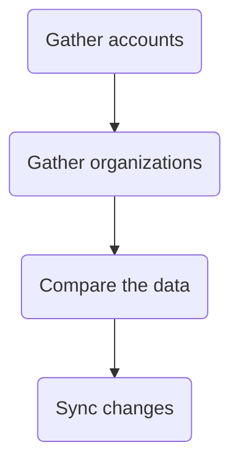

<sup>*Source project: [gitlab-support-readiness/zd-sfdc-sync/partner-sync](https://gitlab.com/gitlab-support-readiness/zd-sfdc-sync/partner-sync)*</sup>

For the Zendesk Global production instance, this is the final stage of the Zendesk-Salesforce sync. The focus of this stage is to handle the organizations tied to authorized GitLab Partners.

This can be broken down into 4 "stages" (even though this is actually one stage in of itself):



## Gather accounts

The purpose of this stage is to gather all relevant Salesforce accounts and generate a JSON file of them (to be used into the next stage).

The `bin/salesforce` script handles the actual work of the stage.

The script begins by generating a bearer token using the Salesforce API. With that, it establishes a Salesforce connection to begin running the query.

From here, the script runs the following Salesforce Query Language query:

<details>
<summary>SOQL query</summary>

```sql
SELECT
  Account_ID_18__c,
  Name,
  Account_Owner_Calc__c,
  Technical_Account_Manager_Name__c,
  Restricted_Account__c,
  Solutions_Architect_Lookup__r.Name,
  Partner_Track__c,
  Support_Hold__c,
  Account_Risk_Level__c,
  Type,
  Partners_Partner_Status__c
FROM Account
WHERE
  Account_ID_18__c = '0014M00001sDiGEQA0' OR
  (
    Type = 'Partner' AND
    Partners_Partner_Status__c IN ('Authorized') AND
    Partner_Track__c IN ('Open', 'Select')
  )
```

</details>

To ensure all data is pulled quickly and efficiently, the script first runs the query as is, and then makes subsequent API calls to pull additional records as needed.

Once all records have been obtained, it then maps them into more usable objects (for future stages).

After that, the script then creates a JSON file.

## Gather organizations

The purpose of this stage is to gather all Zendesk organizations (for all production instances), filter it so it only contains partner organizations, and generate a JSON file of them (to be used into the next stage).

The `bin/zendesk_gather` script handles the actual work of the stage.

The script is scrapping the organizations API endpoint page by page (using cursor based pagniation). As it grabs a page of organizations, it maps them into more usable objects (for future stages). Once it has a list of organizations, it then filters them based off the organization's `account_type` value (specifically looking for     `alliance_partner`, `open_partner`, or`select_partner`).

After that, the script then creates a JSON file.

## Compare the data

The purpose of this stage is to use the files generated via the [Gather accounts](#gather-accounts) and [Gather organizations](#gather-organizations) stages to determine the changes needed in the Zendesk Global production instance and produce JSON files to reflect them.

The `bin/compare` script handles the actual work of the stage.

The script largely compares two arrays (one derived from the "accounts" and one from the "organizations") to determine what is missing (i.e. a create or a "mark for deletion") and what has differences (i.e. an update).

Once this is determined, the script then creates JSON files.

## Sync changes

The purpose of this stage is to use the JSON files generated via the [Compare the data stage](#compare-the-data) to implement the changes needed in the Zendesk Global production instance.

The `bin/sync` script handles the actual work of the stage.

It begins by working on the organizations it needs to create. Going through them one at a time, it creates the organization (nothing further is needed due to users being managed via future stages).

After that is complete, it then works on the updates. These are done in chunks of 100 organizations at a time using the [Update Many Organizations](https://developer.zendesk.com/api-reference/ticketing/organizations/organizations/#update-many-organizations) API endpoint. For every 20 updates jobs created in this way, the script will sleep for 30 seconds (to give the jobs time to complete).

Once all updates have been queued, the script will then bulk update the organziations it needs to mark for deletion (meaning they are expired beyond 3 years). It does this in the same manner the updates where done in (chunks of 100 at a time via bulk update jobs).
