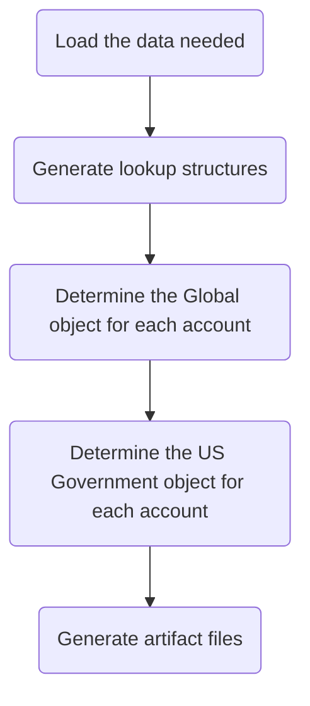

*Source project: [gitlab-support-readiness/zd-sfdc-sync/processor](https://gitlab.com/gitlab-support-readiness/zd-sfdc-sync/processor)*

The processor is arguably the most important part of the entire Zendesk-Salesforce sync, as it determines what salesforce accounts would be delegated to which Zendesk instance. And with that level of importance (as is often the case) comes a good deal of complexity.

To help break it down, we will categorize it in "stages" (even though this is actually one stage in of itself):

## Load the data needed

This stage is one of the "simplest" of the parts of the processor, but it can be broken down into three sub-stages.

### Fetch the overrides file

*Source project: [gitlab-com/support/zendesk-global/organization-entitlement-overrides](https://gitlab.com/gitlab-com/support/zendesk-global/organization-entitlement-overrides)*

This uses a connection to gitlab.com to grab the current raw contents of the support managed overrides file (and stores it into an array of hashes) from the source project.

### Read the plans.yaml

This reads the `plans.yaml` file to have a hash of mappings for product charge names.

### Load the data from artifacts

This reads information from artifact files to generate arrays of:

- The Salesforce accounts
- The Zendesk Global organizations
- The Zendesk US Government organizations

## Generate lookup structures

Due the sheer amount of data being analyzed and manipulated, we need to generated lookup structures so later stages can run more efficiently. All told, the following lookup structures will be generated:

| Name | Description | Object type |
|------|-------------|-------------|
| global_orgs_by_id | All Global organizations converted to a Hash using the salesforce_id key | Hash |
| usgov_orgs_by_id | All US Government organizations converted to a Hash using the salesforce_id key | Hash |
| partners_by_sfdc_id | The salesforce_id of all partner organizations | Array |
| overrides_by_id | All overrides converted to a Hash using the salesforce_id key | Hash |
| plan_lookup | All product charge names tied to the subscription type they align to | Hash |
| all_valid_plans | All product charge names tied to any type of account | Array |
| usgov_plan_names_for_exceptions | All product charge names tied to US Government accounts with an exception | Array |
| usgov_plan_names | All product charge names tied to US Government accounts without an exception | Array |
| today | Today's Date | Date |
| expired_end_date | 15 days ago | Date |
| three_years_out | 3 years and one day ago | Date |

Using these, future stages can rely on the considerably faster key lookup strategy to locate the corresponding information as it is needed.

## Determine the Global object for each account

{}

This runs in conjunction with [Determine the US Government object for each account](#determine-the-us-government-object-for-each-account).

A Salesforce account is skipped entirely in the following conditions:

- It is a partner account
- It has zero subscriptions

{}

Here, an object is generated from the account aligning with what it would correspond to if it was to be in the Zendesk Global instance.

This begins be creating a Hash matching the Zendesk organization attributes. From here, it begins analyzing each subscription tied to the account (both expired and active) to do the following:

- Sets the various subscription attributes based off the subscription data for the account
  - It begins by only selecting the subscriptions that would apply to the Global object depending on the account's US Government exception setting
  - It then iterates over each one to determine the object's subscription values based off the product charge names tied to the subscriptions of the account
- Sets the `expiration_date` value based off the max value of all product charges effective end date

After that is done, it then checks if there is an override listed for the account (and modifies the object accordingly).

From there, it then modifes the object in the following ways:

- Sets the `support_level` of the object to be that of the highest level of support:
  - Ultimate > Gold > Premium > Silver > Consumption Only > Custom > Community > Expired
- Sets the `type` of the object to that of `customer` unless the object is showing as having a `support_level` of expired
- Sets the `aar` of the object to 0 if the object is showing as having a `support_level` of expired
- Sets the `sub_ss_ase` value to true if the object's `sub_ss_enterprise` is true

Once done, it then determines if the account should be included in the sync by checking the relationship between the object's `expiration_date` and the value of the lookup object `three_years_out` (if it is less than, it will not be included).

## Determine the US Government object for each account

{}

This runs in conjunction with [Determine the Global object for each account](#determine-the-global-object-for-each-account).

A Salesforce account is skipped entirely in the following conditions:

- It is a partner account
- It has zero subscriptions

{}

Here, an object is generated from the account aligning with what it would correspond to if it was to be in the Zendesk US Government instance.

This begins be creating a Hash matching the Zendesk organization attributes. From here, it begins analyzing each subscription tied to the account (both expired and active) to do the following:

- Sets the various subscription attributes based off the subscription data for the account
  - It begins by only selecting the subscriptions that would apply to the US Government object depending on the account's US Government exception setting
  - It then iterates over each one to determine the object's subscription values based off the product charge names tied to the subscriptions of the account
- Sets the `expiration_date` value based off the max value of all product charges effective end date

From there, it then modifes the object in the following ways:

- Sets the `support_level` of the object to be that of the highest level of support:
  - Ultimate > Gold > Premium > Silver > Consumption Only > Custom > Community > Expired
- Sets the `type` of the object to that of `customer` unless the object is showing as having a `support_level` of expired
- Sets the `arr` of the object to 0 if the object is showing as having a `support_level` of expired
- Sets the `sub_gitlab_dedicated` and `sub_usgov_24x7` of the object to true if the value of the object's `usgov_fedramp` is true
- Sets the corresponding schedule for the object (12x5 vs 24x7).

Once done, it then determines if the account should be included in the sync by checking the relationship between the object's `expiration_date` and the value of the lookup object `three_years_out` (if it is less than, it will not be included).

## Generate artifact files

This stage is the final part of the processor, and arguably the simplest. It takes the data it has generated in past stages and generates an artifact file for each Zendesk production instance representing that instances accounts.
