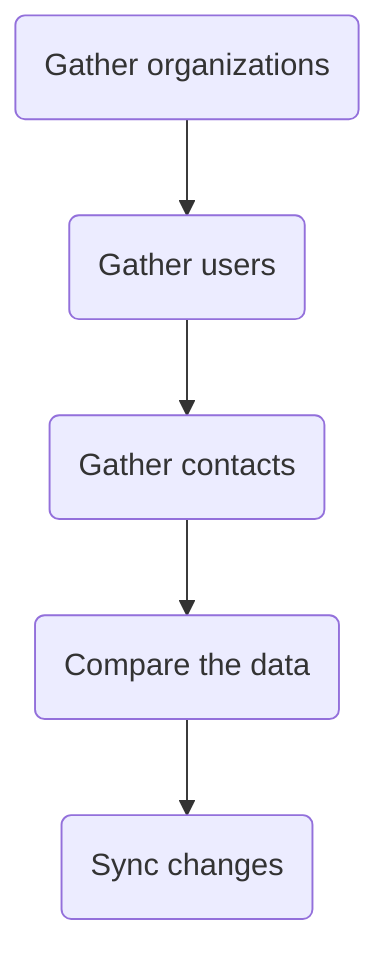

<sup>*Source project: [gitlab-support-readiness/zd-sfdc-sync/zendesk-us-gov-user-sync](https://gitlab.com/gitlab-support-readiness/zd-sfdc-sync/zendesk-us-gov-user-sync)*</sup>

For the Zendesk US Government production instance, this is the final stage of the Zendesk-Salesforce sync. The focus of this stage is to handle the users associated to organizations.

This can be broken down into 5 "stages" (even though this is actually one stage in of itself):



## Gather organizations

The purpose of this stage is to gather all Zendesk organizations (for all production instances) and generate a JSON file of them (to be used into the next stage).

The `bin/zendesk_orgs_gather` script handles the actual work of the stage.

The script is scrapping the organizations API endpoint page by page (using cursor based pagniation). As it grabs a page of organizations, it maps them into more usable objects (for future stages).

After that, the script then creates a JSON file.

## Gather users

The purpose of this stage is to gather all Zendesk users (for all production instances) and generate a JSON file of them (to be used into the next stage).

The `bin/zendesk_users_gather` script handles the actual work of the stage.

The script is scrapping the users API endpoint page by page (using cursor based pagniation). As it grabs a page of users, it maps them into more usable objects (for future stages).

Once that is complete, it then filters out "protected" users (GitLab team members, GitLab bots, etc.).

After that, the script then creates a JSON file.

## Gather contacts

The purpose of this stage is to gather all relevant Salesforce contacts and generate a JSON file of them (to be used into the next stage).

The `bin/salesforce` script handles the actual work of the stage.

The script begins by generating a bearer token using the Salesforce API. With that, it establishes a Salesforce connection to begin running queries. For efficiency, the list of all the salesforce_id for the organizations is split into chunks of 500, with each chunk being used to run the following Salesforce Query Language query:

<details>
<summary>SOQL query</summary>

```sql
SELECT
  Name,
  Email,
  Account.Account_ID_18__c
FROM Contact
WHERE
  Inactive_Contact__c = false AND
  Role__c INCLUDES ('Gitlab Admin') AND
  Name != '' AND
  Email != '' AND
  Account.Account_ID_18__c IN (LIST_OF_IDS)
```

Where `LIST_OF_IDS` is the array of IDs from the chunk mapped to the format `'xxx', 'xxx, ..., 'xxx'`.

</details>

To ensure all data is pulled quickly and efficiently, the script first runs the query as is, and then makes subsequent API calls to pull additional records as needed.

Once all records have been obtained, it then maps them into more usable objects (for future stages).

With that data, it then filters out those containing duplicate `email` values (since emails must be unique for Zendesk users).

After that, the script then creates a JSON file.

## Compare the data

The purpose of this stage is to use the files generated via the [Gather contacts](#gather-contacts) and [Gather users](#gather-users) stages to determine the changes needed in the Zendesk US Government production instance and produce JSON files to reflect them.

The `bin/compare` script handles the actual work of the stage.

The script largely compares two arrays (one derived from the "contacts" and one from the "users") to determine what is missing (i.e. a create or a "mark for deletion") and what has differences (i.e. an update).

Once this is determined, the script then creates JSON files.

## Sync changes

The purpose of this stage is to use the JSON files generated via the [Compare the data stage](#compare-the-data) to implement the changes needed in the Zendesk US Government production instance.

The `bin/sync` script handles the actual work of the stage.

It begins by working on the users it needs to create. Going through them one at a time, it creates the user.

After that is complete, it then works on the updates. These are done in chunks of 100 users at a time using the [Update Many Users](https://developer.zendesk.com/api-reference/ticketing/users/users/#update-many-users) API endpoint. For every 20 updates jobs created in this way, the script will sleep for 30 seconds (to give the jobs time to complete).

Once all updates have been queued, the script will then bulk update the users it needs to mark for deletion (meaning they are not tied to the sync). It does this in the same manner the updates where done in (chunks of 100 at a time via bulk update jobs).
