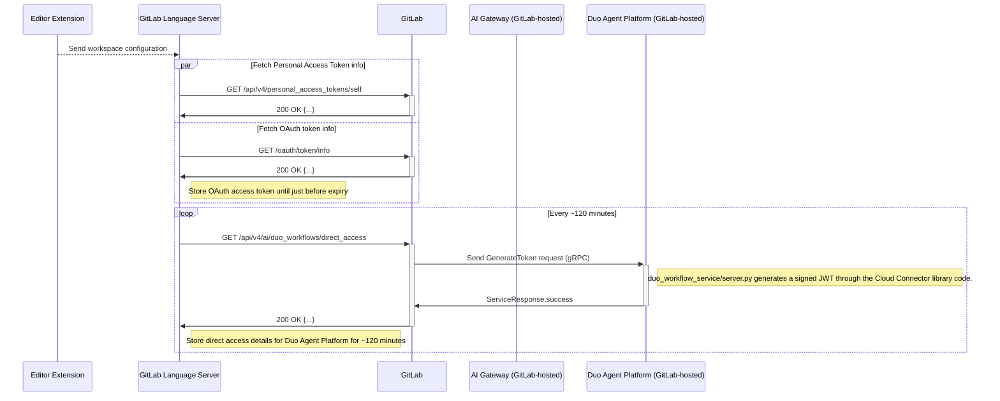

When evaluating security issues or MRs, it can be useful to have a way to reproduce issues, dig in to root causes, look for further impacts. This can also be a great way to get familiar with GitLab during your first few weeks of onboarding. Here are some handy tips & tricks.

## How to setup a local GDK environment

1. Request a license using [this form](https://support-super-form-gitlab-com-support-support-op-651f22e90ce6d7.gitlab.io/) to `Request a team member license` with Ultimate and at least 100 seats (this would avoid removing the ~50 users allready added to the gdk at install)
1. If you plan to replace an existing local install of a GDK or do the setup for [geo](https://gitlab.com/gitlab-org/gitlab-development-kit/-/blob/main/doc/howto/geo.md), first run in the existing gdk folder `gdk kill`. This will stop the processes and release the ports used by different services.
1. General information about the gdk install steps can be found at [gitlab-development-kit](https://gitlab.com/gitlab-org/gitlab-development-kit/-/blob/main/doc/_index.md)
   - Start the [one line install](https://gitlab.com/gitlab-org/gitlab-development-kit/-/blob/main/doc/_index.md#one-line-installation ) with `curl "https://gitlab.com/gitlab-org/gitlab-development-kit/-/raw/main/support/install" | bash`
   - install in gdk, or choose the folder name
   - install with `mise`
   - once the install finished do a `gdk restart` to make sure all services started
1. Once the install is done login with `root` / `5iveL!fe` and change the default password
1. Apply the license, either via [admin/settings/addlicense](http://localhost:3333/admin/application_settings/general#js-add-license-toggle) or using the [rails console(https://docs.gitlab.com/administration/license_file/#add-a-license-through-the-console)].
1. Check if the licese was applied correctly in admin/subscription(http://localhost:3000/admin/subscription)

## Enable GitLab Duo in GDK

Prerequisites:

- Working GDK intall
- GCP console access. Log in to [gcp console](https://console.cloud.google.com) if you have access to `ai-enablement-dev-69497ba7` project. If access is needed, submit an AR with [this](https://gitlab.com/gitlab-com/gl-security/corp/infra/issue-tracker/-/issues/new?issuable_template=gcp_group_account_iam_update_request)
- gcloud CLI is installed. Run `glcoud init` to setup the default configuration and choose the `ai-enablement-dev-69497ba7` as the cloud project to use. Instructions on how to install gcloud CLI can be found [here](https://docs.cloud.google.com/sdk/docs/install-sdk).
- Anthropic license key. Submit an access request here using the `Anthropic_Console_Access_Request`. [This link](https://gitlab.com/gitlab-com/team-member-epics/access-requests/-/issues/new?description_template=Anthropic_Console_Access_Request) should start a new issue with the template applied.
- Search for Fireworks license key from 1password.

## Setting up GitLab AI development environment

Following is a summary of how to configure [GitLab AI Gateway](https://gitlab.com/gitlab-org/gitlab-development-kit/-/blob/main/doc/howto/gitlab_ai_gateway.md) and [Duo Agent Platform](https://gitlab.com/gitlab-org/gitlab-development-kit/-/blob/main/doc/howto/duo_agent_platform.md):

- In the GDK folder, run `gdk rake setup_ai_development`

The prompts are:

1. **Enter your Anthropic API key**: The key will be used to authenticate requests to Anthropic's AI services and is essential for accessing their API and AI models.
1. **Enter your Fireworks API key**: The key will be used to authenticate requests to Fireworks's API services. The key is available in 1Password, in the Engineering or Security folder, under the name (Fireworks development key).
1. **Set additional environment variables for debugging**: This will set additional environment variables that provide more detailed logs and information, useful for troubleshooting and development.
1. **Enable hot reload**: This will enable hot reloading, which allows the application to update in real-time as you make code changes, without requiring a full restart.

After setup completes, services will be automatically restarted.

**Verification:**

- Login with the admin user and you should see a new group named `gitlab-duo` at `http://localhost:3000/gitlab-duo`.
- Add users to this group to get access to AI features at `http://localhost:3000/groups/gitlab-duo/-/group_members`.

**Note**: For testing with multiple users, after inviting a user to the GitLab Duo group, go to **Settings > GitLab Duo > Assign seats** and enable "GitLab Duo Enterprise" for that user


Confirm it's working by navigating to `http://<your-gdk-url>/help/instance_configuration#ai_gateway_url` and looking for `AI Gateway URL: http://127.0.0.1:5052`. For debugging, use `gdk tail gitlab-ai-gateway` to view debug messages and AI responses.

## Enable Duo with VS code

1. With a user that has access to the AI features, create a PAT with API access
1. Download and install [VS code](https://code.visualstudio.com/)
1. From Extensions install GitLab Workflow
1. Configure a [VS code profile](https://code.visualstudio.com/docs/configure/profiles) for GDK go to Code > Settings > Profiles > New Profile
1. In VS code, open the Command Palette (Command + Shift + P) and select "GitLab: Validate GitLab Accounts" to switch to your GDK account. PAT should be added here.
1. GitLab Agent should be added on left tool bar

## Link the VS Code Duo extension to Language Server

The following sequence illustrates how an IDE extension authenticates with the GitLab instance and later Duo Agent Platform.



Note: these steps are an expansion from the [existing steps in documentation](https://gitlab.com/gitlab-org/editor-extensions/gitlab-lsp/-/blob/main/README.md#connect-to-ls-in-the-vs-code-extension).

All of below steps are completed as the GitLab user profile:

1. Clone the [gitlab-vscode-extension](https://gitlab.com/gitlab-org/gitlab-vscode-extension/-/tree/main?ref_type=heads) project.
1. Clone the [gitlab-lsp](https://gitlab.com/gitlab-org/editor-extensions/gitlab-lsp) project in the same path as your VS Code extension project, for example:
   - LSP is in /Users/<USERNAME>/Projects/gitlab-lsp
   - vscode extension is in /Users/<USERNAME>/Projects/gitlab-vscode-extension
1. Have the two project open side by side in a terminal for better setup.
1. For gitlab-vscode-extension project, follow below steps:
   - Run: `npm install`
   - Run extension in dev mode:
       1. Open the project in vscode
       1. Run the View: Show Run and Debug command (Cmd+Shift+P).
       1. Ensure the Run Extension command is selected.
       1. Select the green play icon, or press F5.
1. For gitlab-lsp project, follow below steps:
    1. Open the project in vscode
    1. Run `npm install`
    1. Run `npm run build`
    1. Run `GITLAB_WORKFLOW_PATH=/Users/<USERNAME>/Projects/gitlab-vscode-extension code .`
    1. Run the Attach to VS Code Extension launch task.
    1. Run `npm run watch -- --editor=vscode --packages agentic-duo-chat webview-duo-workflow duo-chat duo-chat-v2 webview-duo-chat webview-duo-chat-v2 webview-vuln-details`
1. Verification: to verify it's working, first make sure you have enabled the GitLab debugging option in the Duo Workflow extension setting and then restart the extension so that you can see debug logs:


## Connect LS with Local GDK Changes for Duo Development

1. Setup a GDK profile
1. Follow the two steps outlined in the [doc](https://gitlab.com/gitlab-org/editor-extensions/gitlab-lsp#connect-ls-with-local-gdk-changes-for-duo-development)

In VSCode, check for "GitLab Language Server" logs in the output pane and see there are any errors. If you come across token errors like below, then go to GitLab Workflow extension setting and make sure ignore TLS/SSL cert errors option is ticked:

```bash
2025-08-20T10:54:14:972 [warning]: Both PAT and OAuth token checks failed: PAT Token: {"valid":false,"reason":"unknown","message":"Token validation failed: Error: request to https://gdk.test:3443/api/v4/personal_access_tokens/self failed, reason: unable to verify the first certificate"}, OAuth Token: {"valid":false,"reason":"unknown","message":"Token validation failed: Error: request to https://gdk.test:3443/oauth/token/info failed, reason: unable to verify the first certificate"}
2025-08-20T10:54:14:973 [info]: [CodeSuggestionsInstanceTelemetry] Instance Telemetry: GitLab Duo Code Suggestions telemetry is always enabled in self-managed instances.
2025-08-20T10:54:14:973 [warning]: Token is invalid. Token validation failed: Error: request to https://gdk.test:3443/api/v4/personal_access_tokens/self failed, reason: unable to verify the first certificate. Reason: unknown
2025-08-20T10:54:14:973 [warning]: Token is invalid. No token provided. Reason: invalid_token
```


1. Restart the extension and to check if it's working, open a GDK folder (git clone a GDK project locally, make sure it has Duo enabled) and check the logs for errors, an example of a working agentic workflow log:

```bash
2025-08-20T11:13:46:002 [info]: [Duo Agentic Chat Plugin] Received new event
2025-08-20T11:13:46:002 [debug]: [WebviewInstanceMessageBus:agentic-duo-chat:8327ccee-1b85-48ba-abd6-eb4cfb5e3f1f] Sending notification: workflowCheckpoint
2025-08-20T11:13:46:002 [debug]: [WebviewInstanceMessageBus:agentic-duo-chat:8327ccee-1b85-48ba-abd6-eb4cfb5e3f1f] Sending notification: workflowStatus
2025-08-20T11:13:46:503 [debug]: [WorkflowTokenService] Reusing existing valid token for workflow "3"
2025-08-20T11:13:46:503 [debug]: [DuoWorkflowNodeExecutor][3] Received new checkpoint: {"workflowStatus":"RUNNING"}
```

## Run a different branch of AI Gateway and Duo Agent Platform Service

When reviewing MRs in [AI Gateway](https://gitlab.com/gitlab-org/modelops/applied-ml/code-suggestions/ai-assist), instead of following the setup steps in [README.md](https://gitlab.com/gitlab-org/modelops/applied-ml/code-suggestions/ai-assist/-/blob/main/README.md?ref_type=heads), AppSec engineers often times just need to follow these [instructions](https://gitlab.com/gitlab-org/gitlab-development-kit/-/blob/main/doc/howto/gitlab_ai_gateway.md#optional-run-a-different-branch-of-ai-gateway-and-duo-agent-platform-service) to test changes on a specific branch.

### Step through execution chains

If you want to see the code executed as part of a web or API request, an interactive debugger may be a useful tool. Here's how to [configure Pry & Thin](https://gitlab.com/gitlab-org/gitlab-development-kit/-/blob/main/doc/howto/pry.md#using-thin)

A typical workflow might be to find the `Controller` action which kicks off the request (methods like `create` or `update` are good bets), add in `binding.pry`, save the file, then perform that request in a browser. The execution will stop and in a terminal you can inspect the current state using IRB, type `step` to go in_to_ a method, `next` to go to the next statement, and `continue` to let the request run to the next break point and/or completion.

Watching logs can be helpful: `tail -f gitlab/log/development.log`.

## Install a testing proxy

Your role might not require you to do "penetration testing", but having access to a testing proxy that lets you intercept and manipulate requests can help with reproducing HackerOne issues.

The AppSec team have a multi-user license for [Burp Suite Professional](https://portswigger.net/burp/pro). Ask in #sec-appsec about getting a license, and ([download the latest stable version here](https://portswigger.net/burp/releases)). You can also use [OWASP ZAP](https://www.zaproxy.org/) which is free and open source.

These tools can easily cause damage to websites or eat up your CPU with active scans. In OWASP Zap, use "Safe" mode to prevent any potentially malicious requests. In Burp Suite, disable any live "audit" scans.

## Browser Profiles

When testing requires using multiple users, an Incognito / Private tab is an easy option. You can also create and use [un-signed-in Chrome Profiles](https://support.google.com/chrome/answer/2364824) or [Firefox Multi-Account Containers](https://support.mozilla.org/en-US/kb/containers) to provide "session sandboxes", which will persist beyond window closure (unlike Incognito tabs) and you can colour code them to help with visual distinction.

## Mocking Servers / tunnels

Making your local machine accessible from the internet is [not permitted](/handbook/security/corporate/systems/#other-servicesdevices), which precludes tools like `ngrok` or `localtunnel`. Use GitLab's [Sandbox Cloud](/handbook/company/infrastructure-standards/realms/sandbox) to host mock servers instead. Refer to [Secure Cloud testing environments](/handbook/support/workflows/test_env/#securing-cloud-testing-environments) for advice on how to secure your Sandbox Cloud test environments.

## Debugging and GDK tips

- `gdk update` Pull application changes from Git
- `gdk tail` Tail logs for all services
- `gdk tail gitlab-ai-gateway` Tail logs for AI services
- `gdk doctor` Run diagnostics on GDK
- in the gitlab folder run: `bundle exec rake gitlab:duo:verify_self_hosted_setup` [to verify the local setup](https://docs.gitlab.com/administration/gitlab_duo_self_hosted/troubleshooting/#verify-gitlab-setup)
- `gdk kill` Forcibly kills services - usefull when a service hangs a port or when to upgrade
- [Feature flags](https://docs.gitlab.com/operations/feature_flags/) can be enabled via `http://127.0.0.1:3000/rails/features`
