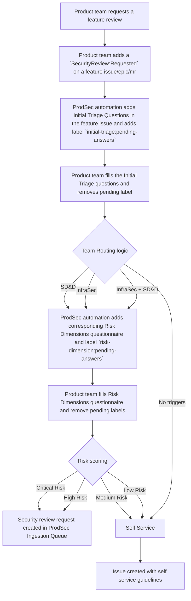

## Security Review Framework

> [!WARNING]
> This process is currently being tested by the AppSec team and is subject to change. For security review requests, please use the [AppSec review process](./application-security/appsec-reviews/).

This security review framework empowers GitLab Product teams with a streamlined approach to security evaluations, making it easier to engage with
the right security partners based on your feature's needs, risk profile, and
[Go-to-market tier](https://gitlab.com/groups/gitlab-org/gitlab-rd-planning/-/wikis/R&D-Interlock-Process#labels-guide).
Designed to maintain your development velocity while ensuring appropriate security coverage, the framework begins with a simple
team routing process that connects you directly with the most relevant security experts—whether that's [Secure Design and Development](./application-security/appsec-operations/sdd-services/) or
[Infrastructure Security](./infrastructure-security/) with additional specialized support from [Security Platforms and Architecture (SPA)](./security-platforms-architecture/) and [Data Security teams](./data-security/) for features
with High or Critical risk scores. This focused approach ensures you receive timely, targeted security guidance without unnecessary process overhead.

The security review framework is designed to work in tandem with the [Product Development Flow](/handbook/product-development/how-we-work/product-development-flow/).
The ideal trigger point for a security review of a feature is during the Design phase
([Validation phase 3: Design](/handbook/product-development/how-we-work/product-development-flow/#validation-phase-3-design) indicated in
issue by `workflow::design` label).
The [key-participants](/handbook/product-development/how-we-work/roles-and-responsibilities/) involved in Design phase are encouraged
to engage with the security review framework to determine whether the feature requires a security review.

### Scope of SRF

1. End to End Security review of a feature
2. Design reviews

#### Example use-cases

1. As a Product Designer, you want to make sure the design of the new feature has taken into consideration all the security best practices.
2. As a Developer creating a potential design for implementing the new feature, you like to confirm whether it will lead to loss of
confidentiality and integrity of the customer data or have a negative impact on the availability of GitLab instance.
3. As an Engineering manager reviewing the new design of a feature, you suspect a design choice might result in a security issue and would like to
verify it with the security team.
4. As an Product Manager, working on the a
[GTM Tier-0](https://docs.google.com/spreadsheets/d/1Pis-VRUYTlitNjoKmDKNQMIf-4bWBo5XjPyWOYo0R54/edit?gid=838006198#gid=838006198&range=B20) feature,
you want to make sure the feature does not introduce any security risks to customers.

#### Following type of requests are out of scope of SRF

1. Ad-hoc MR review requests (unless the feature is already reviewed by SRF)
2. General application security questions

How the security review framework fits into a product teams' workflows is visualized in the following
section.

## Overall Process flow



### Framework purpose

1. Identify which GitLab features needs a security review from the Product Security teams.
1. Which type of [security review](#3-review-process-by-team-and-risk-level) is needed, from the Product Security teams.
1. Which Product Security team(s) needs to be engaged for the security review.
1. Which deliverables Product and Engineering can expect from the various reviews types of security reviews.

### Team Responsibilities

| Team | Focus Areas | Engagement Criteria |
| ----- | ----- | ----- |
| [Secure Design and Development](/handbook/security/product-security/application-security/appsec-operations/sdd-services/) | Code vulnerabilities, threat modeling, developer education, authentication, authorization, input validation | Sensitive data handling, auth changes, new technologies, third-party integrations, customer-facing features |
| [Infrastructure Security](/handbook/security/product-security/infrastructure-security/) | Infrastructure configurations, network security, deployment, cloud security, container orchestration, infrastructure-as-code | New infrastructure, deployment changes, network modifications, cloud provider configuration, container security |
| [Data Security](/handbook/security/product-security/data-security/) | Data access controls, data infrastructure, data lifecycle, cryptography, key management, third-party services | Engage on any high-risk or complex change involving our focus areas. If unsure, tag us or reach out and ask in #security-datasec |
| [SPA](/handbook/security/product-security/security-platforms-architecture/) | System design, data flows, architectural patterns, trust boundaries, component interactions | Escalated reviews from InfraSec and SD&D Team in case of: <br> - Major architectural changes that systematically impact how we develop, build, deploy or run our product (e.g., Dedicated, Cells, Runway)<br>- Significant modifications to Authentication/Authorization at application or infrastructure level<br>- Changes to build/distribution practices that substantially impact the software supply chain<br>- Architectural changes for features that are fundamental to annual business goals |

## 1: Security Team Routing

The first step is to determine which security team(s) should be engaged for the security review of the feature. This routing happens before the
detailed risk assessment to ensure teams only answer questions relevant to their domain.

### Initial Triage Questions

When a product team initiates a [feature](#security-review-phase-1-initial-triage), they complete an initial triage to determine team routing:

#### Secure Design and Development Triggers

* Does this feature handle customer repositories, credentials, PII data? (Y/N)
* Does this feature add or modify any core mechanisms related to authentication, authorization or cryptography? (Y/N)
* Does this feature interact with third-party services? (Y/N)
* Does this feature add a [new service component](https://docs.gitlab.com/development/adding_service_component/)? (Y/N)
* Does this change have an indirect impact on core mechanisms related to authentication, authorization or cryptography ? (Y/N)

#### Infrastructure Security Triggers

* Does this feature require new cloud infrastructure components? (Y/N)
* Does this feature modify containerization or orchestration configurations? (Y/N)
* Does this feature change network architecture or security groups? (Y/N)
* Does this feature alter infrastructure-as-code implementations? (Y/N)
* Does this feature modify production deployment processes? (Y/N)
* Does this feature introduce any new data stores (e.g. cloud storage bucket, database, cache)? (Y/N)
* Does this feature modify secrets management or credential handling ? (Y/N)

### Team Routing Logic

Based on the responses to these triage questions, the system routes the review to the appropriate team(s):

```text
IF ANY Secure Design and Development Trigger is YES
    THEN engage Secure Design and Development Team
IF ANY Infrastructure Security Trigger is YES
    THEN engage Infrastructure Security Team
```

Multiple teams may be engaged for complex features that have triggers across multiple domains.

## 2: Team-Specific Risk Assessment Models

After identifying which team(s) need to be engaged, each engaged team conducts their domain-specific risk assessment to determine review depth.

### Secure Design and Development Risk Dimensions

| Dimension | Description | Score Range |
| ----- | ----- | ----- |
| Data Processing Impact | Level of sensitive data access or processing | 1-4 |
| Feature Exposure | How widely accessible the feature is | 1-5 |
| Architecture Impact | Degree of changes to the system architecture | 1-4 |
| Implementation Complexity | Technical complexity of the implementation | 2-3 |
| Launch Tier Impact | [Launch tier](https://docs.google.com/spreadsheets/d/1Pis-VRUYTlitNjoKmDKNQMIf-4bWBo5XjPyWOYo0R54/edit?gid=838006198#gid=838006198&range=B20) indicates what kind of announcements will be accompanied with the feature launch | 0-3 |
| Past Security Issues | Whether this feature was involved in past security issues | 0-5 |

### Infrastructure Security Risk Dimensions

| Dimension | Description | Score Range |
| ----- | ----- | ----- |
| Infrastructure Scope | Breadth of infrastructure affected | 1-5 |
| Environment Criticality | Criticality of affected environments | 1-5 |
| Configuration Complexity | Complexity of infrastructure changes | 1-4 |
| Automation Level | Level of infrastructure automation | 1-3 |
| Launch Tier Impact | [Launch tier](https://docs.google.com/spreadsheets/d/1Pis-VRUYTlitNjoKmDKNQMIf-4bWBo5XjPyWOYo0R54/edit?gid=838006198#gid=838006198&range=B20) indicates what kind of announcements will be accompanied with the feature launch | 0-3 |

### Detailed Scoring Criteria

#### Secure Design and Development Risk Dimensions

##### Data Processing Impact (1-4)

* 4: Direct access/modification to customer repositories, credentials, PII data.
* 3: Processes untrusted data, even if it is coming from a trusted component
* 2: Access to metadata about projects/pipelines
* 1: No sensitive data access or display-only features

##### Feature Exposure (1-5)

* 5: Public-facing API or web interface accessible without authentication
* 4: Features available to all authenticated users
* 3: Features behind proper role permissions but widely used
* 2: Admin-only features or limited to specific user roles
* 1: Internal tooling not exposed to customers

##### Architecture Impact (1-4)

* 4: Changes to core authentication, authorization, or system architecture
* 3: New service (GitLab or third-party) integrations that are outside the trust boundary of the current application
* 2: Feature additions within the trust boundary of the current application.
* 1: UI changes with no backend implications

##### Implementation Complexity (2-3)

* 3: New feature implementation
* 2: Enhancements to an existing feature

##### Launch Tier Impact (0-3)

* 3: Tier 0
* 2: Tier 1
* 1: Tier 2
* 0: Tier 3

**Note:** Launch tier is different from GitLab tiers (Free/Premium/Ultimate). Launch tier indicates what kind of events/announcements will be accompanied
with the feature launch. Definitions can be found in
[this Google Sheet](https://docs.google.com/spreadsheets/d/1Pis-VRUYTlitNjoKmDKNQMIf-4bWBo5XjPyWOYo0R54/edit?gid=838006198#gid=838006198&range=B20)(Internal).

**Note:** A combination of `~"group::[group-name]"`, `~"severity::1/2/3"` and `~"bug::vulnerability"` labels can be used to search in
project's issue tracker to identify this.

#### Infrastructure Security Risk Dimensions

##### Infrastructure Scope (1-5)

* 5: Affects production infrastructure that is used by multiple product offerings
* 4: Affects production infrastructure that is used by one product offering
* 3: Affects parts of the production infrastructure of one product offering that have minimal customer impact
* 2: Affects non-production infrastructure that other systems depend on (e.g. automated testing environments)
* 1: Affects non-production infrastructure that no other systems depend on (e.g. sandbox environments)

##### Environment Criticality (1-5)

* 5: Production environment component with customer data
* 4: Production environment component without direct customer data
* 3: Pre-production/staging environment
* 2: Testing environment
* 1: Development environment only

##### Configuration Complexity (1-4)

* 4: Complex infrastructure-as-code with multiple services
* 3: Moderate infrastructure changes with some dependencies
* 2: Simple infrastructure changes
* 1: Configuration file changes only

##### Automation Level (1-3)

* 3: Manual infrastructure changes required
* 2: Partially automated infrastructure changes
* 1: Fully automated infrastructure-as-code implementation

##### Launch Tier Impact (0-3)

* 3: Tier 0
* 2: Tier 1
* 1: Tier 2
* 0: Tier 3

**Note:** Launch tier is different from GitLab tiers (Free/Premium/Ultimate). Launch tier indicates what kind of events/announcements will be
accompanied with the feature launch. Definitions can be found in
[this Google Sheet](https://docs.google.com/spreadsheets/d/1Pis-VRUYTlitNjoKmDKNQMIf-4bWBo5XjPyWOYo0R54/edit?gid=838006198#gid=838006198&range=B20).

### Risk Score Calculation

Each engaged team calculates their risk score using their domain-specific dimensions:

```text
Secure Design and Development Risk Score = Data Processing Impact + Feature Exposure + Architecture Impact + Implementation Complexity + Launch Tier Impact
Infrastructure Security Risk Score = Infrastructure Scope + Environment Criticality + Configuration Complexity + Automation Level + Launch Tier Impact
```

### Risk Categorization

Each team categorizes risk based on their domain-specific score:

#### Secure Design and Development

* Score ≥ 15: Critical Risk
* Score 12-14: High Risk
* Score 8-11: Medium Risk
* Score < 8: Low Risk

Security review process for each risk level is detailed in [Secure Design and Development Review Process](#secure-design-and-development-review-process) section.

#### Infrastructure Security

* Score ≥ 15: Critical Risk
* Score 12-14: High Risk
* Score 8-11: Medium Risk
* Score < 8: Low Risk

Security review process for each risk level is detailed in [Infrastructure Security Review Process](#infrastructure-security-review-process) section.

### Security Review Priority

Priority of a Security review is determined by taking into account [roadmap priority](https://gitlab.com/groups/gitlab-org/gitlab-rd-planning/-/wikis/R&D-Interlock-Process/#labels-guide) of the feature (`Interlock Priority::P1`,
`Interlock Priority::P2`, `Interlock Priority::P3`) and the feature [risk score](#risk-categorization)

|#| (Risk score) <br>Critical | High | Medium | Low |
| ------ | ------ | ------ |--|--|
| (Roadmap priority) <br> P1     |  Review-Priority:1      |    Review-Priority:2    |Review-Priority:3 | Self-Service|
|    P2   |  Review-Priority:2      |   Review-Priority:3     |Review-Priority:4 | Self-Service|
|     P3   |  Review-Priority:3      |  Review-Priority:4      | Review-Priority:4|Self-Service |

### SPA and Data Security team engagement criteria

#### For Secure Design and Development Review

The feature is flagged for a Architecture review and/or Data Security review if there is a major Architecture Impact or Data Processing Impact identified during the Risk score calculation.

```text
IF Architecture Impact >= 4
    THEN Flag the feature for Architecture review by SPA team
IF Data Processing Impact >= 4 then
    THEN Flag the feature for Data Security review by Data Security team.
```

#### For InfraSec Review

```text
IF Infrastructure Scope >= 4
   THEN Flag the feature for SPA review
IF Environment Criticality>=4
   THEN Flag the feature for Data Security review
```

When feature are flagged for SPA or Data Security review it will be indicated by a label that is added to the review request.

## 3: Review Process by Team and Risk Level

### Secure Design and Development Review Process

* **SDX Reviews DRI:** SD&D Team
* **Data Security Review DRI:** Data Security team. _This review is will be conducted on a best effort basis since the team has resource constraints._
* **SPA Security Review DRI:** SPA team. _This review is will be conducted on a best effort basis since the team has resource constraints._

> [!WARNING]
> The steps listed in the SDX Design review, SDX Code review, SDX Verify are subject to change based on the out come of https://gitlab.com/groups/gitlab-com/gl-security/product-security/appsec/-/epics/75.

#### Critical Risk Review

##### SDX Design review

* **Threat modeling**
  * **DRI:** [SD&D](/handbook/security/product-security/application-security/appsec-operations/sdd-services/)
  * **Deliverable:** Threat model with design level security assessment and identified threats.
* **Feature Design Review**
  * **DRI:** SD&D
  * **Deliverable:** Design will be verified against best practices and recommendations will be provided.
* **SPA review** (_IF [`Architecture Impact`](#architecture-impact-1-4) >= 4_)
  * **DRI:** [SPA](/handbook/security/product-security/security-platforms-architecture/)
  * **Deliverable:** System design, data flows, architectural patterns, trust boundaries, component interactions will be verified aganist best practices and recommendations will be provided.
* **Data Security review** (_IF [`Data Processing Impact`](#data-processing-impact-1-4) >= 4_)
  * **DRI:** [Data Security](/handbook/security/product-security/data-security/)
  * **Deliverable:** Data access controls, data infrastructure, data lifecycle, cryptography, key management, third-party services will be verified aganist best practices and recommendations will be provided.

##### SDX Code review

* **Merge request review**
  * **DRI:** SD&D
  * **Deliverable:** MR will be reviewed for implementation level security issue.
* **Verify adherence to [Secure Coding Guidelines](https://docs.gitlab.com/development/secure_coding_guidelines/)**
  * **DRI:** SD&D
  * **Deliverable:** MR will be reviewed to check if [Secure Coding Guidelines](https://docs.gitlab.com/development/secure_coding_guidelines/) is followed.
* **Static analysis**
  * **DRI:** SD&D
  * **Deliverable:** SD&D will run Software composition analysis using [Dependency scanning](https://docs.gitlab.com/user/application_security/dependency_scanning/), [Container Scanning](https://docs.gitlab.com/user/application_security/container_scanning/) tools and [SAST tools](https://docs.gitlab.com/user/application_security/sast/).

##### SDX Verify Final Security review

* **Dynamic Analysis**
  * **DRI:** SD&D
  * **Deliverable:** SD&D will run Dynamic Analysis using [DAST tools](https://docs.gitlab.com/user/application_security/dast/)
* **Penetration Testing**
  * **DRI:** SD&D
  * **Deliverable:** SD&D will run a pen-testing and share identified issues.
* **Check discovered issues**
  * **DRI:** SD&D
  * **Deliverable:** Check whether critical vulnerabilities identified in other reviews are remediated.

#### High Risk Review

##### SDX Design review

* **Change focused Threat modeling**
  * **DRI:** SD&D
  * **Deliverable:** Threat model with design level security assessment and identified threats.
* **Change focused Design Review**
  * **DRI:** SD&D
  * **Deliverable:** Design will be verified against best practices and recommendations will be provided.
* **SPA review** (_IF [`Architecture Impact`](#architecture-impact-1-4) >= 4_)
  * **DRI:** SPA
  * **Deliverable:** System design, data flows, architectural patterns, trust boundaries, component interactions will be verified aganist best practices and recommendations will be provided.
* **Data Security review** (_IF [`Data Processing Impact`](#data-processing-impact-1-4) >= 4_)
  * **DRI:** Data Security
  * **Deliverable:** Data access controls, data infrastructure, data life cycle, cryptography, key management, third-party services will be verified aganist best practices and recommendations will be provided.

##### SDX Code review

* **Merge request review**
  * **DRI:** SD&D
  * **Deliverable:** MR will be reviewed for implementation level security issue.
* **Verify adherence to [Secure Coding Guidelines](https://docs.gitlab.com/development/secure_coding_guidelines/)**
  * **DRI:** SD&D
  * **Deliverable:** MR will be reviewed to check if [Secure Coding Guidelines](https://docs.gitlab.com/development/secure_coding_guidelines/) is followed.
* **Static analysis**
  * **DRI:** SD&D
  * **Deliverable:** SD&D will run Software composition analysis using [Dependency scanning](https://docs.gitlab.com/user/application_security/dependency_scanning/), [Container Scanning](https://docs.gitlab.com/user/application_security/container_scanning/) tools and [SAST](https://docs.gitlab.com/user/application_security/sast/) tools.

##### SDX Verify Final Security review

* **Dynamic Analysis**
  * **DRI:** SD&D
  * **Deliverable:** SD&D will run Dynamic Analysis using [DAST tools](https://docs.gitlab.com/user/application_security/dast/)
* **Penetration Testing**
  * **DRI:** SD&D
  * **Deliverable:** SD&D will run a pen-testing and share identified issues.
* **Check discovered issues**
  * **DRI:** SD&D
  * **Deliverable:** Check whether critical vulnerabilities identified in other reviews are remediated.

#### Medium Risk Review

##### Security checklist completion

* **DRI:** Product Team
* **Deliverable:**
  * Check whether [Security Standards](/handbook/security/policies_and_standards/) are met.
  * Check if [Secure Coding Guidelines](https://docs.gitlab.com/development/secure_coding_guidelines/) is followed.

##### Automated security scanning

* **DRI:** Product Team
* **Deliverable:**
  * Remediate issues identified in Software composition analysis using [Dependency scanning](https://docs.gitlab.com/user/application_security/dependency_scanning/), [Container Scanning](https://docs.gitlab.com/user/application_security/container_scanning/)
  * Remediate issues identified by [SAST tools](https://docs.gitlab.com/user/application_security/sast/) are enabled.
  * Remediate issues identified in Dynamic Analysis using tools like [DAST tools](https://docs.gitlab.com/user/application_security/dast/)

#### Low Risk Review

##### Self-assessment against security guidelines

* **DRI:** Product Team
* **Deliverable:**
  * Check whether [Security Standards](/handbook/security/policies_and_standards/) are met.
  * Check if [Secure Coding Guidelines](https://docs.gitlab.com/development/secure_coding_guidelines/) is followed.

##### Automated security scanning

* **DRI:** Product Team
* **Deliverable:**
  * Remediate issues identified in Software composition analysis using [Dependency scanning](https://docs.gitlab.com/user/application_security/dependency_scanning/), [Container Scanning](https://docs.gitlab.com/user/application_security/container_scanning/)
  * Remediate issues identified by [SAST tools](https://docs.gitlab.com/user/application_security/sast/) are enabled.
  * Remediate issues identified in Dynamic Analysis using tools like [DAST tools](https://docs.gitlab.com/user/application_security/dast/)

### Review SLO

These are initial estimates and are subjected to change as we adopt the framework.

Note: _Low risk level is not mentioned here since Product team is the DRI for those reviews._

|Review Type | Critical Risk Level| High Risk Level|Medium Risk level|
|--|--|--|--|
|SDX Design Review|10 days|5 days|--|
|SDX Code Review (May extend based on number of MRs)|10 days|5 days |--|
|SDX Verify|10 days|5 days|--|
|Security checklist completion |--|--|5 days|

#### How early the review needs to be submitted ?

Review requests received at least 10 calendar days before the next milestone starts will be scoped for next milestone.

Requests received later than 10 days before the next milestone starts will be scoped for milestone+2.

The SLO will start from the date on which the planned milestone starts.

### Infrastructure Security Review Process

Note: _The list of reviews mentioned in this section are examples and not comprehensive nor do they always apply._

* InfraSec Reviews DRI: InfraSec Team
* Data Security Review DRI: Data Security team. _This review is will be conducted on a best effort basis since the team has resource constraints._
* SPA Security Review DRI: SPA team. _This review is will be conducted on a best effort basis since the team has resource constraints._

#### Critical Risk Review

* Joint architectural and infrastructure review
* Comprehensive infrastructure security review
* Cloud configuration audit
* Network security analysis
* Container security review
* Infrastructure-as-code security analysis
* Multiple security engineers involved
* Post-implementation validation
* Timeline: TBD (could span across multiple milestones since there could be gap between design and implementation of feature)

#### High Risk Review

* Joint architectural review
* Focused infrastructure review
* Key configuration validation
* Security group analysis
* Security architect and infrastructure security engineer collaboration
* Timeline: TBD (could span across multiple milestones since there could be gap between design and implementation of feature)

#### Medium Risk Review

* Infrastructure security checklist completion
* Configuration validation of key components
* Timeline: 3-5 business days

#### Low Risk Review

* Self-assessment against infrastructure security guidelines
* Automated configuration checking using [GitLab IaC scanning](https://docs.gitlab.com/user/application_security/iac_scanning/) or `Checkov`

### Exception workflow

The Security Review Framework (SRF) is in a dry-run phase and has not been rolled out yet, so the exception workflow is currently not applicable. After the SRF is rolled out and before security reviews become mandatory for feature releases, an appropriate [exception workflow](https://gitlab.com/gitlab-com/gl-security/product-security/appsec/appsec-team/-/issues/1294) will be added to the SRF to cover situations such as releasing features without completing the necessary security reviews.

## 4. Implementation

### Security Review Phase 1: Initial Triage

1. The security review process begins with a product team requesting a security review for a feature. The ideal time for requesting a review would be during the [design phase](../../product-development/how-we-work/product-development-flow/#validation-phase-3-design), when the design is ready (For any AppSec or InfraSec questions before design phase, please follow [Contacting us](./application-security/#contacting-us) and [Working With Us](./infrastructure-security/#working-with-us) respectively). This is done by adding a label
`SecurityReview::Requested` to a feature issue or epic (`~"type::feature"`).
1. ProdSec automation will then add the initial triage questionnaire
to this feature issue, ping the review initiator for completion, and add the label `initial-triage:pending-answers`. The [initial triage questionnaire](#initial-triage-questions)
is a set of Yes/No questions to determine whether this feature needs a review from Secure Design and Development (SD&D, SPA) or InfraSec.
1. Once the phase 1 questionnaire is completed, the review initiator removes the `initial-triage:pending-answers` label.

### Security Review Phase 2: Determine Risk Score

1. The ProdSec automation will then run the Team Routing Logic to decide which teams need to perform the security review of the feature and add their
corresponding Risk Dimensions questionnaire to the feature issue. Review initiator is pinged  for completing the questions and the label
`risk-dimension:pending-answers` is added to the issue as well.
1. When the questionnaire is completed, the review initiator removes the `risk-dimension:pending-answers` label.
1. The ProdSec automation will then calculate the Risk Score, which determines the review type and recommended timeline. A Security Review request issue is then opened by ProdSec
automation in the ProdSec ingestion queue.

The Security Review request issue in the ProdSec ingestion queue will contain the following details and the ProdSec ingestion triage process can
redirect the request to the team members.

1. Initial triage questionnaire and its answers
2. Secure Design and Development Risk Dimensions questionnaire and its answers
3. Infrastructure Security Risk Dimensions and its answers (if applicable)
4. Secure Design and Development risk score
5. Infrastructure Security risk score (if applicable)
6. Recommended Security review type
7. Recommended Security review teams (SD&D, SPA, InfraSec)

### Security Review Phase 3: Conduct Security Review

Based on the risk score the ProdSec conducts Critical, High or Medium level Security review.
