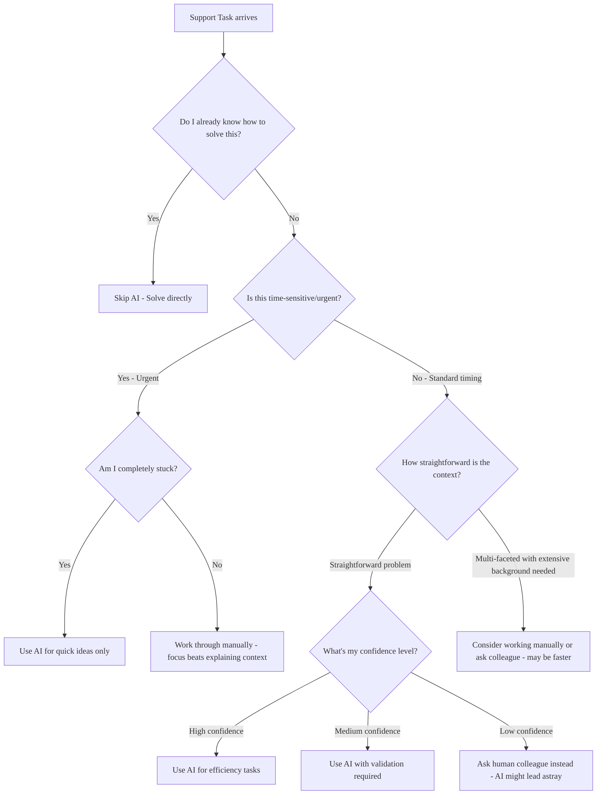

## Overview

GitLab provides access to multiple AI models to enhance Support Engineering efficiency.

It is important to consider when to use AI and select the right tool for your specific tasks.

## When to use AI: Decision Framework

Before reaching for AI, ask yourself: **"Will this AI interaction save me time and improve quality, or am I just adding steps?"**

### Red flags: When AI will waste your time

1. You're learning something new
   - If you don't understand the domain well enough to spot AI mistakes, don't use AI
   - Learn the basics first, then use AI to accelerate your work

1. The customer is frustrated
   - Frustrated customers need authentic human responses and personal attention
   - AI generated empathy often sounds hollow
   - Handle the emotional aspect first, then maybe use AI responsibly for technical research

1. You need to understand "why"
   - AI can provide plausible-sounding explanations for root causes that may be incorrect
   - If you need to understand underlying reasons deeply, verify AI explanations independently

1. Security or compliance issues
   - Never use AI for sensitive data or compliance questions
   - The risk of AI hallucination is too high

1. When you need version-specific guidance
   - AI often provides generic advice that doesn't account for the customer's specific GitLab version, edition, or installation method
   - Version mismatches can lead to incorrect troubleshooting paths

### Green flags: When AI will likely help

1. You need research across multiple resources
   - AI excels at synthesizing information from various docs
   - Good for "find all the ways X can fail" type questions

1. You are doing repetitive analysis
   - Use specialized tools (like [`fast-stats`](https://gitlab.com/gitlab-com/support/toolbox/fast-stats)) for statistical analysis, then AI for interpretation if needed
   - Comparing configurations
   - Finding similar past issues
   - Summarizing important points from a long conversation

1. You want a critical review ([rubber ducking](https://en.wikipedia.org/wiki/Rubber_duck_debugging))
   - Ask AI to "find inconsistencies or problems with my approach"
   - Good for challenging your assumptions rather than seeking validation

1. You're stuck and need ideas
   - AI can suggest troubleshooting paths you hadn't considered
   - Helpful for brainstorming when you hit a wall

1. Identifying missing information in complex issues
   - Good for "what context am I missing?" type questions
   - Helpful when preparing [requests for help issues](../workflows/how-to-get-help.md#how-to-formally-request-help-from-the-gitlab-development-team) for the Development team

1. Refining responses you've already drafted
   - AI can help improve clarity, completeness, and tone of responses you've written
   - Good for polishing communication before sending to customers

## Core Principle: AI as augmentation, not replacement

Use AI to build upon your existing knowledge and responses, not to replace your thinking:

- **Start with your own understanding** - Begin with what you know, then use AI to enhance or validate your approach
- **Build upon your drafts** - Write your initial response based on your expertise, then use AI to refine, expand, or improve it
- **Amplify your expertise** - Let AI help you explore additional angles or catch things you might have missed
- **Maintain ownership** - You remain the expert and decision-maker. AI is your research assistant and writing collaborator

This approach ensures you stay engaged with the problem-solving process while leveraging AI's strengths in research, analysis, and communication enhancement.

### Readiness Self-Assessment

This is a self-assessment. If you're still developing your technical troubleshooting skills or learning how to communicate effectively with customers, focus on building those fundamentals before adding AI to your workflow.

Before using AI on active tickets, try using AI to solve 3-5 already resolved tickets with different problem types. This gives you insight into what AI is good for and where it struggles to move you forward.

You are ready to use AI when:

1. Knowledge foundation
   - You can easily spot incorrect technical advice
   - You know how to verify AI suggestions and technical details (environment variables, configuration options, documentation URLs)
   - You can test and explain any commands or code snippets before sharing them
   - You have a fundamental understanding of the GitLab feature/system you're working with

1. Time management
   - You can estimate how long tasks should take manually
   - You notice when AI is slowing you down vs. speeding you up

You are not ready to use AI when:

1. Knowledge gaps
   - You can't tell if the technical explanation provided by AI is reasonable
   - You don't know where to find authoritative documentation
   - You don't know how to check if advice applies to the customer's specific GitLab setup
   - You're learning the basics of GitLab functionality

1. Problematic usage patterns
   - You're tempted to send AI responses without proper verification when time constrained
   - You rely on AI because you don't know how to solve problems manually
   - You use AI to avoid learning difficult concepts or developing fundamental troubleshooting skills
   - You rely on AI instead of building necessary technical expertise

### The "AI is working" test

You'll know AI is helping when:

- You finish tasks faster than your manual baseline
- You learn something new that you can apply later
- The AI suggestions spark ideas you wouldn't have had
- You catch AI mistakes quickly and confidently

You'll know AI is hurting when:

- You spend more time prompting than you would solving manually
- You're blindly following AI advice you don't understand
- You're sharing technical advice you haven't verified or can't explain
- You're using AI to avoid learning things you should know
- Customers or colleagues notice a drop in your response quality
- Colleagues notice you're not building necessary technical expertise

## How to Use AI Tools

> [!important]
> When using AI tools with customer data, follow GitLab's Data Classification Standard and select appropriate tools based on data sensitivity. See [Responsible AI use in customer tickets](#responsible-ai-use-in-customer-tickets) for guidelines on tool selection and data handling requirements.

### Tool selection

When using AI, it is crucial to select the right AI tools and models for your work, whether you need an LLM like Claude Sonnet 4 or integrated tools like GitLab Duo Chat and ZenDuo.

See [AI tool selection](./ai-tool-selection.md).

### Use cases

The following use cases demonstrate practical applications of AI tools in GitLab Support workflows. Each example includes the specific tool used and workflow context to help you identify similar opportunities in your own work.

1. Ticket Summarization with ZenDuo

   Support Engineers can use [ZenDuo](../../security/customer-support-operations/docs/zendesk/apps/#zenduo) (Duo integration in Zendesk) to automatically summarize long customer tickets. [For example, a complex ticket about token expiry notifications was summarized](https://gitlab.com/gitlab-com/support/support-team-meta/-/issues/6302) into 8 key points with next steps, saving significant time for handovers and reviews.

1. Knowledge Base Article Generation

   Support Engineers can use GitLab Duo to generate draft KB articles from Zendesk tickets by:

   - Passing a KB template to Duo
   - Having it parse the ticket to fill in the template
   - Creating time-effective KB articles with minimal manual effort

1. Ticket Analysis and Insights

   Support Engineers can upload entire customer tickets as files to GitLab Duo Agentic Chat/GitLab Duo Agentic Flows to:

   - Parse ticket data and offer insights
   - Spot details they might have missed
   - Get "another set of eyes" on complex issues
   - Identify patterns across similar tickets

1. Slack Thread Summarization

   Support Engineers can uses an AI tools like GitLab Duo Chat or Claude to summarize long Slack threads, particularly useful for:

   - CEOC emergency threads with hundreds of messages
   - Reducing 30 minutes of manual reading to seconds

1. Code Analysis and Troubleshooting

   Support Engineers can use GitLab Duo Chat's Code Explanation feature to:

   - Understand code paths when they're not developers
   - Identify expected behavior in GitLab codebase
   - Find bugs more efficiently
   - Analyze customer-provided code snippets

1. Issue and MR Research

   Support Engineers can use GitLab Duo Agentic Chat to:

   - Search for existing issues or merge requests related to customer problems
   - Find workarounds in long issue discussions
   - Quote specific responses that identify solutions
   - Access GitLab projects, issues, MRs, and documentation

1. Customer Communication Enhancement

   Support Engineers can use an GitLab Duo Chat or Claude for:

   - Translation of tickets in foreign languages
   - Deciphering difficult to understand customer responses
   - Improving clarity of technical explanations
   - Generating more professional responses

1. Documentation Creation

   Support Engineers can use GitLab Duo Agentic Chat for:

   - Auto-generating draft MRs for documentation updates
   - Creating "wire-frame" documentation that can be manually finalized
   - Reacting to "Document this" issues with AI-generated drafts
   - Assisting with doc contributions and improvements

1. Log and Data Processing

   Support Engineers use GitLab Duo Chat to:

   - Process and summarize logs/data from customer environments
   - Analyze fast-stats output for common problems
   - Parse complex diagnostic information
   - Identify patterns in system logs

1. Workflow Automation with GitLab Duo Agentic Flows

   Support Engineers can use GitLab Duo Agentic Flows for:

   - Complex multi-step analysis tasks
   - Accessing GitLab's entire codebase, issues, MRs, and documentation
   - Getting comprehensive answers that beat other AI tools in accuracy
   - Handling tasks that require deep GitLab knowledge

1. Training and Onboarding

   Support Engineers can use GitLab Duo during:

   - Duo training modules for Support Engineers
   - Learning GitLab features and troubleshooting
   - Understanding complex customer scenarios
   - Practicing with AI-assisted problem solving

These examples show that GitLab Support has deeply integrated AI into their daily workflows, from basic ticket handling to complex technical analysis, significantly improving efficiency and quality of support delivery.

### Prompt examples

#### Issue Analysis & Diagnosis Prompt

"I'm working on a GitLab support ticket with the following details:

**Issue Summary:** [Brief description of the customer's problem]
**GitLab Version:** [Customer's GitLab version]
**Environment:** [Self-managed/SaaS, OS, Omnibus/Charts etc.]
**Error Messages/Logs:**
[Paste relevant error messages or log excerpts here]

**Steps to Reproduce:**
[List the steps the customer provided]

Please help me:

1. Analyze the error messages/logs to identify the root cause
1. Suggest potential solutions or troubleshooting steps
1. Identify if this might be related to known issues or recent changes
1. Recommend what additional information I should request from the customer if needed

Focus on GitLab-specific issues and provide actionable next steps."

#### Solution Research & Documentation Prompt

"I need to find GitLab documentation and resources for this support case:

**Problem:** [Describe the specific GitLab feature or issue]
**Customer's Use Case:** [What they're trying to accomplish]
**Environment:** [Self-managed/SaaS, OS, Omnibus/Charts etc.]
**Relevant Features:** [CI/CD, Runner, Security, etc.]

Please help me:

1. Find the most relevant official GitLab documentation links
1. Identify any known workarounds or best practices
1. Check for recent feature changes or deprecations that might be relevant
1. Suggest troubleshooting steps specific to this scenario
1. Point out any configuration requirements or prerequisites

Prioritize official GitLab documentation and proven solutions from the GitLab community."

#### Customer Response & Communication Prompt

"Help me draft a professional response for this GitLab support ticket:

**Customer's Issue:** [Summary of their problem]
**Root Cause:** [What I've determined is causing the issue]
**Solution/Next Steps:** [The fix or troubleshooting steps]

Please help me create a response that:

1. Acknowledges their issue clearly and empathetically
1. Explains the root cause in customer-friendly terms
1. Provides clear, step-by-step resolution instructions
1. Includes relevant documentation links
1. Sets appropriate expectations for timeline/follow-up
1. Maintains GitLab's professional and helpful tone

Make it technical enough to be useful but accessible to users with varying technical backgrounds."

## Responsible AI use in customer tickets

- See "[can I use output from an AI in ticket replies](../workflows/working-on-tickets.md#can-i-use-output-from-an-llm-in-ticket-replies)".
