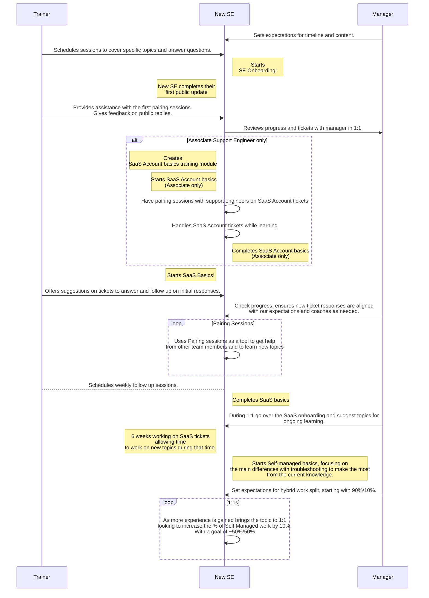

## Support Learning Pathways

All the learning pathways we have in Support are listed [here](https://gitlab-com.gitlab.io/support/team-pages/skills-by-subject.html). Each pathway contains a set of modules, and a module may reside in multiple pathways.

To create an issue for yourself with one of the module templates:

- Click on the module you want to pursue from the [Skills Catalog](https://gitlab-com.gitlab.io/support/team-pages/skills-catalog.html) page
- Title it as **_Your Name_ - _Module Name_**
- Assign it to yourself
- Now you're all set to follow the instructions in the module!

**NOTE:** Contact your [Onboarding Buddy](/handbook/support/training/onboarding_buddy) if you have any questions about these pathways. Buddies are always happy to help!

## Support hybrid model

The hybrid model is a structured training plan that will prepare you to work on [GitLab.com](https://docs.gitlab.com/subscriptions/gitlab_com/), [self-managed](https://docs.gitlab.com/subscriptions/self_managed/), and [GitLab Dedicated](https://docs.gitlab.com/subscriptions/gitlab_dedicated/) support issues. You may find these [checkpoints](/handbook/support/training/onboarding_hybrid_path_checkpoints) helpful while working through the hybrid model path.

## Overview of Support Onboarding

When you first join the team everything will be new to you. Don't worry! In order to get you started with GitLab quickly, apart from the company wide onboarding issue that will be assigned to you on Day 1 by PeopleOps, we also have an onboarding program in Support. There are two pathways:

1. [Support Engineer Onboarding Pathway](#support-engineer-onboarding-pathway)
1. [Support Manager Onboarding Pathway](#support-manager-onboarding-pathway)

**NOTE:** You can start the PeopleOps onboarding and the Support Onboarding at the same time, or you can complete PeopleOps and then switch to Support. Determine the best path with your manager.

## Support Engineer Onboarding Pathway

Your primary Support Engineer Onboarding Issue is created from the [New Support Team Member Start Here template](https://gitlab.com/gitlab-com/support/support-training/-/blob/main/.gitlab/issue_templates/New%20Support%20Team%20Member%20Start%20Here.md). This issue keeps track of your completion of the onboarding modules shown in the table below.

It is recommended that you start the modules in the order listed, but it depends on your learning style. Note that the specific learning pathway modules are not included in the list, and when you open and start working on those modules may differ from other team members as well.

For example, many Support Engineers on the "GitLab Support Learning Pathway" will open the "Working on Tickets" module to start pairing with others once they have parts of the various basics module completed. Similarly, prior experience with administering a self-managed GitLab instance may change the order you complete the modules as well. If you are unsure about how best to approach onboarding, please discuss it with your manager.

Typically, for a new team member in Support, completion of the below onboarding modules (including those in the Area of Focus Pathway) takes **approximately 6 weeks**. A new team member's first ticket reply ranges typically in their first 28 - 38 days (week 3 - 5 of Support onboarding).

| Module                                                                                                                                                                                                      | Duration   | Description                                                                                                           |
| ----------------------------------------------------------------------------------------------------------------------------------------------------------------------------------------------------------- | ---------- | --------------------------------------------------------------------------------------------------------------------- |
| [Git & GitLab Basics](https://gitlab.com/gitlab-com/support/support-training/-/issues/new?%5Bissue%5Dtitle=YOUR%20NAME%20-%20Git%20and%20GitLab%20Basics&description_template=Git%20and%20GitLab%20Basics)  | 2 Days     | Understand our products and services                                                                                  |
| [Customer Service Skills](https://gitlab.com/gitlab-com/support/support-training/-/issues/new?issuable_template=Customer%20Service%20Skills&%5Bissue%5Dtitle=YOUR%20NAME%20-%20Customer%20Service%20Skills) | 2 Days     | Understand how we interact with customers, and how to utilize your customer service skills to ensure customer success |
| [GitLab Support Basics](https://gitlab.com/gitlab-com/support/support-training/-/issues/new?issuable_template=GitLab%20Support%20Basics&%5Bissue%5Dtitle=YOUR%20NAME%20-%20GitLab%20Support%20Basics)       | 1 Day      | Understand how GitLab Support operates and the most common workflows                                                  |
| [Zendesk Basics](https://gitlab.com/gitlab-com/support/support-training/-/issues/new?issuable_template=Zendesk%20Basics&%5Bissue%5Dtitle=YOUR%20NAME%20-%20Zendesk%20Basics)                                | 1 Day      | Utilize ZenDesk to perform ticket management                                                                          |
| [Customer Calls](https://gitlab.com/gitlab-com/support/support-training/-/issues/new?issuable_template=customer_calls&%5Bissue%5Dtitle=YOUR%20NAME%20-%20Customer%20Calls)                                  | 6-12 hours | Understand when and how to organize and lead successful calls with customers                                          |
| [Documentation](https://gitlab.com/gitlab-com/support/support-training/-/issues/new?issuable_template=Documentation&%5Bissue%5Dtitle=YOUR%20NAME%20-%20Documentation)                                       | 1 Day      | Become proficient in making documentation and merge requests                                                          |
| [Knowledge Base](https://gitlab.com/gitlab-com/support/support-training/-/issues/new?issuable_template=Knowledge%20Base&%5Bissue%5Dtitle=YOUR%20NAME%20-%20Knowledge%20Base)                                | 1-2 hours  | Understand the GitLab Knowledge Base and learn how to create knowledge articles                                       |

### GitLab Support Learning Pathway

The GitLab Support pathway covers all platforms that we offer. In completing these modules, Support Engineers are expected to answer tickets submitted to any of them.

**NOTE:** As described in [Support hybrid model](#support-hybrid-model), engineers typically complete one Area of Focus, and then add another. Please discuss your timeline with your manager. Please note you can complete multiple training modules in parallel!

| Module                                                                                                                                                                                                                                                                                 | Duration | Description                                                                |
| -------------------------------------------------------------------------------------------------------------------------------------------------------------------------------------------------------------------------------------------------------------------------------------- | -------- | -------------------------------------------------------------------------- |
| [Working on Tickets](https://gitlab.com/gitlab-com/support/support-training/-/issues/new?issuable_template=Working%20On%20Tickets&%5Bissue%5Dtitle=YOUR%20NAME%20-%20Working%20on%20Tickets)                                                                                           | 2 Weeks  | Help customers by pairing with Support Engineers and replying to tickets   |
| [GitLab-com SaaS Basics](https://gitlab.com/gitlab-com/support/support-training/-/issues/new?issuable_template=GitLab-com%20SaaS%20Basics&%5Bissue%5Dtitle=YOUR%20NAME%20-%20GitLab-com%20SaaS%20Basics)                                                                               | 2 Weeks  | Understand the basics to answer GitLab.com (SaaS) product related tickets  |
| [Introduction to GitLab Architecture](https://gitlab.com/gitlab-com/support/support-training/-/issues/new?description_template=Introduction%20to%20GitLab%20Architecture&issue%5Btitle%5D=YOUR%20NAME%20-%20Introduction%20to%20GitLab%20Architecture)                                 | 0.5 Day  | Understand GitLab architecture                                             |
| [GitLab Installation & Administration Basics](https://gitlab.com/gitlab-com/support/support-training/-/issues/new?%5Bissue%5Dtitle=YOUR%20NAME%20-%20GitLab%20Installation%20and%20Administration%20Basics&description_template=GitLab%20Installation%20and%20Administration%20Basics) | 1 Week   | Understand the different ways in which GitLab can be installed and managed |
| [Self-Managed Support Basics](https://gitlab.com/gitlab-com/support/support-training/-/issues/new?issuable_template=Self-Managed%20Basics&%5Bissue%5Dtitle=YOUR%20NAME%20-%20Self-Managed%20Basics)                                                                                    | 2 Weeks  | Understand the basics to answer Self Managed product related tickets       |
| [GitLab Dedicated Basics](https://gitlab.com/gitlab-com/support/support-training/-/issues/new?issuable_template=GitLab%20Dedicated&%5Bissue%5Dtitle=YOUR%20NAME%20-%20GitLab%20Dedicated)                                                                                              | 1 Week   | Understand the basics to answer GitLab Dedicated related tickets           |

#### Role-specific Modules

For some roles, additional modules are also required. Your manager may direct you to complete one or more of the following modules.

| Module | Duration | Description |
| ------ | -------- | ----------- |
| [GitLab.com Administration Access](https://gitlab.com/gitlab-com/support/support-training/-/issues/new?issuable_template=GitLab-com%20Admin) | 0.5 Day | Admin access is required for some tasks. Other training modules will direct you to complete this module. |
| [GitLab-com SaaS Account Basics](https://gitlab.com/gitlab-com/support/support-training/-/issues/new?description_template=GitLab-com%20Saas%20Account%20Basics&%5Bissue%5Dtitle=YOUR%20NAME%20-%20GitLab-com%20SaaS%20Account%20Basics) | 4 Days | **(Associate Support Engineer only)** Understand the basics to answer GitLab.com (SaaS) account related tickets |
| [License and Renewals](https://gitlab.com/gitlab-com/support/support-training/-/issues/new?issuable_template=Subscriptions%20License%20and%20Renewals&%5Bissue%5Dtitle=YOUR%20NAME%20-%20Subscriptions%20License%20and%20Renewals) | 2 Weeks | Understand the basics to answer our product's License and Renewals related tickets |
| [Shift Engineer](https://gitlab.com/gitlab-com/support/support-training/-/issues/new?description_template=Shift%20Engineer)| 3 Days | **(Shift Engineer only)** Understand the responsibilities of the Shift Engineer role |

When these modules are complete:

1. Let your manager know that you are ready to [proceed to the appropriate on-call rotation training](#on-call-rotations).
1. With your manager, discuss how to describe your Area of Focus percentage in the [support-team project](https://gitlab.com/gitlab-com/support/team-pages), removing onboarding.

### On-call rotations

After you complete an Area of Focus, talk with your manager about joining an on-call rotation. Usually, you complete only one of these modules, and join only one on-call rotation.

| Module                                                                                                                                                                                                            | Duration | Description                                                                                                                                                                                               |
| ----------------------------------------------------------------------------------------------------------------------------------------------------------------------------------------------------------------- | -------- | --------------------------------------------------------------------------------------------------------------------------------------------------------------------------------------------------------- |
| [GitLab.com CMOC](https://gitlab.com/gitlab-com/support/support-training/-/issues/new?description_template=GitLab-com%20CMOC&%5Bissue%5Dtitle=YOUR%20NAME%20-%20GitLab-com%20CMOC)                                | 1 Day    | Understand the responsibilities of being the [Communications Manager On Call (CMOC)](/handbook/engineering/infrastructure/incident-management/#incident-response-roles) for an active GitLab.com incident |
| [Customer Emergencies](https://gitlab.com/gitlab-com/support/support-training/-/issues/new?description_template=Customer%20Emergency%20On-Call&%5Bissue%5Dtitle=YOUR%20NAME%20-%20Customer%20Emergency%20On-Call) | 1 Week   | Understand the responsibilities of being on-call for Customer Emergencies                                                                                                                                 |

### Support Engineer Achievable Progress - First 6 Months

Our onboarding pathway gives new Support Engineers an opportunity to learn at their own pace and explore. We strongly believe in learning by doing ([70/20/10 learning model](https://trainingindustry.com/wiki/content-development/the-702010-model-for-learning-and-development/)), and encourage Support Engineers to start contributing on tickets as soon as they can.

While your growth and skill cannot be determined by metrics, the following reference table can be used as a guideline on achieving comfort with ticket management in your first 6 months in GitLab Support. Discuss your contributions with your manager if are unsure about your progress or ticket volume.

**Monthly Progress Reference Table**
The table below shows the expected progression for Ticket Assignment over the first 6 months, along with milestones for onboarding to on-call responsibilities. These guidelines help track your growing efficiency and expertise in handling customer issues.

| Month | Weekly Ticket Assignment Volume (Associate Engineers) | Weekly Ticket Assignment Volume (Intermediate/Senior Engineers) | On-call milestones (Intermediate/Senior Engineers)                                                                                                                                                                                               |
| ----- | ----------------------------------------------------- | --------------------------------------------------------------- | ------------------------------------------------------------------------------------------------------------------------------------------------------------------------------------------------------------------------------------------------ |
| 1     | 1-2 SM/SaaS/Dedicated OR 5-7 SaaS Account             | 1-2 SM/SaaS/Dedicated                                           | -                                                                                                                                                                                                                                                |
| 2     | 1-2 SM/SaaS/Dedicated OR 8-12 SaaS Account            | 2-4 SM/SaaS/Dedicated                                           | -                                                                                                                                                                                                                                                |
| 3     | 2-3 SM/SaaS/Dedicated OR 10-15 SaaS Account           | 4-5 SM/SaaS/Dedicated                                           | -                                                                                                                                                                                                                                                |
| 4     | 2-3 SM/SaaS/Dedicated OR 10-15 SaaS Account           | 4-5 SM/SaaS/Dedicated                                           | Complete the On-call Module                                                                                                                                                                                                                      |
| 5     | 3-5 SM/SaaS/Dedicated OR 15-20 SaaS Account           | 5-6 SM/SaaS/Dedicated                                           | Start shadow shift                                                                                                                                                                                                                               |
| 6     | 3-5 SM/SaaS/Dedicated OR 15-20 SaaS Account           | 5-6 SM/SaaS/Dedicated                                           | Continue shadow shifts and target readiness for CEOC duty around months 7–8, in alignment with your manager. If additional time is needed to ensure confidence and capability in providing CEOC-level support, a later start can be agreed upon. |

In addition please complete all required onboarding modules by month 3 and participate in 4-5 pairing sessions per week to accelerate your learning and knowledge sharing.

---

### Ongoing learning

Support Engineers are expected to continuously learn after onboarding. As per the [Support Engineer Responsibilities](/handbook/support/support-engineer-responsibilities/#develop-your-skills-through-learning-and-training-weekly), Support Engineers should aim to complete a training module every quarter (3 months).

You can find a list of all our current training modules and Modules in the [Support Training project](https://gitlab.com/gitlab-com/support/support-training/-/tree/main/.gitlab/issue_templates). We are continuously working on adding more modules and building out more learning pathways. [Anyone at GitLab can contribute and create Support-specific training!](#creating-and-viewing-gitlab-component-based-training)

### Creating and viewing GitLab component based training

Anyone at GitLab can contribute to creating custom Support-specific training on how to use, configure or debug GitLab and its various components. Within the existing [Support Training Project](/handbook/support/training/) there is a directory named [Support Specific Trainings](https://gitlab.com/gitlab-com/support/support-training/-/tree/main/Support%20Specific%20Trainings) that provides a means for storing shorter non-module-based training documents and videos. The directory contains a [ReadMe](https://gitlab.com/gitlab-com/support/support-training/-/blob/main/Support%20Specific%20Trainings/ReadMe.md) which provides specific instructions on how to add training material to the directory and where to upload any associated videos.

---

## Support Manager Onboarding Pathway

Your primary Support Manager Onboarding Issue is based on the [New Support Team Member Start Here template](https://gitlab.com/gitlab-com/support/support-training/-/blob/main/.gitlab/issue_templates/New-Support-Team-Member-Start-Here.md). This Issue keeps track of and completes the onboarding modules shown in the following table.

It is recommended that you complete the modules in the order listed, unless an issue mentions that you can start something else simultaneously. Typically, for a new manager in Support, completion of the below onboarding modules should take **3 weeks**.

| Module                                                                                                                                                                                                                  | Duration | Description                                                                        |
| ----------------------------------------------------------------------------------------------------------------------------------------------------------------------------------------------------------------------- | -------- | ---------------------------------------------------------------------------------- |
| [Support Manager Basics](https://gitlab.com/gitlab-com/support/support-training/-/issues/new?description_template=Support%20Manager%20Basics&%5Bissue%5Dtitle=YOUR%20NAME%20-%20Support%20Manager%20Basics)             | 2 Weeks  | Understand support management processes and workflows, including on-call rotations |
| [Git & GitLab Basics](https://gitlab.com/gitlab-com/support/support-training/-/issues/new?%5Bissue%5Dtitle=YOUR%20NAME%20-%20Git%20and%20GitLab%20Basics&description_template=Git%20and%20GitLab%20Basics)              | 2 Days   | Understand our products and services                                               |
| [GitLab Support Basics](https://gitlab.com/gitlab-com/support/support-training/-/issues/new?issuable_template=GitLab%20Support%20Basics&%5Bissue%5Dtitle=YOUR%20NAME%20-%20GitLab%20Support%20Basics)                   | 1 Day    | Understand how GitLab Support operates and the most common workflows               |
| [Zendesk Basics](https://gitlab.com/gitlab-com/support/support-training/-/issues/new?issuable_template=Zendesk%20Basics&%5Bissue%5Dtitle=YOUR%20NAME%20-%20Zendesk%20Basics)                                            | 1 Day    | Utilize ZenDesk to perform ticket management                                       |
| [Support Logic Basics](https://docs.google.com/presentation/d/1Plhjswt3WIvBTVkJf4v8IXPX17AXp7Oe/edit?slide=id.p1#slide=id.p1)                                                                                           | 1 Day    | Utilize SupportLogic to understand ticket health                                   |
| [Customer Emergencies](https://gitlab.com/gitlab-com/support/support-training/-/issues/new?description_template=Customer%20Emergency%20On-Call&%5Bissue%5Dtitle=YOUR%20NAME%20-%20Customer%20Emergency%20On-Call)       | 1 Week   | Understand the responsibilities of being on-call for Customer Emergencies          |
| [SSAT Reviewing for Managers](https://gitlab.com/gitlab-com/support/support-training/-/issues/new?description_template=SSAT%20Reviewing%20Manager&%5Bissue%5Dtitle=YOUR%20NAME%20-%20SSAT%20Reviewing%20for%20Managers) | 1 Day    | Understand how to handle Support Satisfaction feedback results                     |

When this pathway is complete, let your manager know that you are ready to join the appropriate on-call rotations. (Your Support Manager Basics issue contains the instructions for this step.)

_As always, please submit an Issue or MR if you have suggestions on how this page could be better!_
