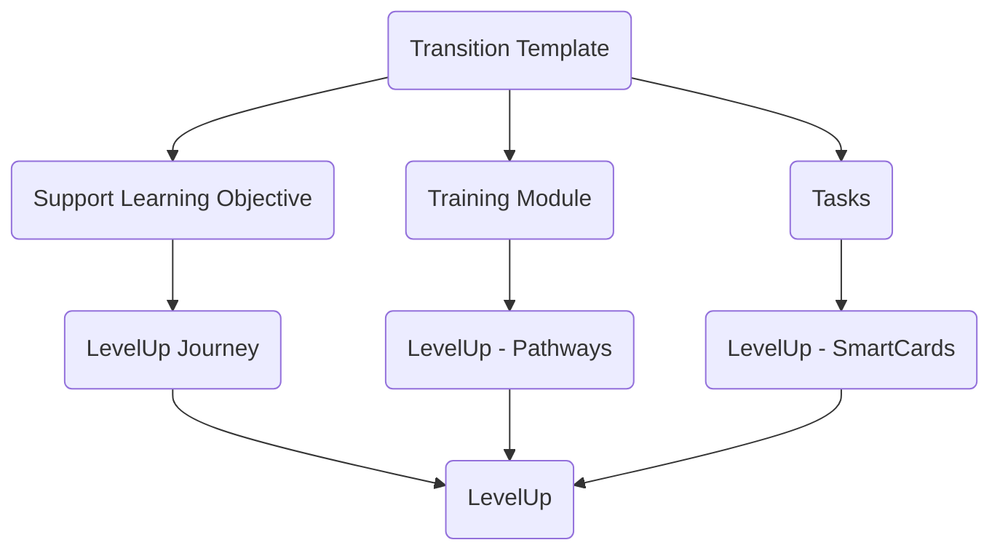

This document covers the process for transitioning existing [GitLab Support training modules](https://gitlab.com/gitlab-com/support/support-training/) to [LevelUp](https://levelup.edcast.com/home).

## Transition template

The following template shows how each element in a Training Module aligns with LevelUp components.

## Transition process

### Step 1 - Define transition goals

The first step in the transition is to visualize how the training will work on LevelUp, what new components will be used, and which limitations you might have.

The key elements to consider in LevelUp are:

1. **Quizzes**

    At the moment, only single or multi-select answer questions are available.

1. **Project type SmartCards**

    This smartcard allows the author to request a URL to be given. The functionality is useful for requesting and verifying an issue, such as an access request or pairing issue.

### Step 2 - Create your Pathway

It is recommended to follow the steps listed in the [LevelUp Handbook Page](/handbook/people-group/learning-and-development/level-up/#pathways).

A Training module becomes a pathway in LevelUp.

- Create your pathway

    The pathway is similar to the issue used on Training Modules.

- Define collaborators

    Collaborators will be allowed to modify the pathway settings and add smartcards to the pathway.

- Set the pathway to private

    This setting is needed during the transition. The final setting may be different depending on the audience for the training module.

- Create a badge, so members who complete the material will have it in their profile.

### Step 3 - Create the Smartcards

It is recommended to follow the steps listed in the [LevelUp Handbook Page](/handbook/people-group/learning-and-development/level-up/#smartcards).

Tasks become smartcards in LevelUp.

- Select the option to edit the pathway and from there create the smartcards.
- Any smartcard type can be used.
- Quizzes are optional but recommended. Depending on how long the training can be, we can have one per section or one halfway through and one in the end.
- Make sure to set the smartcard as locked, so any smartcard will require the previous one to be completed.
- Be creative! LevelUp offers different smartcard types and also gives room for other tools by allowing `iframes with html`.

### Step 4 - Test Run

As a collaborator or author, the pathway cannot be fully tested. For this step, we will require volunteers to help us test our pathway.

- Maintain the Pathway private and publish it.
- Add the `reviewers` in the `Share` field for the pathway.
- Share the pathway URL with the `reviewers`.

#### What does success looks like ?

- No smartcards can be skipped.
- The quizzes have the correct answers.
- By completing the pathway it will show 100% completed.

### Step 5 - Request final review from the L&D team and publish

- Put a comment in the issue created from the first step to request a final review.
- Once the pathway has been approved and depending on the audience, change it to public.

## Considerations

- A pathway author will be considered as DRI, and must ensure important updates in the training are also present in LevelUp as soon as possible.
