## Overview

This workflow focuses on disabling [Two-factor Authentication](https://docs.gitlab.com/ee/user/profile/account/two_factor_authentication.html) (2FA) on a GitLab.com account. The general principles for authenticating a request are covered in our [account verification workflow](account_verification.html).

2FA removal and other account actions can only be completed if the [workflow](#workflows) below is successful.

## Related topics

### GitLab Team Members

If the user is a GitLab team member, have them [contact IT Ops](/handbook/security/corporate/end-user-services/_index.md).

## 2FA removal within GitLab

### Self Service 2FA removal

In many cases, users can disable 2FA themselves and regain access to their accounts **without contacting support**. Before opening a support ticket, users should attempt all applicable recovery methods below.

*Note that, as of August 2020, GitLab Support will [not assist with 2FA resets for free users](https://about.gitlab.com/blog/gitlab-support-no-longer-processing-mfa-resets-for-free-users/), if self-service methods do not work for them.*

## Available Recovery Methods

1. **GitLab Recovery Codes -** Users can use the [recovery codes](https://docs.gitlab.com/user/profile/account/two_factor_authentication/#recovery-codes) they saved when they first enabled their Multi-Factor Authentication.
1. **Regenerate codes via SSH keys -** If the user has added an SSH key to their GitLab account, they can regenerate their recovery codes with SSH, explained below.

   1. In a console/terminal, run `ssh git@gitlab.com 2fa_recovery_codes`.
   1. Answer 'yes' when asked whether you wish to generate new recovery codes.
   1. Copy one of the recovery codes.
   1. Sign in to [https://gitlab.com](https://gitlab.com) using your normal username and password. When asked for a two-factor authentication code, paste the recovery code you copied previously.
   1. After successfully authenticating, go to **Profile -> Account**.
   1. Disable two-factor authentication.
   1. Re-enable two-factor authentication with a new device (Google Authenticator, Duo Security, etc.).

1. **Authenticator App Cloud Backup -** Some authenticator apps offer [cloud backup features that allow users to restore their 2FA](https://docs.gitlab.com/user/profile/account/two_factor_authentication_troubleshooting/#restore-2fa-codes-from-authenticator-backup) codes on a new device. **This only works if backup was enabled before losing the device.**

   1. Install the authenticator app on a new device.
   1. Follow the specific authenticator's recovery process.
   1. Sign in to [https://gitlab.com](https://gitlab.com) using username, password, and the restored 2FA code.

   **Note:** GitLab Support does not assist with authenticator app-specific recovery issues. The user must refer to their authenticator's official documentation for detailed recovery instructions.

### Enterprise Owner 2FA removal for Enterprise users

A top-level group owner can [disable 2FA for any enterprise user](https://docs.gitlab.com/security/two_factor_authentication/#enterprise-users) who is also a group member. A user is automatically claimed as an Enterprise User if [the group has a verified domain](https://docs.gitlab.com/ee/user/enterprise_user/#verified-domains-for-groups) and the user meets the [Enterprise User criteria](https://docs.gitlab.com/user/enterprise_user/#automatic-claims-of-enterprise-users).

## Definitions

- **Account holder**: The person who uses the account day-to-day. The individual themselves may or may not be the account owner.
- **Enterprise owner**: One or more people who represent the business entity who purchased a paid plan with GitLab, hold Owner permissions in that paid namespace, and are [claimed as an Enterprise User](https://docs.gitlab.com/user/enterprise_user).
- **Owner**: One or more people who represent the business entity who purchased a paid plan with GitLab, hold Owner permissions in that paid namespace, and are NOT [claimed as an Enterprise User](https://docs.gitlab.com/user/enterprise_user).

**Note:** For the purposes of support, a user may still be considered an enterprise user when they meet [support's definition for an enterprise user](/handbook/support/workflows/gitlab-com_overview/#enterprise-users).

## Conditions for GitLab.com users

A GitLab.com user must meet **one of** the following conditions to be eligible for a 2FA reset.

1. The user occupies a seat in a paid group on GitLab.com, or a top-level group owner intends to add the user to the paid group.
1. The user is claimed as an [Enterprise User](https://docs.gitlab.com/user/enterprise_user/#automatic-claims-of-enterprise-users).
1. The user meets the support definition for an [Enterprise User](../workflows/gitlab-com_overview/#enterprise-users).
1. The user is the primary billing contact on a current invoice for a GitLab.com purchase.
1. A GitLab team member (account managers, CSMs, or others) collaborates with the holder of this account in an account management project.
1. The user account is required for SSO access to Customers Portal to manage a paid subscription - see: [Conditions for 2FA Reset when account is used to access Customers Portal](#conditions-when-account-is-used-to-access-customers-portal).

More succinctly: they're paid, they use the account to pay, or we use the account to communicate with them.

In many cases, a top-level group owner may submit a ticket on behalf of the user. See the [Account verification matrix](../workflows/account_verification.md#account-verification-matrix) for more information and eligibility.

### Account verification matrix

Find the Account verification matrix on the [Account Owner Verification handbook page](../workflows/account_verification.md#account-verification-matrix).

### Conditions when account is used to access Customers Portal

[Customers Portal](https://customers.gitlab.com) requires all customers to access through a [Linked GitLab Account](https://docs.gitlab.com/ee/subscriptions/customers_portal.html#link-a-gitlabcom-account).

The user is eligible and 2FA can be reset when **one** of following conditions are met:

1. The request is made by the primary billing contact on the latest invoice for a GitLab subscription.
1. The GitLab account is linked to the customers portal account for the primary billing contact on the latest invoice for a subscription purchase.

If an invoice can not be provided, suggest [sign in with legacy email/password](https://customers.gitlab.com/customers/sign_in?legacy=true), where an invoice can be downloaded.

## Keep the Ticket simple and accurate

Because 2FA removal tickets **are a matter of record**, the ticket must be simple, accurate, and tightly focused on the access issue.
**Do not allow the customer to bring up unrelated topics.**

## Disable 2FA with support intervention

Support intervention for 2FA removal after the above steps have been attempted is only possible for users with an *existing paid plan* when the ticket is created. For security purposes, Support will not process 2FA resets for users who are added to a paid subscription for the express purpose of having 2FA disabled on their account.

### Workflows

#### Request for 2FA removal initiated by the account holder

Requests initiated by the account holder will be prompted by an autoreply to provide information to satisfy the security challenges.

##### Step 0: Validation

Some initial validation steps will occur automatically:

- Email / Username match
- Group membership validation
- Group subscription validation

If any of these are inaccurate, the ticket will be closed.

If a user submits a 2FA reset request ticket using the `2FA Assistance` category but does not use the `2FA removal` ticket subcategory, set the form subcategory to `2FA removal`. If the ticket is obviously about 2FA reset but the customer didn't use any of the 2FA ticket categories, use the [`General::Forms::Incorrect form used` macro](https://gitlab.com/gitlab-com/support/zendesk-global/macros/-/blob/master/active/General/Forms/Incorrect%20form%20used.md) to have Support Operations take the appropriate action on the ticket. If the user is not eligible for support, the ticket will automatically close.

##### Step 1: Checking challenge answers

> **Note**: In case the user sends back very minimal information and it's clear it's not sufficient or the answers are vague, reply asking for more information immediately after their response. You can provide some additional guidance, such as "please provide the exact date and time of the commit, not just an approximate one".

1. To verify the challenge answers use the Zendesk GitLab User Lookup App or, for those who have admin access, check at `https://gitlab.com/admin/users/USERNAME`.
1. Use the ZenDesk GitLab Super App's 2FA Helper to determine the [risk factor](https://internal.gitlab.com/handbook/support/#risk-factors-for-an-individual-trying-to-access-their-own-account) (GitLab internal) based on the user's answers. Data classification criteria and any notes are in the [Internal Handbook - Data Classification table](https://internal.gitlab.com/handbook/support/#data-classification) (GitLab internal), which is considered the source of truth. If you need to leave a comment manually (instead of through the app), use the [`Support::SaaS::Gitlab.com::2FA::2FA Internal Note` macro](https://gitlab.com/gitlab-com/support/zendesk-global/macros/-/blob/master/active/Support/SaaS/GitLab.com/2FA/2FA%20Internal%20Note.md?ref_type=heads) to put an internal note on the ticket.
   - Challenge answers must be evaluated against a paid namespace if the user is a member of any paid namespace. If the user is not a member of a paid namespace, refer to [Conditions for 2FA Reset Consideration](#conditions-for-gitlabcom-users) for further guidance.

1. **If verification passed:** Request that your decision be peer-reviewed by another member of the team via Slack `#support_gitlab-com`. They will perform the steps in 2a.
1. **If the verification failed**: Move to step 2b.

##### Step 2a: User successfully proves account ownership

This section is typically done by the peer reviewer. If needed, the peer reviewer (or approving manager) may leave an approval note, in which case the original reviewer will perform the actions.

1. If you agree with the decision, sign into your admin account and locate the username in the users table or by going to `https://gitlab.com/admin/users/usernamegoeshere`
      1. Under the account tab, click `Edit`, add an [Admin Note](../workflows/admin_note.md), and save.
      1. On the account tab, click on `Disable 2FA`.
      1. Use the `Support::SaaS::Gitlab.com::2FA::2FA Removal Verification - Successful` [macro](https://gitlab.com/gitlab-com/support/zendesk-global/macros/-/blob/master/active/Support/SaaS/GitLab.com/2FA/2FA%20Removal%20Verification%20-%20Successful.md?ref_type=heads).

##### Step 2b: User fails to prove account ownership

> **Note**: Do *not* provide hints to answers, or let the user know which challenges they got right or wrong. That is how social engineering works!

1. If the user is unable to pass the risk factor:
   1. Inform them that without verification we will not be able to remove 2FA, but they may request an Enterprise Owner create a request on their behalf (if they would qualify), use the `Support::SaaS::Gitlab.com::2FA::2FA Removal Verification - GitLab.com - Failed - Final Response` [macro](https://gitlab.com/gitlab-com/support/zendesk-global/macros/-/blob/master/active/Support/SaaS/GitLab.com/2FA/2FA%20Removal%20Verification%20-%20GitLab.com%20-%20Failed%20-%20Final%20Response.md?ref_type=heads).
   1. Mark the ticket as "Solved".

#### Request for 2FA removal initiated by an Enterprise owner

Requests initiated by an Enterprise owner should include a [Support PIN](https://docs.gitlab.com/user/profile/#generate-or-change-your-support-pin).

Note that Zendesk performs the following checks when a ticket is submitted for 2FA removal initiated by an Enterprise owner:

1. Has support entitlement?
1. Requester email domain matches target email domain?
1. Requester is owner of top-level paid namespace?
1. Target is a member under the top-level paid namespace?

If any of those fail, then the user is sent the regular 2FA challenges. Use [step 1b](#step-1b-checking-challenge-answers) below in this case.

If other challenges are sent, note that owners should answer the challenges in reference to their **own** account. Other answers are not acceptable.

##### Step 0: Validation

Some initial validation steps will occur automatically:

- Email / Username match
- Group membership validation
- Group subscription validation

If any of these are inaccurate, the ticket will be closed.

##### Step 1a: Verifying Support PIN

> **Note**: In case the user sends back very minimal information and it's clear it's not sufficient or the answers are vague, reply asking for more information immediately after their response.

1. **If the user was sent regular challenge answers**, use [step 1b](#step-1b-checking-challenge-answers) instead.
1. Use the ZenDesk GitLab Super App's 2FA Helper ([as of May 1, 2025](https://gitlab.com/gitlab-com/gl-security/corp/cust-support-ops/issue-tracker/-/issues/1)) to determine the [risk factor](https://internal.gitlab.com/handbook/support/#risk-factors-for-an-enterprise-owner-operating-on-an-enterprise-user-account) (GitLab internal) based on the user's answers. Data classification criteria and any notes are in the [Internal Handbook - Data Classification table](https://internal.gitlab.com/handbook/support/#data-classification) (GitLab internal), which is considered the source of truth. If you need to leave a comment manually (instead of through the app), use the [`Support::SaaS::Gitlab.com::2FA::2FA Internal Note` macro](https://gitlab.com/gitlab-com/support/zendesk-global/macros/-/blob/master/active/Support/SaaS/GitLab.com/2FA/2FA%20Internal%20Note.md?ref_type=heads) to put an internal note on the ticket.
1. To verify the Support PIN use admin access and check at `https://gitlab.com/admin/users/USERNAME`.
   - **Note:** Ensure the Support Pin was provided from the respective owner on the ticket. We cannot accept the Support Pin if it was provided by another user on the ticket on behalf of an owner.
1. Since the user was sent the Support PIN response, the other required conditions are already matched:
    - Requester is an Enterprise owner
    - Target is an Enterprise user

1. **If verification passed:** Request that your decision be peer-reviewed by another member of the team via Slack `#support_gitlab-com`. They will perform the steps in 2a.
1. **If the verification failed**: Move to step 2b.

##### Step 1b: Checking challenge answers

> **Note**: In case the user sends back very minimal information and it's clear it's not sufficient or the answers are vague, reply asking for more information immediately after their response.

1. Skip this step if the user was sent the Support PIN autoresponse in Zendesk.
1. To verify the challenge answers use the Zendesk GitLab User Lookup App or, for those who have admin access, check at `https://gitlab.com/admin/users/USERNAME`.
1. Use the ZenDesk GitLab Super App's 2FA Helper to determine the [risk factor](https://internal.gitlab.com/handbook/support/#risk-factors-for-account-ownership-verification) (GitLab internal) based on the user's answers. Data classification criteria and any notes are in the [Internal Handbook - Data Classification table](https://internal.gitlab.com/handbook/support/#data-classification) (GitLab internal), which is considered the source of truth. If you need to leave a comment manually (instead of through the app), use the [`Support::SaaS::Gitlab.com::2FA::2FA Internal Note` macro](https://gitlab.com/gitlab-com/support/zendesk-global/macros/-/blob/master/active/Support/SaaS/GitLab.com/2FA/2FA%20Internal%20Note.md?ref_type=heads) to put an internal note on the ticket.
   - Challenge answers must be evaluated against a paid namespace if the user is a member of any paid namespace. If the user is not a member of a paid namespace, refer to [Conditions for 2FA Reset Consideration](#conditions-for-gitlabcom-users) for further guidance.

1. **If verification passed:** Request that your decision be peer-reviewed by another member of the team via Slack `#support_gitlab-com`. They will perform the steps in 2a
1. **If the verification failed**: Move to step 2b

##### Step 2a: Enterprise Owner successfully proves their identity

This section is typically done by the peer reviewer. If needed, the peer reviewer (or approving manager) may leave an approval note, in which case the original reviewer will perform the actions.

1. If you agree with the decision, sign into your admin account and locate the username in the users table or by going to `https://gitlab.com/admin/users/usernamegoeshere`
      1. Under the account tab, click `Edit`, add an [Admin Note](../workflows/admin_note.md), and save.
      1. On the account tab, click on `Disable 2FA`.
      1. Use the `Support::SaaS::Gitlab.com::2FA::2FA Removal Verification - Successful` [macro](https://gitlab.com/gitlab-com/support/zendesk-global/macros/-/blob/master/active/Support/SaaS/GitLab.com/2FA/2FA%20Removal%20Verification%20-%20Successful.md?ref_type=heads).

##### Step 2b: Enterprise Owner fails to prove their identity

> **Note**: Do *not* provide hints to answers, or let the user know which challenges they got right or wrong. That is how social engineering works!

1. If the user is unable to pass the risk factor:
   1. Send the additional challenges with the `Support::SaaS::GitLab.com::2FA::Additional 2FA Challenges` [macro](https://gitlab.com/gitlab-com/support/zendesk-global/macros/-/blob/master/active/Support/SaaS/GitLab.com/2FA/Additional%202FA%20Challenges.md?ref_type=heads).
   1. You can ask the owner to generate a [Support PIN](https://docs.gitlab.com/user/profile/#generate-or-change-your-support-pin) and provide it to us in a response to the ticket, as an owner vouch. NOTE: If another user is CC'd on the ticket, once you’ve verified the Support PIN ask the user to generate a new PIN to revoke the previous one.
      - **Note:** Ensure the Support Pin was provided from the respective owner on the ticket. We cannot accept the Support Pin if it was provided by another user on the ticket on behalf of an owner.
   1. You may also leverage [Backup methods for authenticating an owner](#backup-methods-for-authenticating-an-owner).
1. If the user is still unable to pass the risk factor:
   1. Inform them that without verification we will not be able to remove 2FA, use the `Support::SaaS::Gitlab.com::2FA::2FA Removal Verification - GitLab.com - Failed - Final Response` [macro](https://gitlab.com/gitlab-com/support/zendesk-global/macros/-/blob/master/active/Support/SaaS/GitLab.com/2FA/2FA%20Removal%20Verification%20-%20GitLab.com%20-%20Failed%20-%20Final%20Response.md?ref_type=heads).
   1. Mark the ticket as "Solved".

#### Request for 2FA removal initiated by an Owner (Non-Enterprise User)

Requests initiated by an Owner (Non-Enterprise User) will be prompted by an autoreply to provide information to satisfy the security challenges.

**Note:** The target user has to be CC'd to the ticket and the challenge questions should be answered directly by the target user. The owner must **NOT** answer the questions on behalf of the target user.

The initial validation and subsequent steps are same as the [request for 2FA removal initiated by the account holder](#request-for-2fa-removal-initiated-by-the-account-holder). 

##### Backup methods for authenticating an owner

If a group owner does not include the owner vouch, you may use another method to verify their identity. It must be an action that has been specifically instructed by Support and identifiably unique to the situation. Some examples include having the owner:

- create a [private snippet](https://docs.gitlab.com/user/snippets/#create-snippets), containing the ticket number as a string.
- create an issue in a project they have access to with a specific piece of text that you provide.
- create a new project at a path that you provide.

## Large Customers (Deprecated)


Note: This process was [deprecated on April 30, 2025](https://gitlab.com/gitlab-com/content-sites/handbook/-/issues/462). All customers using this process have been notified.


## Flowchart

Below is a flowchart that can help you to visualize the steps described in the [2FA removal within GitLab](#2fa-removal-within-gitlab) section above.

```mermaid
flowchart TD
    A[Customer opens ticket]
    B{Is user a support contact?}
    C[Autoresponse is sent]
    D{🟡 Use Incorrect Form Macro}
    E[🛑 Ticket is closed]
    F[Follow Account Holder workflow]
    G[Follow Enterprise Owner workflow]
    H([Score challenges using Acct Verify App])
    I{Challenges passed?}
    J[Peer Review]
    K{Peer Review passed?}
    L{Check Appropriate workflow}
    M[Account Holder workflow]
    N[Enterprise Owner workflow]
    O[🛑 Close ticket]
    P([🟡 Send additional challenges - if none exist, 🛑 close ticket])
    Q((🟢 Peer reviewer disables 2FA, </br> sends response, solves ticket))
    A ---> B
    B ---> |Yes| C
    B ---> |No| D
    D ---> |Associated?| C
    D ---> | Not associated? | E
    C ---> |Request initiated by the account holder| F
    C ---> |Request initiated by an Enterprise owner| G
    F ---> H
    G ---> H
    H ---> I
    I ---> |Yes| J
    I ---> |No| L
    J ---> K
    K ---> |Yes| Q
    K ---> |No| P
    L ---> M
    L ---> N
    M ---> O
    N ---> P
    P ---> I

click D href "#step-0-validation"
click F href "#request-for-2fa-removal-initiated-by-the-account-holder"
click G href "#request-for-2fa-removal-initiated-by-an-enterprise-owner"
```

