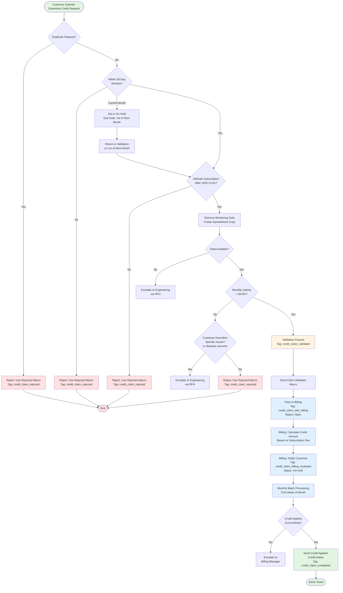

## Flowchart



## Overview

This workflow details how Support processes customer requests for credits due to GitLab.com downtime. Credits are available to eligible customers when monthly uptime falls below 99.9%. See [this](/handbook/engineering/infrastructure-platforms/service-level-agreement/) for a list of features and services covered by the SLA. The SLA explicitly covers failing requests (5xx errors), but certain outages may not be captured:

- Application bugs that make covered features unusable without generating 5xx errors
- Sidekiq outages preventing job processing
- Other infrastructure issues affecting user experience without failing requests

If customer describes such issues, open an [RFH with the Observability team](https://gitlab.com/gitlab-com/request-for-help/-/blob/main/.gitlab/issue_templates/SupportRequestTemplate-DowntimeCredits-GitLabCom.md?ref_type=heads) (for GitLab.com) or [RFH with the Environment Automation team](https://gitlab.com/gitlab-com/request-for-help/-/blob/main/.gitlab/issue_templates/SupportRequestTemplate-DowntimeCredits-Dedicated.md?ref_type=heads) (for GitLab Dedicated) to investigate further.

**Important:** This workflow applies only to **Ultimate GitLab.com or GitLab Dedicated customers**, or those with a documented exception in their org notes. Self-Managed customers are not eligible.

## Definitions

- **Monthly Uptime**: The percentage of time GitLab.com services were available during a calendar month, calculated from monitoring data.
- **Eligible Customer**: A customer with a new or renewed Ultimate subscription on GitLab.com or GitLab Dedicated (not Self-Managed). The subscription must have a start date of 2025-12-01 or later, or have an exception noted in their org notes.
- **Affected Month**: The calendar month during which downtime occurred.
- **Credit Tiers**: Credits are calculated based on monthly uptime percentage. Refer to [the SLA handbook page](https://gitlab.com/gitlab-com/content-sites/handbook/-/merge_requests/15942/diffs#c01d3f1a95e516a85744800ee399622ba1e31df3_0_96) for the calculation of credits.

## Eligibility Requirements

A customer must meet **all** of the following conditions:

1. Has a **new or renewed Ultimate** subscription with a start date after 2025-12-01 on GitLab.com or GitLab Dedicated, or have a documented exception in their org notes.
1. Experienced downtime that resulted in **monthly uptime below 99.9%**
1. Submits claim **within 30 days** after the affected month ends.

    - Example: For downtime in November 2025, claims must be submitted between December 1, 2025 and December 31, 2025
    - Customers may submit claims **only after the affected month has ended**

1. Has not previously submitted a claim for the same month

## Processing Timeline

- **Customer submission window**: Within 30 days after affected month ends
- **Support validation**: Within 1 business day of submission
- **Billing calculation**: Within 3 business days of validation
- **Credit application**: Monthly batch processing (typically first week of following month)
- **Total timeline**: Intake to credit issuance within 60 days

## Workflow

### Step 1: Request Submission by Customer

Customers submit downtime credit requests via the **Downtime Credit Request** Zendesk form.

**Required Information:**

- Affected month
- Namespace Path or GitLab Dedicated instance URL
- Brief description of impact experienced
- Customer should attest they were impacted

**Note:** If a customer claims downtime for multiple months in one ticket, separate tickets should be created for each month.

### Step 2: Support Validation

Support validates the claim against monitoring data and eligibility requirements.

#### Validation Checklist

Complete the following checks in order:

1. **Duplicate Check**: Search for existing tickets from the same customer for the same month.

    - **Duplicate request found**: Close the new ticket using `Support::Downtime Credits::Claim Rejected` macro. Reference the original ticket number and explain it's a duplicate.
    - **Credit already applied**: Close using `Support::Downtime Credits::Claim Rejected` macro. Explain the credit was previously processed.

1. **Subscription Eligibility Check**

    - Verify customer has a **new or renewed Ultimate** subscription with a start date after 2025-12-01 on GitLab.com or GitLab Dedicated, or has a documented exception in their org notes.
    - If not eligible: Use the `Support::Downtime Credits::Claim Rejected` macro providing the reason for rejection
 
1. **Timing Validation**

    - Confirm submission is within 30-day window after month end
    - If they provided the current month:

        - Reply back explaining the claim can only be validated once the month ends
        - Set ticket type to `Task` with Due date of 1st of the next month
        - Set ticket to On hold
        - On the 1st of the next month, return back to the validation steps

    - If outside window: Use the `Support::Downtime Credits::Claim Rejected` macro providing the reason for rejection

1. **Monitoring Data Retrieval**

    - Open the [calculation spreadsheet](https://docs.google.com/spreadsheets/d/1GNZOq3K9tIR6LzWGay_2WHCTabksAVBDV26S7FPb4Zs/)
    - Make a copy of the spreadsheet selecting the `Downtime credits spreadsheets` [drive folder](https://drive.google.com/drive/folders/1hfVWvkFPYQoWpyc4rNkCjlNMYG8N-cxQ?usp=sharing)
    - Set the title of the spreadsheet to `[CustomerName]-[YYYY-MM]-[TicketNumber]`
    - Retrieve uptime percentage for the namespace or instance for the specified month. Watch [this video](https://gitlab.com/-/group/1112072/uploads/71eb8ae1b42cf6c38ca63d6feb52284b/video1277894444.mp4) for a demo.

        - GitLab.com: Ensure you enter the **top-level group path** (not group ID nor URL) in `Customer ID` and select `gitlab.com` for `Platform`.
        - GitLab Dedicated: Retrieve the relevant `customer_id` from the **Dedicated Customer IDs** sheet in the calculation spreadsheet and enter it in `Customer ID` then select `gitlab-dedicated` for `Platform`.

    - If monitoring data is missing or incomplete: Escalate to Engineering via RFH. Use [SupportRequestTemplate-DowntimeCredits-GitLabCom](https://gitlab.com/gitlab-com/request-for-help/-/blob/main/.gitlab/issue_templates/SupportRequestTemplate-DowntimeCredits-GitLabCom.md?ref_type=heads) (for GitLab.com) or [SupportRequestTemplate-DowntimeCredits-Dedicated](https://gitlab.com/gitlab-com/request-for-help/-/blob/main/.gitlab/issue_templates/SupportRequestTemplate-DowntimeCredits-Dedicated.md?ref_type=heads) (for GitLab Dedicated)
    - If customer disputes the validation outcome: Escalate to Engineering via RFH. Use [SupportRequestTemplate-DowntimeCredits-GitLabCom](https://gitlab.com/gitlab-com/request-for-help/-/blob/main/.gitlab/issue_templates/SupportRequestTemplate-DowntimeCredits-GitLabCom.md?ref_type=heads) (for GitLab.com) or [SupportRequestTemplate-DowntimeCredits-Dedicated](https://gitlab.com/gitlab-com/request-for-help/-/blob/main/.gitlab/issue_templates/SupportRequestTemplate-DowntimeCredits-Dedicated.md?ref_type=heads) (for GitLab Dedicated)

1. **Threshold Check**

    - Verify monthly uptime is less than 99.9%
    - If uptime is 99.9% or higher: Review customer's description of impact

        - If customer describes specific issues that may not be captured by monitoring (e.g., Sidekiq job processing failures, application bugs causing unusable features without 5xx errors), escalate to Engineering via RFH before refusing. . Use [SupportRequestTemplate-DowntimeCredits-GitLabCom](https://gitlab.com/gitlab-com/request-for-help/-/blob/main/.gitlab/issue_templates/SupportRequestTemplate-DowntimeCredits-GitLabCom.md?ref_type=heads) (for GitLab.com) or [SupportRequestTemplate-DowntimeCredits-Dedicated](https://gitlab.com/gitlab-com/request-for-help/-/blob/main/.gitlab/issue_templates/SupportRequestTemplate-DowntimeCredits-Dedicated.md?ref_type=heads) (for GitLab Dedicated)
        - If no such issues described: Use the `Support::Downtime Credits::Claim Rejected` macro providing the reason for rejection

#### Validation Outcomes

- **PASS**: All checks successful → Proceed to Step 3 (Pass to Billing)
- **FAIL**: Use the `Support::Downtime Credits::Claim Rejected` macro providing the reason for rejection

1. Review the claim and identify the applicable refusal reason(s)
2. Edit the macro body to keep ONLY the relevant reason section(s)
3. Delete all other reason sections before sending
4. Ensure the closing paragraph remains intact

### Step 3: Pass to Billing

1. Respond back to the customer using **Support::Downtime Credits::Claim Validated** macro
1. Use macro: `General::Forms::Incorrect form used`
1. Delete the contents of the incorrect form macro
1. Use `Support::Downtime Credits::Pass to Billing` macro that adds internal note with validation details and adds the tag `credit_claim_with_billing`:

   ```text
   Customer name: [Org name]
   Monthly Uptime: [X]%
   Namespace Path or Instance URL: [Path/URL]
   Month: [YYYY-MM]
   Uptime Spreadsheet: [Link to copy of uptime spreadsheet, shared with GitLab]
   ```

1. Submit as Open

### Step 4: Billing Workflow

**Note:** This section is only for information purposes. The billing workflow is owned by Billing and subject to change.

Once Support validates and passes the ticket to Billing, the Billing team will:

1. Calculate the credit amount based on the monthly subscription fee and uptime percentage
1. Notify the customer of the calculated credit amount and expected application date
1. Apply credits during monthly batch processing (typically the first week of each month)
1. Confirm application to the customer once the credit appears on their invoice
1. Solve the ticket

## Frequently Asked Questions

**Q: Is this workflow intended to be used for incidents affecting CI/CD minutes usage?**
A: No, this workflow covers the features listed in [Covered Experiences](/handbook/engineering/infrastructure-platforms/service-level-agreement/#covered-experiences).

**Q: Can customers submit claims for the current month?**
A: No. Claims can only be submitted after the affected month has ended. Follow the steps if the customer is eligible to request downtime credits.

**Q: What if a customer submits multiple months in one request?**
A: Create separate tickets for each month to ensure clean tracking. We do not process multiple months in one ticket for audit reasons.

**Q: How long does the entire process take?**
A: From submission to credit application, the process takes up to 60 days, with most of that time in monthly batch processing.

**Q: What if monitoring data shows different uptime than the customer experienced?**
A: Engineering's monitoring data is authoritative. We escalate to Engineering via RFH if there are discrepancies.

**Q: What if the customer experienced downtime but the monitoring data shows uptime above 99.9%?**
A: Our SLA explicitly covers failing requests (5xx errors). However, some outages may not be captured by standard monitoring, such as application bugs making features unusable or Sidekiq job processing failures. If the customer experienced such issues, request them to provide specific details. We'll escalate to Engineering via RFH to investigate whether there were outages not captured by the monitoring systems.

**Q: Can customers request a specific credit application method?**
A: Credits are applied to the next invoice by default. Alternative requests are handled case-by-case by Billing.

**Q: Are we allowed to provide customers with the data + formula we're using to calculate the credits?**
A: Yes, by request - export the raw data from the "Availability Calculation" tab as a .csv file and send it along as an attachment. Any questions regarding credit amounts should be redirected to the Billing team.

**Q: What should Support Engineers do when Sales pushes back on a downtime credit claim that failed validation?**
A: It depends on the reason for the pushback:

- If the customer believes they were affected by an outage not accounted for in the data: Open a Request for Help (RFH) to ensure that case is properly considered.
- If Sales is pushing back for customer satisfaction reasons: Escalate to Support Engineering Management to decide whether to allow a one-time exception for CSAT reasons.

**Q: If a customer disputes the uptime calculation or has any more questions about the data, Support is expected to 'explain' this data. Would we have some training on how this data is extracted?**
A: A demo video provides an overview of the data. If you need further assistance, open a Request for Help (RFH).

**Q: Are there any costs of refreshing the spreadsheet?**
A: There is a small cost associated with refreshing the data. See [this comment](https://gitlab.com/gitlab-com/gl-infra/data/sla-analytics-pipeline/-/issues/27#note_2879084261) for more details.
